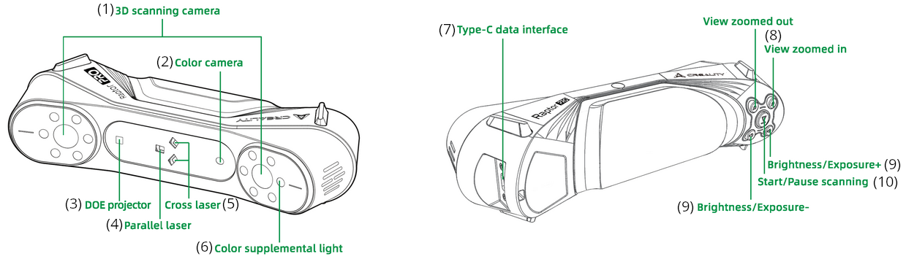
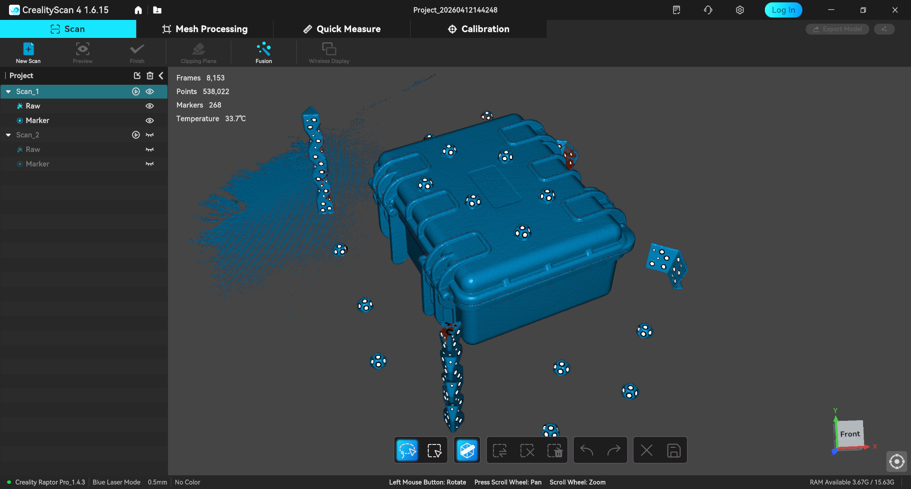
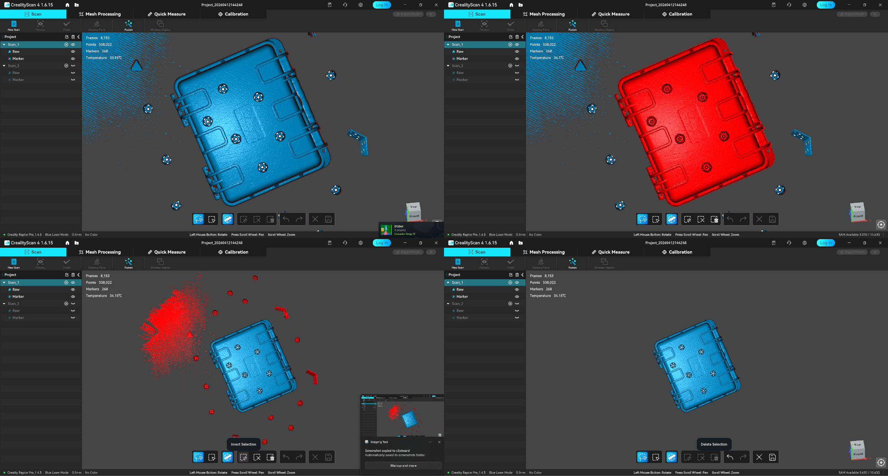

The Creality Raptor Pro is a handheld 3D scanner that captures the geometry — and optionally the color — of real-world objects and turns them into texture-mapped 3D mesh models. Use it for reverse engineering, digitizing freeform shapes like body panels or organic forms, and full-surface capture where calipers and manual measurement are impractical. It handles objects from roughly coin-sized up to about 4 m (with markers), with a practical accuracy of about 0.05–0.2 mm depending on mode — far coarser than calipers, so it's the tool for complex surfaces, not precision measurement of simple features. If you're not sure this is the right tool for your project, ask a staff member.
<!-- TODO: link /docs/which-machine/ at the end of the intro once that page exists -->

> [!WARNING]
> **Handle the scanner with extreme care.** It's a precision optical instrument: don't drop it, strain the cables, or touch the glass. If you smudge the glass, clean it with the **included microfiber cloth** only.

> [!WARNING]
> The scanner projects **blue laser lines and infrared light**. Even though these are marketed as eye-safe, treat them like any laser: don't aim the emitters at anyone's eyes or stare into them at close range.

:::note[Staff note — 3D Scanner lead]
Two things to confirm for this page: (1) the Raptor Pro's laser classification (check the manufacturer manual / EHS) and whether TAMU laser-safety rules apply to it — if they do, this page needs the red certification callout like the laser cutter's; (2) the access policy (free walk-up use vs. training or staff checkout), so "Before you start" can state it instead of guessing.
:::

## Before you start

- You need a **clear space** to maneuver the scanner all the way around the object.
- The object — and the surface it rests on — should **not be black, reflective, or transparent**. If it is, scanning spray can fix it (see Common problems below).
- Bring an [adequately powered](https://wiki.creality.com/en/3d-scanner/tutorials/general/performance) laptop with a **USB 3.0 port**, set up next to the scanning area. Keep an eye on free disk space — scan files get decently large.
- If you'll scan in a laser mode, you'll need the **reference markers** from the kit (laser modes require markers; infrared mode doesn't).

> [!NOTE]
> For additional reference, the Raptor Pro's official [user manual](https://wiki.creality.com/en/3d-scanner/raptorpro/manual) is genuinely good.

## Operating

1. 3D Scanning Camera: The cameras used to capture geometric data
2. Color Camera: The cameras used to capture color textures to map to the scanned model
3. DOE Projector: Projects the structured infrared light pattern onto the object
4. Parallel Laser: Projects the parallel laser lines
5. Cross Laser: Projects the crossed laser lines
6. Color Supplemental Light: Illuminators for color camera (basically just flash)
7. Type-C Data Interface: Interface to the computer and power supply
8. View Zoom Out/In: Increase/decrease FOV on the scan preview window
9. Brightness/Exposure +/−: Manual adjustment of scanning camera's brightness
10. Start/Pause button: works equivalently to the start/pause scanning button in CrealityScan

**Set up and connect:**

1. Slide the *American* wall plug adapter into the DC power supply.
2. Insert the USB Type-C plug into the **Type-C Data Interface (7)** and hand-tighten the screws.
3. Connect the female and male ends of the DC power supply cable together.
4. Plug the USB Type-A data cable into a **USB 3.0** port on your computer.
5. Plug the DC power supply into a standard 110V wall outlet.
6. Start the **CrealityScan 4** software. Once you get past whatever popups and dialogues, it should say **"Scanner Connected"** at the top left.

**Scan:**

7. In CrealityScan, click **"New Project"** and complete the dialogue.
8. At the top center of the screen, enter the **Calibration** tab and follow the on-screen instructions. You only need to calibrate once.
9. Back in the scan tab, choose your mode — **blue laser or infrared**. If you're unsure, hover over the **"🛈" tooltips** for more information.
10. Customize the additional settings in the sidebar to your needs. If you're using markers, do a **"Global Markers" scan first** — it detects markers better than the actual scan modes, and having all markers mapped before scanning makes the scan itself much easier.
11. Click **"Preview"** (or press the center button on the scanner) and get a feel for how far to hold the scanner from the object. The colored distance sidebar helps here, though it can get confused.
12. Click **"Start"** and perform your scan, watching the point cloud populate in real time. The point cloud lives in RAM while you scan — available RAM limits how many points you can capture and post-process. If you need to split the object into multiple scans, store them in the same project and let CrealityScan align them automatically.
13. When you're done scanning, click **"Finish"**.

**Post-process:**

14. From the project's main page, use the editing toolbar to remove excess data points — **[Shift]+[LMB]** selects, **[Ctrl]+[LMB]** deselects.

    

    A quick way to remove most excess data: enable **"Penetrate Selection"**, right-click the viewport to switch to **orthographic view**, position the camera above the model, lasso-select only the model, then **Invert Selection** → **Delete Selection** → **Save Edit**.

    

15. Use the **"Fusion"** tool to process the scanned data into a mesh, then check again for excess geometry. You can now remove any reusable markers from your object.
16. For advanced cleanup — manual mesh edits, smoothing, simplifying, hole-fixing — switch to the **"Mesh Processing"** tab.

Depending on your use case, post-processing may be the bulk of the work. For specialized, higher-power tools, [MeshLab](https://www.meshlab.net/), [Blender](https://www.blender.org/), and [CloudCompare](https://www.cloudcompare.org/) are free and open source; [Autodesk Meshmixer](https://meshmixer.org/) is free but proprietary (⚠️ deprecated since 2023; that link is **unofficial**).

## Finishing up

- Make sure the lens glass is clean — if not, use the **included microfiber cloth**.
- Close CrealityScan and unplug all the cables you connected during setup.
- Repack every item in the box the way you found it. If something seems wrong or missing, tell Fab Lab staff — and if the marker stickers are running low, let the lab assistant know.
- Take your object and your scan files with you — the lab has no storage.

## Common problems

Don't attempt to troubleshoot major issues yourself — get a staff member.

**The scanner crashes, freezes, or loses connection.** Unless something looks seriously wrong, don't worry — it happens. Close CrealityScan, unplug and replug the scanner, then relaunch.

**The scanner keeps losing track.** Switch to a more effective tracking mode — use the "ⓘ" tooltips to help decide. If issues persist, add more markers or switch to marker-based tracking. Also check that the object isn't black, reflective, or transparent; if it is, scanning spray may be needed.

**The object has black, reflective, or transparent surfaces.** Bring the object to the sink, shake the scanning spray well, and apply a light coat. Don't over-apply — the effect only becomes visible once it fully evaporates. The spray is simply a mixture of isopropanol and talcum powder.
