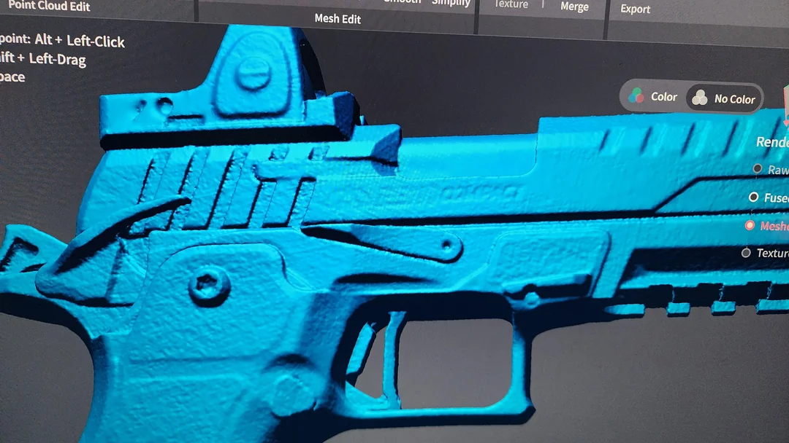
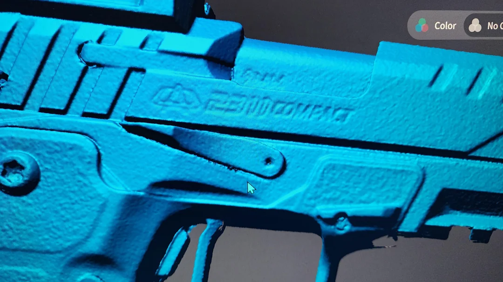
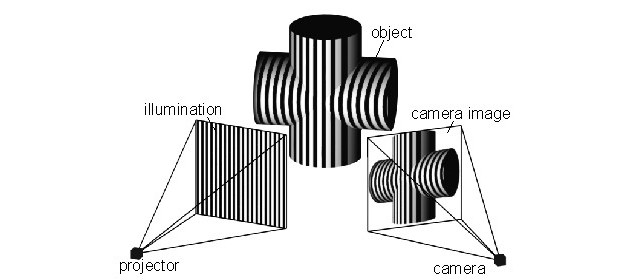

Understand when 3D scanning is the right tool, how the Raptor Pro's scanning and tracking modes work, and then put it into practice by scanning a real object. Work alongside the [3D Scanner (Creality Raptor Pro) manual](/docs/3d-scanner/3d-scanner-creality-raptor-pro/).

## Part 1 – When should I use 3D scanning?

Understanding when a 3D scanner is the right tool for the job — and when it's not — will save you time and effort.

3D scanning is best used in cases where metrology using manual instruments such as calipers, micrometers, or even Coordinate Measuring Machines (CMMs) becomes impractical — particularly when dealing with complex geometries, large volumes of measurement points, or freeform surfaces.

An important distinction between calipers and a 3D scanner is accuracy. While even cheap calipers can reliably perform with an accuracy of 0.0005″ (0.01 mm), the Creality Raptor Pro has been tested to produce 0.1–0.2 mm accuracy in practical scanning settings ([Unpacking the 20 Micron Accuracy Claim – Creality Scan Raptor PRO](https://www.youtube.com/watch?v=UYjavPonUaE)). For many cases, accuracy this coarse is unusable.

Still, there are many cases in which precise geometric tolerance is not the goal. One job where 3D scanning excels is freeform scanning. When measuring things like automotive body panels or objects with various angles, it can be difficult or entirely impossible to determine measurements using calipers and protractors. In these cases, 3D scanning can be quite precise ([It's Time To Put A 3D Scanner In Your Toolbox](https://www.youtube.com/watch?v=rORuE8Oyxd0)).

Below is a simple tradeoff table between calipers and 3D scanners.

| Criteria | Digital calipers | 3D scanner |
|---|---|---|
| Typical accuracy | ±0.01 mm | ±0.05–0.2 mm (hobby-class) |
| Measurement range | 0–150 mm (typical) | ~5 mm – several meters |
| Cost | $$ ($20–$500) | $$$$ ($500–$10,000) |
| Freeform-capable? | No | Yes |
| Contact required? | Yes | No |
| Speed | Moderate (one point at a time) | Fast capture; slow post-processing |
| Skill required | Low–moderate | Moderate–high |
| Output | Single discrete measurements | Full 3D surface mesh |
| Best for | Diameters, depths, steps, simple geometry | Organic shapes, reverse engineering, full-surface inspection |
| Limitations | Cannot characterize curves or complex surfaces | Expensive; requires software and a powerful computer; cannot measure hidden/internal features |

## Part 2 – Infrared vs. LASER

The Creality Raptor Pro operates in three scanning modes: NIR (Near-Infrared) Structured Light, 7 Parallel Blue Laser Lines, and 22 Cross Blue Laser Lines. Understanding when to use each mode is important for getting a useful scan on your first attempt.

Infrared (NIR) structured light works by projecting an invisible speckle pattern of infrared light onto the object. Two cameras observe how that pattern deforms across the surface, and the scanner reconstructs a 3D mesh from those deformations. Because the entire field of view is captured at once, NIR mode is fast — the Raptor Pro captures up to 3,580,000 measurements per second at 30 fps in this mode.

Laser scanning works similarly: the scanner projects one or more lines of blue laser light across the object while cameras measure where the line bends or shifts. The Raptor Pro's blue lasers (405 nm wavelength) trace these lines across the part at up to 60 fps, building up a point cloud row by row.

*(Left) Scan using cross lines. (Right) Scan using parallel lines. ([source](https://www.reddit.com/r/3DScanning/comments/1knrtgo/metrox_cross_laser_vs_parallel/))*

*Structured-light 3D scanning. ([source](https://bitfab.io/blog/3d-scanning-with-structured-light/))*

> [!NOTE]
> Both modes use structured light — they project a known pattern and measure its deformation. The difference is the light source: NIR uses a broadband infrared projector casting a dot/speckle pattern, while the laser modes use coherent blue laser diodes casting precise lines.

For the practical comparison of the three modes — accuracy, capture area, best object size, color capture — see the [manual's "Choosing scan and tracking modes" section](/docs/3d-scanner/3d-scanner-creality-raptor-pro/#choosing-scan-and-tracking-modes).

## Part 3 – Tracking modes

The Raptor Pro supports three tracking modes in the Creality Scan software: Geometry, Texture, and Marker. Tracking mode determines how the scanner knows where it is in space relative to the object — it is a separate choice from your scanning light mode. Choosing the wrong tracking mode is one of the most common reasons a scan fails, so understanding each option is important.

All three modes — how each one tracks, what it's best for, its limitations, and marker-placement tips — are covered in the [manual's "Choosing scan and tracking modes" section](/docs/3d-scanner/3d-scanner-creality-raptor-pro/#choosing-scan-and-tracking-modes). Read it before you start Part 4: the assignment depends on choosing tracking modes deliberately.

## Part 4 – The assignment

:::note[Staff note — 3D Scanner lead]
The cutting board was a tentative choice — the final assignment object is picked but not yet added here. Update this Part (and the hint below, if the scan strategy changes) once it's in the lab.
:::

Generate a model of the cutting board, using the [3D Scanner (Creality Raptor Pro) manual](/docs/3d-scanner/3d-scanner-creality-raptor-pro/) to guide you through the process.

Hint: you will need more than one scan to complete this assignment, which must then be aligned into a single model. Pay attention to what tracking mode you use for each scan.
