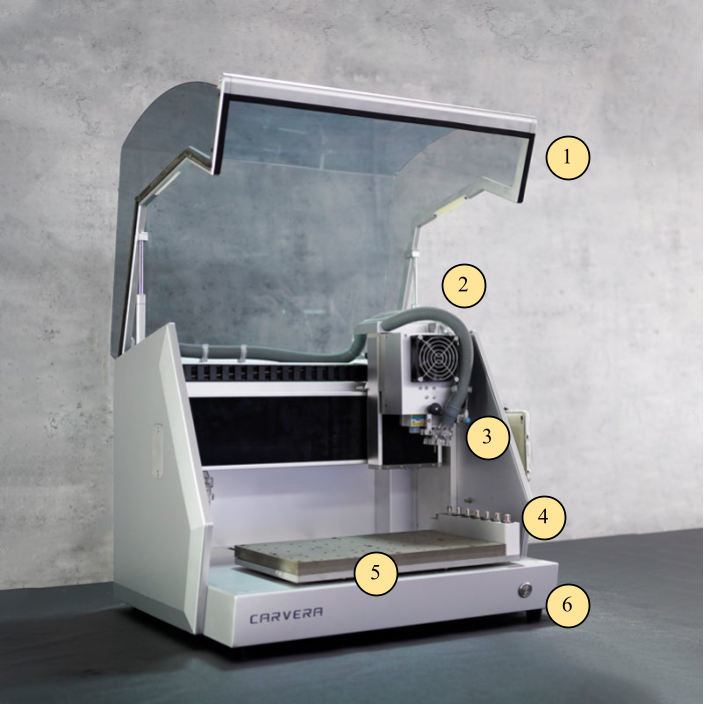
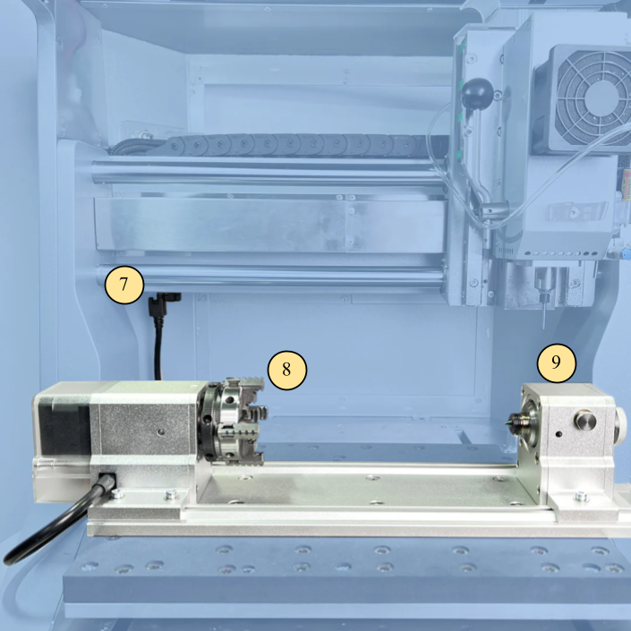
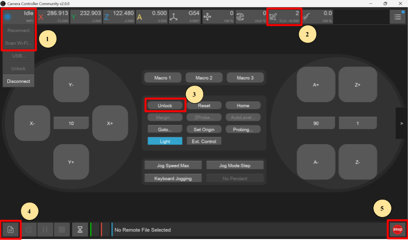

The Makera Carvera is an enclosed desktop CNC mill that cuts detailed parts from wood, hard plastics, and soft metals — and doubles as a laser engraver for wood and metal. Use it for precision-milled parts, pockets and profiles, engraving, and, with the optional 4th axis, rotational work on cylindrical stock. If you're not sure this is the right machine for your project, ask a staff member.

:::danger[LASER SAFETY TRAINING REQUIRED]
TAMU laser safety training is required before using the Carvera's laser, and **laser goggles must be worn whenever the laser is running**.
:::

> [!WARNING]
> **A staff member must be present whenever this machine is in use.** Don't run a job alone.

> [!WARNING]
> **Only mill approved materials** (listed under [Before you start](#before-you-start)). Materials that are brittle, fibrous, or "dead soft" — softening and going pliable with heat — cannot be milled. Anything unusual needs staff approval first.

:::caution[EMERGENCY STOP]
Hit the red **Emergency Stop** button on the table next to the machine. You can also press the red **STOP** button at the bottom right of the controller to pause the job. If the situation persists, flip the **power switch at the rear right** of the machine. After an emergency stop every function locks — the machine has to be released with **Unlock** in the controller before it will run again.
:::

:::caution[FIRE PROCEDURE]
Keep the lid closed if the flames are small — they often self-extinguish within a few seconds. Pause the job with the controller or the Emergency Stop, and turn the machine off at the rear power switch if needed. If the flames continue, get a staff member. **Only if no staff member can reach the machine in time:** open the lid and throw the fire blanket over the workpiece.
:::

## Before you start

- **A staff member must be present** to oversee the operation.
- **Using the laser?** You need TAMU laser safety training, and laser goggles are required while it runs.
- Only mill **approved materials**:
  - **Wood** — hard and soft woods, MDF and HDF. *(Composites pending approval.)*
  - **Metal** — 6061 aluminum, brass.
  - **Plastic** — ABS, acrylic. *(Hard rubbers pending approval.)*

  This list is subject to change — ask a staff member about anything that isn't on it.
- Install the [Carvera Community Controller](https://github.com/Carvera-Community/Carvera_Controller/releases) — the lab uses the community build, not Makera's official controller.
- Prepare your job in **Fusion 360** and post it to G-code. For CAM setup, the lab follows the **ACE machining program's documentation** — ask a staff member for it.
  <!-- TODO: link the ACE machining program's CAM documentation once we have a URL students can reach. -->

- Wear the right PPE:
  - **(Required)** Laser goggles during laser use.
  - **(Required)** Safety glasses for post-processing — filing, sanding, cutting, snapping.
  - **(Recommended)** Gloves for handling metal parts with sharp edges.
  - Milling itself needs no special PPE beyond standard Fab Lab attire.

> [!NOTE]
> For deeper reference, the [Carvera wiki](https://wiki.makera.com/en/home) and the [Carvera How-To playlist](https://youtube.com/playlist?list=PL7zu0ucQCuYRTigCJ4nqRrI0TIhcHHbZl) are both good. Tool specifications — RPM, feed, and depth-of-cut guidance for your material — come from the manufacturer's website or store page for that tool.

:::note[Staff note — CNC lead]
Lab-specific feeds and speeds are being worked out with experienced Carvera users and will be published here as they're confirmed. Until then, use the tool manufacturer's guidance and check with staff.
:::

## Machine overview

| # | Part |
|---|---|
| 1 | Protective cover (hood) |
| 2 | Vacuum hose |
| 3 | Spindle & laser |
| 4 | Tool holder |
| 5 | MDF bed |
| 6 | Indicator light |
| 7 | 4th-axis connector |
| 8 | Chuck |
| 9 | Tail stock |

| # | Control in the community controller |
|---|---|
| 1 | **Scan Wi-Fi** / **Reconnect** — connect to the Carvera |
| 2 | **Tool Status** dropdown — drop or change tools |
| 3 | **Unlock** — release the machine from Emergency Stop mode |
| 4 | **File upload** — import G-code and start a job |
| 5 | **Emergency Stop** (UI button) |

## Operating

**Set up:**

1. Turn on the power switch at the **back right** of the machine.
2. *(Optional)* If your job uses the 4th axis, attach the module to the bed and plug it in.
3. Secure your material to the bed as planned in CAM. If the job cuts through the part, put an **MDF waste board** underneath so you don't cut into the bed. On the 4th axis, make sure the stock is properly aligned in the jaws.
4. Connect your computer to the **TamuFabLab_MACHINES** Wi-Fi, then connect to the Carvera in the community controller using **Scan Wi-Fi** or **Reconnect**.
5. Drop the current tool if one is loaded, and check that the correct tools are in the correct numbered slots as defined in your CAM file.

> [!WARNING]
> The spindle and laser head move before, during, and after a job — keep hands, hair, clothing, and loose items clear of the moving system. **Opening the hood stops the machine immediately** (it's on an interlock), and the interlocks and guards should never be bypassed.

6. Locate the **Emergency Stop** button and have it ready.
7. Work through the [Carvera pre-flight checklist](/files/CNC%20Mill/Pre-Flight%20Checklist%20for%20Carvera%20CNC.ods).

**Run the job:**

8. Upload your G-code — the page icon at the bottom right of the controller, then **upload and select**.
9. Inspect the toolpath on screen to confirm you selected the right file.
10. Turn on the vacuum.

> [!WARNING]
> **Never run the machine without the vacuum and ventilation running.** Milling and laser work produce dust and fumes that may contain hazardous compounds.

11. Click **Run**.

> [!WARNING]
> Stay at the machine for the entire job, within reach of the Emergency Stop. Normal operation looks like this: the tool follows the intended path without hitting fixtures, there's no excessive vibration in the tool or machine, the cut produces evenly sized chips, the vacuum clears debris as it goes, and nothing sounds unusual. **Hit the Emergency Stop immediately** if you see or hear anything else — unusual noise, smoke, sparks, odor, the machine leaving its intended path, or a broken tool — and notify staff.

12. When the job is done and all movement has stopped, leave the machine **on** — you'll want its lights and vacuum for cleanup.

## Finishing up

> [!WARNING]
> Freshly cut parts, chips, and end mills can be **hot and sharp**. Give them a moment to cool, and wear gloves when handling metal parts with sharp edges.

- Vacuum all debris out of the machine:
  - **External vacuum:** keep it connected to the back of the machine, disconnect the hose from the shield, and use that hose to vacuum.
  - **Internal vacuum:** disconnect the vacuum hose from the shield, turn the fan on with the command **M811 S100**, vacuum the debris, then turn it off with **M812**.
- Empty the dust collector once cleaning is finished.
- Remove the fixtures from your part and return them to storage, then retrieve your finished part. Put the MDF waste board back if it can be used again.
- Return the tools you used to their containers. If a tool is still in the spindle, use **drop tool** in the controller to have the machine put it away.
- Make sure the wireless probe is back in its charging station.
- Store excess material if it can still be processed to a workable size.
- Power the machine down with the switch at the rear.
- Report any concerns or abnormal behavior to staff before you leave.
- Take your project and materials with you — the lab has no storage.

## Common problems

**The machine isn't following the intended path** — it cuts above the material, or off to one side. Check the **work origin** in your CAM file and make sure it matches the Carvera's work origin. X and Y are defined by the Carvera's axes; Z is found at the start of each job by probing the material, so Z=0 is the top of your stock.

**The machine is on but unresponsive** and won't move from the controller. Check that the controller is still connected to the machine and reconnect if it isn't. Then check the run light: if it's red, the machine has been emergency-stopped and needs to be released with **Unlock** in the controller.

**A tool broke mid-job.** Hit the Emergency Stop and get a staff member — don't restart the job or try to retrieve the tool yourself.
