**Machine Name:** Carvera Desktop CNC

**Location:** The Fab Lab

**Version:** v1.1

**Last Updated:** 8/10/2026

**Responsible Student Worker:** Marcus Gou

## 1. Overview

The purpose of this project is to practice the basics of CNC machining:

* Measuring, modeling, and securing stock material.
* Creating a CAD file of the desired geometry.
* Defining toolpaths, feeds, speeds, and depth of cut in CAM.
* Editing and creating tools in Fusion360 to simulate cutting and program tool changes for the Carvera.

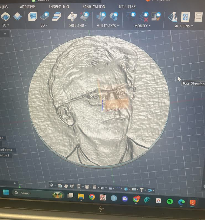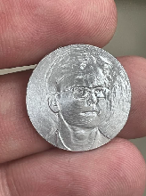

## 2. What You Need Before You Start

The hardware:

* The aluminum sheet stock material, which the coin will be made from. In this tutorial, a ~1.5mm thick sheet was used. Measure the stock material using calipers.
* Fixtures for the bed of the Carvera, such as clamps and the L-shaped corner bracket.
* A metal cutting bit and a metal engraving bit. In this tutorial, a 12mm endmill and a 60° 0.1mm engraving bit is used.
* Pliers and diamond filing tools for post-processing.

On the software side:

* Read the “**CAM Guide for Carvera CNC**” document.
* The Image2Surface add-in for Fusion360. This will be used to turn an image into a 3D heightmap mesh, which will become the surface of the coin.
* A picture for the coin. For best results, use a photo with a solid background and good contrast, such as a Linkedin headshot, where there is space between the subject and the edges of the image. There are online tools to give photos a solid background, if needed.

**2.1 Adding the Image2Surface Plugin**

* Download and unzip the file “**Image2Surface.zip**” found in the google drive folder of this learning assignment.
* Open the folder that was just unzipped. Inside, there should be a folder named “Image2Surface”. Copy this folder.
* Navigate to the folder **C:\\Users\\(user)\\AppData\\Roaming\\Autodesk\\Autodesk Fusion 360\\API\\AddIns**, and paste the Image2Surface folder here.

**2.2 Choosing and Editing an Image**

	The Fusion360 plug-in for this project works by grayscaling an image, and for each pixel, assigning a height value depending on the intensity (brightness) value of that pixel. With that in mind, there are some qualities that make some images better for this project than others:

* **A black or white background** to act as the top/bottom of the relief.
* **Sharp outer edges**.
* A range of light values.
* **Excess space** between the subject and the edge of the image. (With a rectangular image on a circular coin, some of the image will get cut off)

**Linkedin headshots**, such as the image below, work particularly well for this project and are an easy starting point. If the image has a background, there are online tools such as [remove.bg](http://remove.bg) that can replace it with a black or white background. Make sure the image is **downloaded as a .jpg**, not a .pdf or .png.

Other online tools, such as [Photoroom](https://www.photoroom.com/), can help edit an image to make a good heightmap. In the image of the puppy, the background is removed, the eye details were sharpened, and a black outline was added in order to create a sharp edge around the white paw.

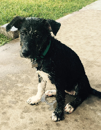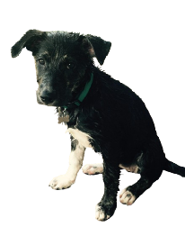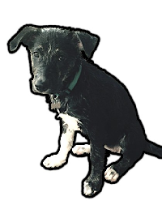

Drawing a circle on the image can help show how it will look on the coin, but note that if this circle is included in the final image, it will be part of the engraving.

## 3. Creating the CAD file for the coin

The plan is to create a 3D surface which will be used to split a cylinder, leaving a solid model of a coin with the desired pattern on it.

To start, create a new part file (with mm units) and navigate to the Design workspace.

**3.1 Model the Coin’s Shape**

For reference, a nickel is about **22mm in diameter**. Model a cylinder at the origin to represent the coin, about 22mm in diameter and about **0.1mm less than the height** of the stock material. The stock material used in this tutorial is ~1.5mm thick, so the cylinder is 1.4mm tall. Later on, we will instruct the Carvera to remove 0.1mm from the surface of the stock to ensure that we are engraving the coin on a smooth, even surface.

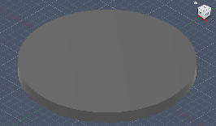

**3.2 Create the 3D Mesh using Image2Surface**

Find the Image2Surface plugin under **UTILITIES** \> **ADD-INS** dropdown. If it does not appear under the dropdown, click on “**Scripts and Add-Ins**” and enable Image2Surface in the popup menu.

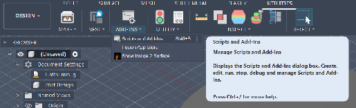

Turn your image into a 3D surface using the **Image2Surface plug-in**.

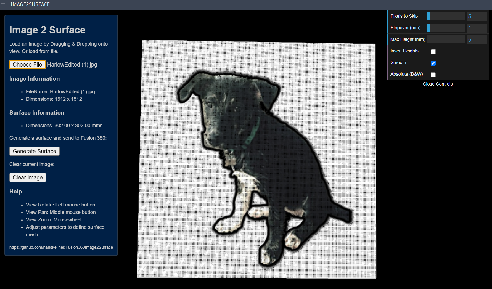

Notice the settings on the right hand side:

* “**Pixels to skip**” decreases the number of pixels turned into points on the mesh, which is useful to reduce the processing time, but reduces image quality.
* “**Stepover**” is the space between each point in the mesh. This is used to scale the mesh to the size we need.
* “**Max Height**” controls the distance between pure black and pure white pixels. For the 1.5 mm coin in this tutorial, set this to the minimum value of 1 mm.

	Recall the size of the coin \- in this case, 22mm in diameter \- and scale the mesh to be **slightly larger** than this size by changing the “Stepover” and “Pixels to Skip” values. Every image will have different settings based on image size and the size of the background.

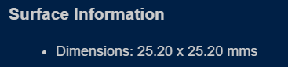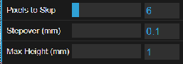

Finally, click “**Generate Surface**”.

Note that this mesh is **not** what the finished coin will look like.

**3.3 Use the Mesh to Split the Cylinder**

To use surface modeling tools in Fusion360, the mesh that was just created needs to be a surface with area. To turn the mesh into a surface, navigate to the **SURFACE** toolbar and click “**Create Form**” (The purple cube icon).

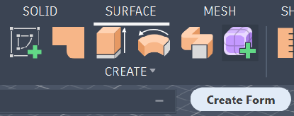

Select the mesh, then navigate to the **UTILITIES** dropdown and select **CONVERT**, and select the conversion “**Quad Mesh to T-Splines**”, then click OK. This may take a few seconds. When the shiny new surface is generated, click the green checkmark **Finish Form** button to finish this step.

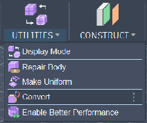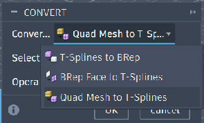

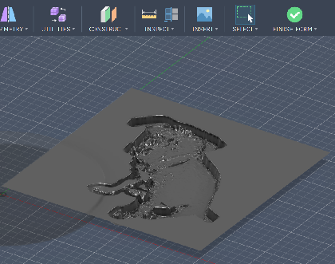

Next, move the surface onto the coin by clicking the surface and using the “**M**” key for “move”. Use the XYZ arrows to line up the image onto the coin as desired. **Make sure that the mesh extends past the cylinder on all sides**, or else it will not be able to split the cylinder.

If the mesh needs to be adjusted slightly, it can be scaled up or down using SURFACE \> MODIFY dropdown \> Scale.

By moving the surface above the coin and using the **top view**, the surface can be moved to the origin. Hover the mouse over the edge of the coin to reveal its profile and show how the image is aligned.

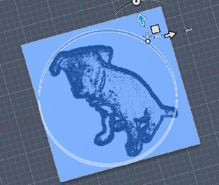

Once the XY position is lined up, use **side or front view** and drag the Z-position arrow to move the **highest point on the mesh** to **just below the top** **of the coin**, as shown. (The yellow in the image below is part of this mesh sticking out of the coin)

If the mesh seems to go more than roughly ⅓ through the coin, decrease its depth by using the **Scale** function previously mentioned, and use “**Non-Uniform Scaling**” to adjust only the Z axis scale.

(Optional) To have the image pop out of the coin instead engraved into it, use **Mirror** to flip the orientation of the mesh, and then reposition the surface into place. If you do this, make sure to use **SURFACE \> MODIFY  \> Reverse Normal** so that the gray side (positive direction) is on top, and the yellow side (negative direction) is on bottom.

The image on the left shows the normal orientation and scale of the mesh, and on the right it is mirrored and scaled.

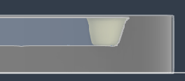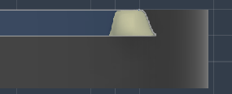

Finally, split the coin with the surface using the **Split Body** function, found in the **SOLID** toolbar \> **MODIFY** dropdown. Select the **cylinder** as the **Body to Split**, and use the **surface** as the **Splitting Tool**, then click OK.

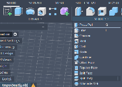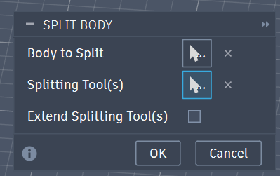

To show the cut that was just made, hide anything in the feature tree that is not the bottom of the coin by clicking on the eye icons. Rotating the camera, the final look of the coin can be seen.

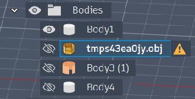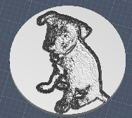

## 4. CAM Setup and Toolpath

Now, we will create instructions for the Carvera to make this coin. This involves defining the necessary tools, making the top of the stock material smooth and even, engraving the pattern, and cutting out the coin.

Navigate to the **MANUFACTURE** workspace in Fusion for this section of the tutorial.

### 4.1 Setup

Create a new setup by navigating to SETUP \> New Setup in the MANUFACTURE workspace.

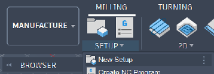

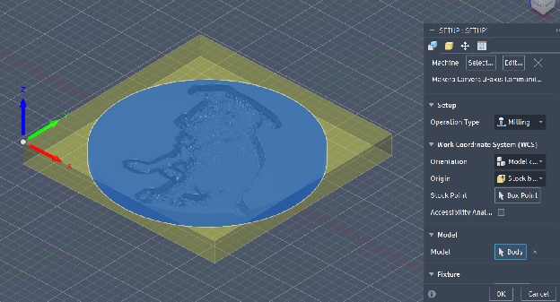

For **Machine**, select the Makera Carvera 3-axis.

The yellow box represents our stock material, which we will adjust next. Click on the top-front-left corner of the yellow box to select this as the origin.

Then, go to the Stock tab (yellow cube icon) of the SETUP window.
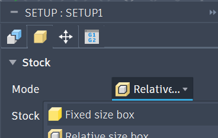

For **Mode**, select **Fixed Size Box**. This is where the size of the stock material and the position of the coin will be defined.

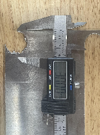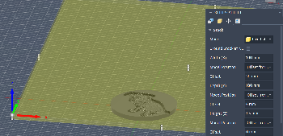

This aluminum sheet is sufficiently large, so here the dimensions are 100 x 100 x 1.5 mm. Using the calipers, 30mm is a safe distance between the left size of the stock and the left side of the coin (**Offset from Left Side (-x)** \= 30mm), and about 6mm is a safe distance from the front (**Offset from Front Side (-y)** \= 6mm).
Note that this is the **distance to the coin**, not distance to the cut around the coin. A ⅛” endmill is about 3.125mm, so by making a 6mm offset from the front, there will be about 2.875mm of aluminum from the front to hold the coin in place. This is important when making the tabs that will hold the coin in place, making sure this part of the stock material doesn’t get cut off or vibrate excessively from being too thin.
As seen in the left image, there is not enough material for a tab on the left side of the coin, and this will need to be accounted for when designing the tabs.

Next, navigate to the **Part Position** tab.
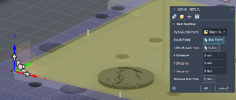

Select **Stock Box Point** as the **Part Attach Point** and select the **bottom front left** corner of the stock box. Notice that this represents that our stock box, the aluminum sheet, will be aligned to the corner of the L-bracket, the Carvera’s default anchor point.
To see only the stock box and coin, hide the Carvera by clicking the eye icon in the **Browser** \> **Setups** \> **Setup 1** \> **Makera Carvera 3-Axis**.

Now we have fully defined the work origin, the size of the stock material, and the position of the coin. Before creating the toolpath, the tools themselves need to be defined.

### 4.2 Tool Selection

This project involves two tools:

* **Engraving Bit for Metal,** for making the precise engraving of the image.
* **Endmill for Metal,** for facing off the stock material and cutting out the coin.

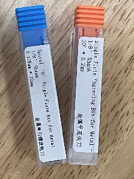

For the chosen tools, navigate to the manufacturer’s website and find the **size information** and the **feeds & speeds** **for aluminum.**

| 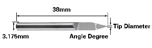 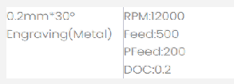  | 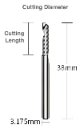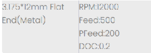 |
| :---: | :---: |

Create the tools in Fusion by navigating to MANAGE \> Tool Library, and adding a new tool. The endmill is a **Flat End Mill** and the engraving bit is an **Engrave/Chamfer Mill**. Modify the tool properties in the **Cutter** and **Cutting Data** tabs using manufacturer information, or lengths measured with calipers. By changing the **Spindle Speed (RPM)**, **Cutting Feedrate (Feed), and Plunge Feedrate (Pfeed)**, most of the other values should calculate themselves (this is shown with the “fx” icon). For the **Depth of Cut (DOC)**, go to **Passes and Linking \> Use Stepdown \> Stepdown**.

Finally, in the **Post Processor** tab, give each tool a number between 1 and 6.

|  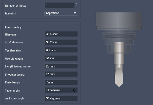 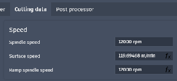  | 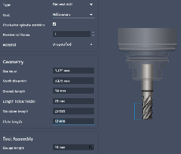 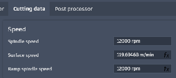 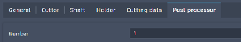 |
| :---- | :---- |

### 4.3 Facing the Stock Material

	This is where the coin will begin to come to life.

	Start by facing off the coin to create a smooth, even surface. Select **Face** in the **2D** toolpath dropdown.

* For the **Tool**, select the flat endmill that was created earlier. It should already have the feeds and speeds information filled out, but make sure these numbers look correct.
* For **Geometry**, select the top face of the coin. It may appear to select the lowest point of the surface, and this is okay. The next tab will show where the actual cut is made.
* For **Heights**, nothing needs to be adjusted. See the images below. Using the side view, make sure that the deep blue line (the **Bottom Height**) is at the top of the coin (**Model Top**). This shows that the tool will remove all stock material that exists above the top of the coin, creating a smooth even surface.
* For **Passes**, as long as the stepover is less than the diameter of the tool, the stock will be faced effectively. **2mm** here is good enough to reduce tooling marks for the 3.125mm tool.

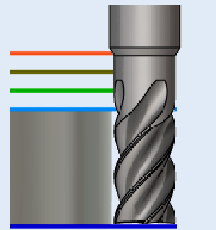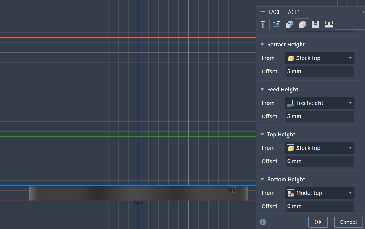

Clicking **OK** will reveal the first toolpath for this job:
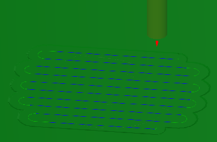

Here, green is the stock material, and we can see the material that has been removed to make our coin surface.

### 4.4 Engrave the Coin Image

To engrave the coin, use **Morphed Spiral** under the **3D** toolpath dropdown.

* For the **Tool**, select the engraving bit that was created earlier. Once again, make sure the feeds & speeds look correct.
* For **Geometry**, use the default settings. “**Machining Bound**” should be set to **“silhouette”**.
* For **Heights**, nothing needs to be adjusted.
* For **Passes**, note the tip size of the engraving tool. In this tutorial, the tip of the tool is 0.2mm. So, for a highly precise coin, the stepover should be **0.1 mm.** For a less precise, faster process, something like **0.2mm** or slightly larger can be used.

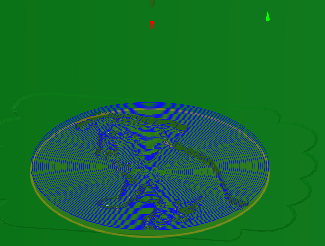

### 4.5 Cut Out the Finished Coin

To cut the coin out of the stock material, use **2D Contour** under the **2D** toolpath dropdown.

* For the **Tool**, select the flat end mill.
* For **Geometry**, select the outside edge of the coin.
  * Select **Tabs** to add blocks that will hold the coin in place while this cut is made. Three tabs should be enough. Remember to keep in mind the stock material and where these tabs should be placed.
* For **Heights**, nothing needs to be adjusted.
* For **Passes**, select **Multiple Depths** and set the stepdown sizes to **0.2mm**, consistent with the manufacturer’s recommended depth of cut.

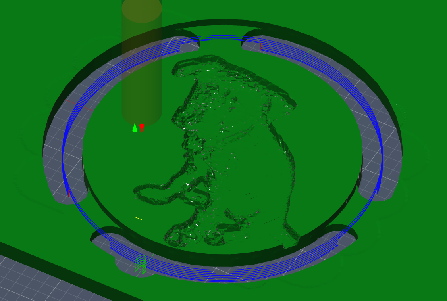

Now the toolpath has been fully defined, and the coin can be sent to the Carvera for milling.

To see how the Carvera will make this part, simulate the milling by selecting **Actions** \> **Simulate with Machine.**

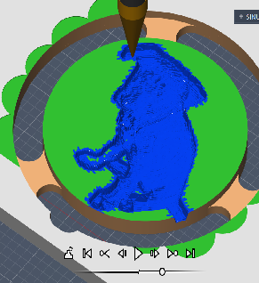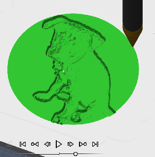

Here, the 0.2mm stepover doesn’t bring enough quality to the image because of the sharp changes in height. Seeing this simulation, the morphed spiral stepover was changed to 0.1mm, and can be lowered even further to trade machining time for extra precision in the engraving.

## 5. Creating the Coin with the Carvera

### 5.1 Export from Fusion, Upload to Carvera

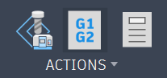

Navigate to **ACTIONS** \> **Post Processing** (the G1G2 icon). In the popup window, change the file name and save the G-code file.

Next, connect to the Carvera using the Carvera Controller app.

Use the document button in the bottom left and click **Upload File**. Find the G-code downloaded from Fusion, and click **Upload and Select**.

Clicking the arrow on the right side of the controller app brings up a preview of the G-code.

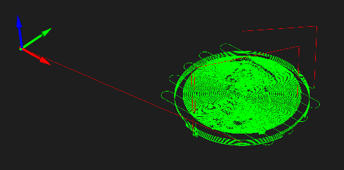

This is useful to visually check multiple things on the [checklist](https://docs.google.com/spreadsheets/u/0/d/1ViTiqQyEoflTdvnngzUehGwnDOnr0iL4d97xEuyk8TQ/edit):

* The G-code **includes all processes**, and not just one, which can happen when an operation is selected in Fusion during export.
* The **work origin** looks correct, leaving space between the corner and where our coin is.
* The facing operation takes up more space than the coin, but **there will not be any fixtures there.** In the image below, see how the green square does not overlap with the L-bracket.
* The **tabs and their positions** will stop the coin from separating during machining.

If the preview looks correct and passes all checklist items, select the **Start File** gear icon in the bottom left corner.

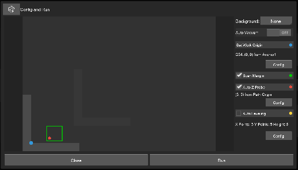

This project was designed with the origin at the corner of the L bracket, so set the work origin to the blue **Anchor 1** with an offset of (0,0).

Next, the fixtures and the material itself needs to be set in place.

### 5.2 Material, Fixtures, Tools

With the digital side taken care of, it’s time to get the stock material into place to be machined. In this project, a thin sheet of aluminum is attached to the bed of the Carvera, with the bottom left corner being the reference point for the CAM instructions.

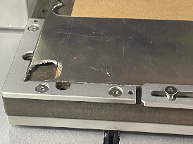

Notice a few important things:

* An **MDF waste board** is placed beneath the cutting area of the aluminum sheet. Since this operation will cut through the aluminum sheet, this waste board will make sure the actual bed of the Carvera is not damaged.
* The **L-bracket** used as a reference for the work origin is secured tightly in place, with the stock material securely pushed up against it.
* On the right side of the image above, a **top clamp** holds the aluminum in place. Outside of the image, more fixtures are holding the stock in place. The thin sheet of aluminum will vibrate while being machined, so the more securely attached it is, the better the final part will turn out.

The only thing left now is to make sure that the Carvera has the correct tools in the correct places. Recall **creating the tools in Fusion for section 4.2** and giving each tool a number between 1-6. Now, make sure those tools used in CAM are in the correct numbered tool slots in the Carvera on the right side of the bed.

Once the hardware is in place, it is time to run the CAM instructions.

### 5.3 Machining

Watch closely to make sure that the Carvera is following the instructions as intended. Keep the **emergency stop button** within reach while watching the machine work.

The first operation run by the Carvera is the **facing operation** programmed in section 4.3:

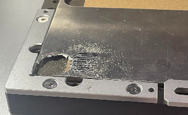

From the way this part was fixed, notice that more material was removed from the left side of the working area than the right side, showing that the aluminum sheet was uneven on the bed. This is why it is important to fix the stock to the bed securely in a way that does not warp the material, as it did here. Nevertheless, it is now a flat surface according to the Carvera’s coordinate system.

Next, the engraving process begins:

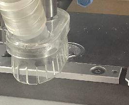

And finally, the coin is cut out from the stock material, leaving three tabs to hold it in place:

Here, it looks like vibration or the uneven stock material caused it to not fully cut through the aluminum sheet, but left a very thin layer at the bottom.

This thin layer and the tabs can be removed with snips or wire cutters once the coin is removed from the machine.

Gloves and safety glasses are recommended for cleaning up the edges of the coin, since they can be extremely sharp. After smoothing the edges with a metal file, the 2D relief coin is complete.

## 6. User Responsibilities After Use

After using this machine, you are responsible for:

* Cleaning the inside of the machine of loose chips and dust.
* Returning tools, stock material, and fixtures to their proper storage.
* Turning off the machine.

If you have questions or need assistance at any point, ask a **Fab Lab staff member**. Staff are always present during operating hours.

---

**End of Operations Manual**
