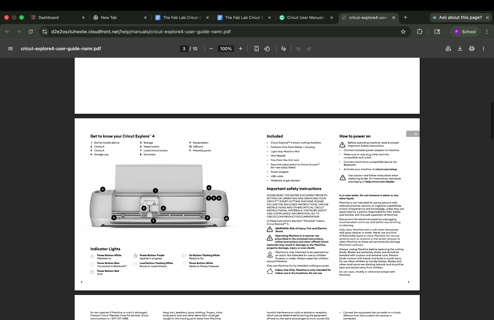
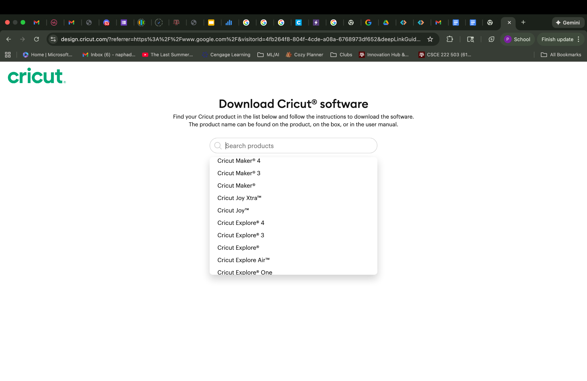
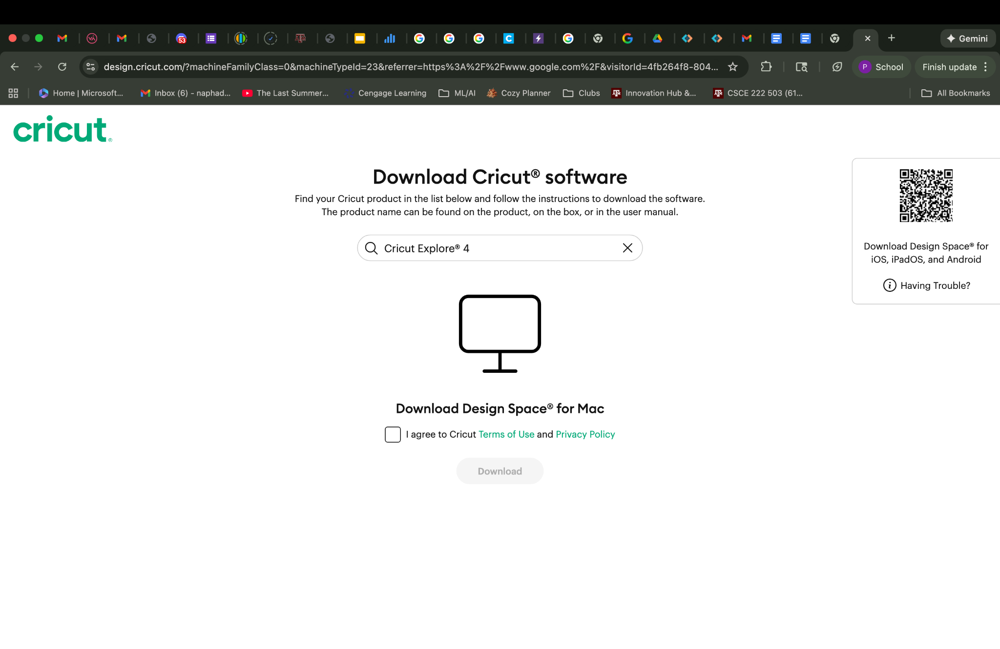
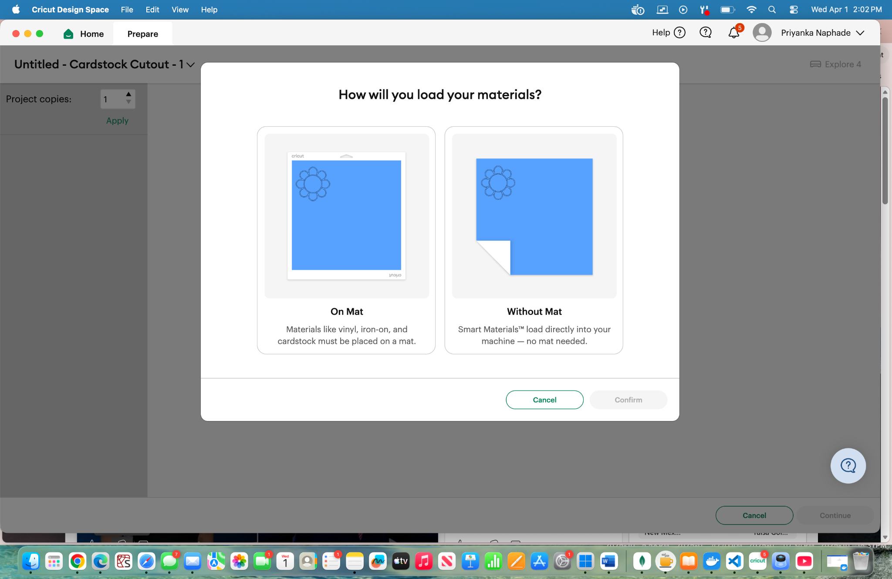
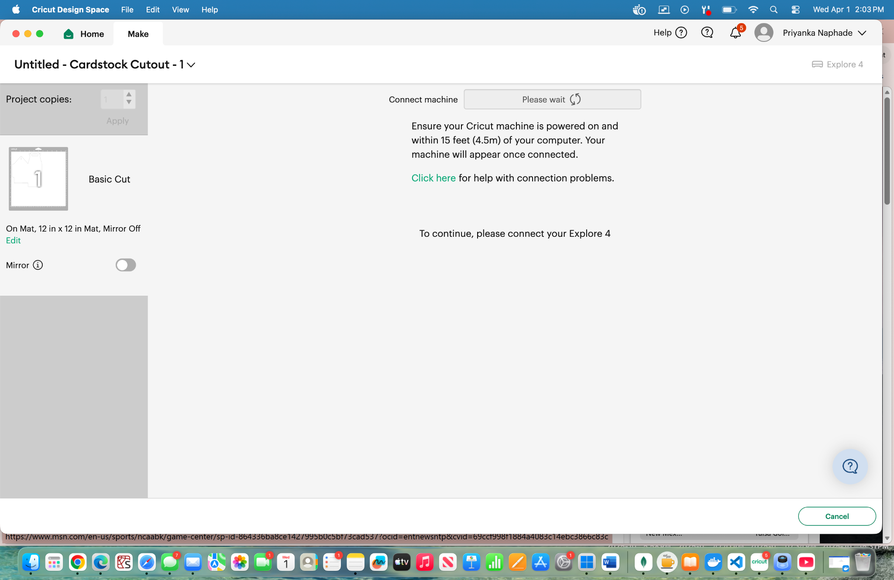
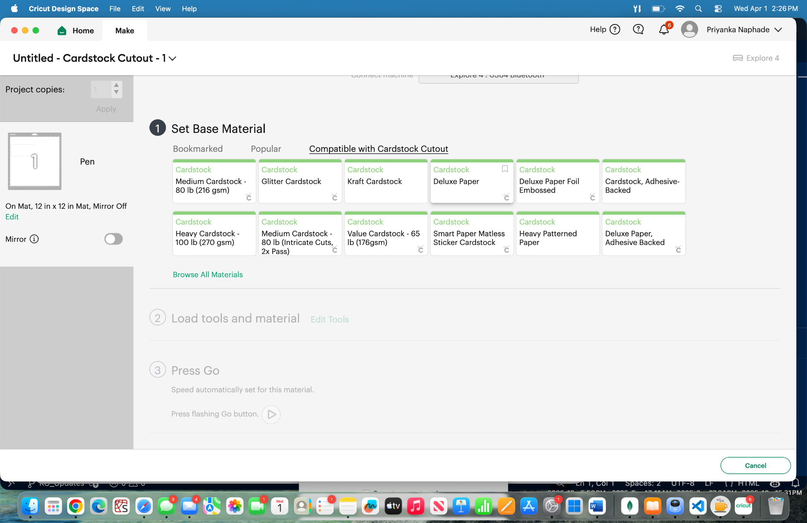
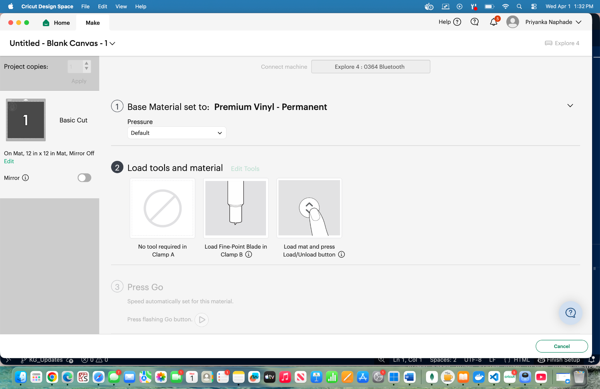
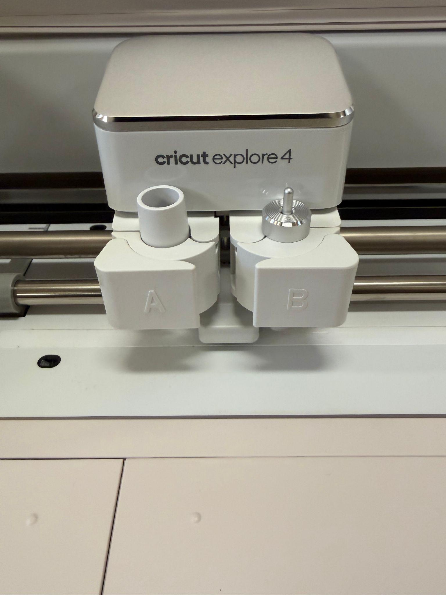
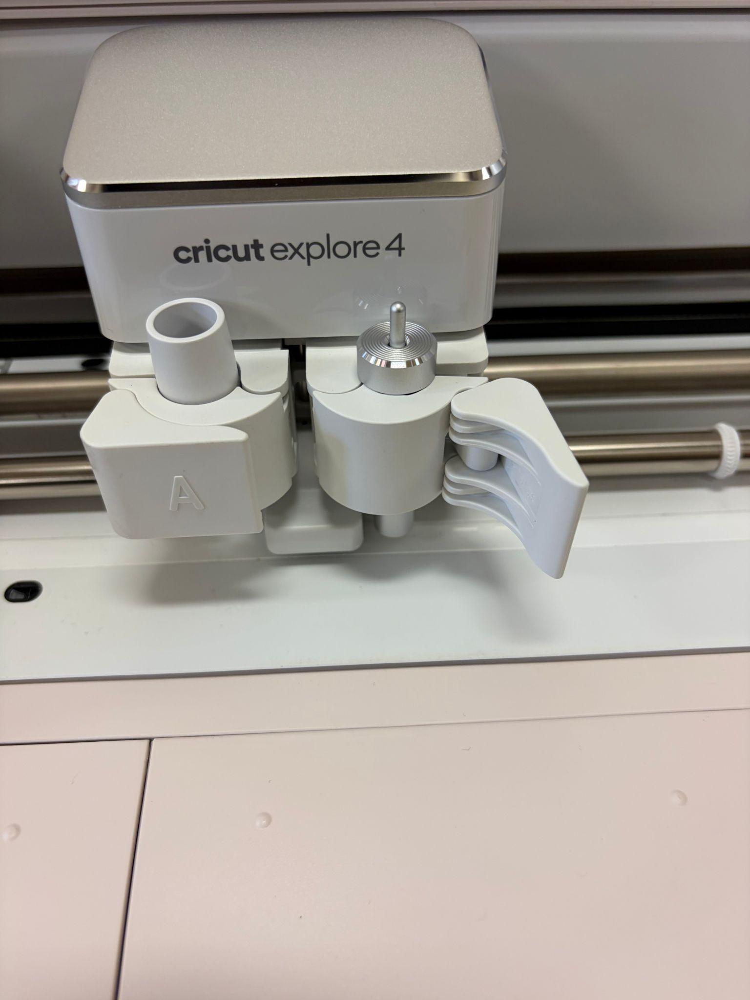

Cricut Operations Manuel 

Machine Name: Cricut Smart Cutting Machine | Explore 4 

Location: The Fab Lab

Version: v1.0

Last Updated: 4/11/26

Responsible Student Worker: Priyanka Naphade

Linked Safety Manual: [Safety Manuel](/docs/cricut/operations--safety-manuals/the-fab-lab-cricut-safety-manual/)

## 1\. What This Machine Is For

Use this machine to:

  * Cut and engrave various materials

  * List of materials that this machine can cut can be found here: [Which materials can I cut with my Cricut smart cutting machine? – Help Center](<https://www.google.com/url?q=https://help.cricut.com/hc/en-us/articles/360009504773-Which-materials-can-I-cut-with-my-Cricut-smart-cutting-machine%23explore-machines&sa=D&source=editors&ust=1776804294588118&usg=AOvVaw2sABkp8g4hbxnqhNp_457m>) (Click the Cricut Explore Machines then the Cricut Explore 3 & Explore 4 tab to find the list ) 

## 2\. What This Machine Is Not For

Do not use this machine for:

  * If the material is not in[ this list](<https://www.google.com/url?q=https://help.cricut.com/hc/en-us/articles/360009504773-Which-materials-can-I-cut-with-my-Cricut-smart-cutting-machine%23explore-machines&sa=D&source=editors&ust=1776804294588495&usg=AOvVaw3E8d_y0yI7SmqA27tZPtbT>) do not use it in the machine 
  * Do not use this machine to cut anything thicker than 2.0mm
  * Thick wood, metal, or glass materials 
  * PVC 
  * Food 
  * Leather 
  * Reflective materials 

## 3\. What You Need Before You Start

Before operating this machine, ensure:

  * [S](/docs/cricut/operations--safety-manuals/the-fab-lab-cricut-safety-manual/)[afety Manual](/docs/cricut/operations--safety-manuals/the-fab-lab-cricut-safety-manual/) acknowledged
  * Material to be cut: Paper, vinyl, HTV, fabric, metals, wood
  * Cricut design space 

## 4\. Machine Overview

             

                                                     

Power(6) \- This is the button that turn the machine on and off

Pause / Emergency Stop(9) \- Will stop the machine whenever it is pressed, even in mid but

Go / Start Project(8) \- Pushing this button when it is lit up will prompt the machine to start the cut. 

Load(7) \- When this button is pressed the machine will start to detect and measure the size and material that is being fed into it. 

Open Machine(12) \- This button will open the panels that cover the cutting apparatus portion of the machine. 

                                         

## 5\. Basic Operating Workflow

### 5.1 Start-Up

If using lab computers, open the Cricut Design Space application. Then upload or create your project file. 

If using personal device first set up software (First time use)  

  1. Go to this website [Cricut Design Space](<https://www.google.com/url?q=https://design.cricut.com/?referrer%3Dhttps%253A%252F%252Fwww.google.com%252F%26visitorId%3D4fb264f8-804f-4cde-a08a-6768973df652%26deepLinkGuid%3Dd9460574-036f-4575-b553-6d04e986ecf6&sa=D&source=editors&ust=1776804294590418&usg=AOvVaw39f9cJ3zSmZH8rUBmJJ_3o>)

  1. Download Cricut Design Space onto your computer 
  2. The machine is a Cricut Explore 4, select this from the drop down menu of options 

 

  2. Agree to the terms and conditions and download the application. 
  3. Open the application on your computer and create a Cricut account if prompted 
  4. Turn on the machine by pressing the power button (6), it is on the right side of the machine
  5. Follow the prompts on the Design Space app

  1. When asked about connections, select bluetooth, make sure bluetooth is enabled on your device. 
  2. When the machine is pairing with your laptop or lab computer the power button (6) will flash blue. 
  3. If errors occur, consult the lab staff. 

### 5.2 Running a Job

  1. Ensure that the Cricut is paired with the lab computer 
  2. Open the machine by pressing on the button on the left side of the machine which has raised circles or button 12
  3. If using a material that required a mat (Materials that need a mat typically have a backing of some sort, the box that the material comes from will say smart materials if it does not require a mat):

  1. Peel the plastic off of the mat, and save the plastic keep it in a safe place
  2. Take the material you are to cut and line it up on the mat and place it down, make sure the mat is firmly attached. 

  4. After creating / loading your design into design space click make 

  1. Follow and answer the prompts 

Unless you are using smart materials, you should select On Mat

Ensure the cricut is paired with the lab computer 

             

Select the correct material, clicking browse all materials and specifically searching may be necessary. 

            

Follow the instructions and prompts given to initialize and start the cut 

  2. Make sure you’ve selected the right sized mat if your cut requires a mat, as well as the correct material 

  5. When prompted to load tool, pull the appropriate tab on the machine open and load the tool      

|   
---|---  
  
  3. Sometimes this means taking the tool out of the machine and placing it back into the machine 

  6. Eventually the prompts on design space will ask you to load the materials, to load the materials line your material or mat up with the first row of rollers and press the load button(7). 

  1. Let go of your material after the machine has gripped it otherwise hold onto the material. If it is not gripped correctly then your engraving / cut will not come out correctly. 

  7. Press the play / go button (8) once is starts flashing, this will start the cut 

  1. Make sure there is adequate space behind the machine and wall, at least 12 inches. 

  8. During operation, confirm that:

  1. There are no sparks, irregular loud noises, or smoke / burning like smells. 

### 5.3 End-of-Job / Shutdown

  1. Press the unload button(7) to release the project
  2. Peel the material off of the mat and extract your products. 
  3. Turn the machine off by clicking the power button (6) and gently lift and close the panels to close the machine. 

  1. If there are scraps in / around the machine clean it up 

## 

## 6\. User Responsibilities After Use

After using this machine, you are responsible for:

  * Returning the materials to the proper locations 
  * If there are any problems with the machine report it to the staff 
  * Clean up the area, don’t leave a mess. 

## 7\. Stop Conditions

Stop immediately and notify Fab Lab staff if:

  * Abnormal noise or motion 
  * Smoke, sparks, or odors 
  * Unexpected machine behavior 
  * You are unsure how to proceed 
  * Unresolvable Error Messages 

Do not attempt to troubleshoot major issues yourself.

## 8\. Common Issues & What To Do

  * How to pair cricut with computer 

  * Ensure that bluetooth is enabled on your device. 
  * After downloading design space when asked for connection type select bluetooth

  * Make sure the cricut machine is powered on while this process is happening

  * Bluetooth not connecting

  * Go to the bluetooth settings in the lab computer itself and connect from there
  * If this still doesn’t work, power on and off the cricut by unplugging it and plugging it back in.
  * If this still doesn’t work exit out of the design space software and reopen your project. 

## 9\. External Resources

For more detailed information, refer to:

  * [Cricut User Manuals – Help Center](<https://www.google.com/url?q=https://help.cricut.com/hc/en-us/articles/360055603134-Cricut-User-Manuals&sa=D&source=editors&ust=1776804294595468&usg=AOvVaw2LX4wi_pHEtVsSQrNkAYmP>)
  * [The Ultimate Cricut Beginner Guide](<https://www.google.com/url?q=https://cricut.com/blog/gb/the-ultimate-cricut-beginner-guide/&sa=D&source=editors&ust=1776804294595608&usg=AOvVaw0TvY8ULK8qqyuVj2GNGwbq>)  

## 10\. Questions or Help

If you have questions or need assistance at any point, ask a Fab Lab staff member. Staff are always present during operating hours.

* * *

End of Operations Manual