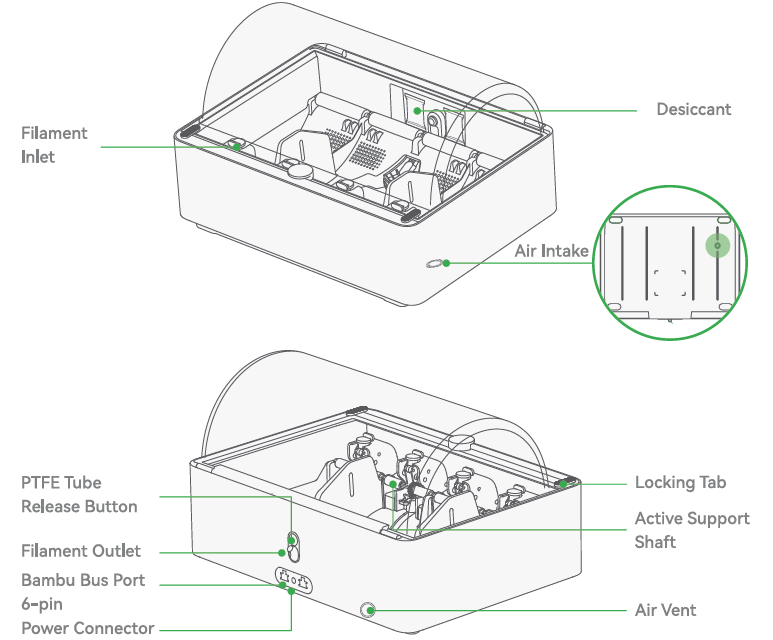

The Bambu Lab X1 Carbon builds parts one thin layer at a time, melting plastic filament and drawing each layer onto a heated plate — fused deposition modeling, or FDM. It's the lab's workhorse: prototypes, brackets, enclosures, jigs, replacement parts, and anything else you'd rather hold than look at on a screen. Most parts come off in a few hours. The Fab Lab has **four** of them — **George**, **John**, **Paul**, and **Ringo** — and each one can print in up to four colors or materials at once from its **AMS** (Automatic Material System) filament changer. Your part has to fit inside a **256 × 256 × 256 mm** cube. If you're not sure this is the right machine for your project, ask a staff member.
<!-- TODO: link /docs/which-machine/ at the end of the intro once that page exists -->

> [!WARNING]
> **The nozzle and the build plate get hot enough to burn you.** The nozzle runs up to 300 °C and the plate up to 100 °C, and both stay dangerous for several minutes after a print ends. Never reach into the chamber to touch the toolhead or the plate.

> [!WARNING]
> **Keep the chamber door and the glass lid closed while a print is running.** The toolhead moves fast, without warning, and won't stop for your hand. If you need to get inside, stop the print first.

:::caution[EMERGENCY STOP]
Tap **Stop** on the printer's touchscreen — that cancels the print and parks the toolhead. To cut power completely, flip the **power switch on the back of the machine**, next to where the power cable plugs in. Tell a staff member either way.
:::

:::caution[SMOKE OR BURNING SMELL]
Stop the print, cut power at the rear switch, and get a staff member immediately. **Keep the chamber closed** — the enclosure contains the problem, and opening it feeds it air. Warm plastic has a mild smell; smoke, an acrid burning smell, or scorching does not belong and is never something to wait out.
:::

> [!NOTE]
> **No PPE is needed for this machine.** No goggles, no gloves, no mask. Tie back long hair and keep loose sleeves and drawstrings clear of the chamber when it's open, and you're set.

## Before you start

- **No training or checkout is required.** Read this page, then go print. If it's your first time, staff are happy to stand with you — just ask.
- Bring a **3D model file**: `.stl`, `.obj`, `.3mf`, or `.step`. Bambu Studio opens all of them.
- **To get your file onto a lab computer**, email it to **meloy.FabLab@gmail.com**, then open Gmail on a lab computer and download it there. A USB drive works too.
- Your part must fit inside **256 × 256 × 256 mm**. Bigger than that and you either split it into pieces or use a different machine.
- **Approved filaments:**
  - **PLA** and **PETG** — go ahead, no questions asked.
  - **TPU** (the flexible one) — allowed, but ask a staff member to set it up. TPU is too soft to feed reliably through the AMS, so it runs off the external spool holder instead.
  - **ABS** and **ASA** — check with a staff member first.
  - **Nylon**, and any **carbon-fiber- or glass-filled** filament — not approved on these machines.
- **Lab filament is free** — use whatever's already loaded in the AMS. You're also welcome to bring your own, as long as it's on the list above. If you have something that isn't listed and you think it should be, ask a staff member rather than loading it and finding out.
- **Keep the door closed while printing.** With it shut, the chamber's activated-carbon filter handles what little the plastic gives off. (It's also why ABS and ASA need a staff OK — those are the ones that actually smell.)
- **Don't touch the top surface of the build plate.** Skin oil is the single most common reason a print won't stick. Pick the plate up by its edges or the tab at the front.

## Machine overview

The parts you'll actually touch are few:

- **Touchscreen (1)** — everything you can control at the machine itself: filament, print status, and stopping a job.
- **Build plate (13)** — the removable gold **Bambu Textured PEI Plate** your part prints on. It lifts straight out and goes back in the same way. This is the only plate the lab runs, and it handles PLA, PETG, and ABS.
- **Micro SD slot (8)** — you won't need it. Jobs come over the network from Bambu Studio.

Everything else inside the chamber — the rods, belts, fans, lidar, cameras, and the bed leveling knob — is calibrated. Leave it alone.

Two more worth locating before you start. The **Pause** and **Screen Sleep/Wake** buttons sit on the front face just to the right of the touchscreen. The **excess chute** is on the back — the printer spits purged filament out of it, so the little coils of plastic on the floor behind the machine are normal, and clearing them up is part of finishing up.

## Loading filament into the AMS

Most of the time something usable is already loaded and you can skip straight to [Operating](#operating). To check, tap the **filament icon** in the touchscreen's left-hand toolbar. You'll see what's in each of the AMS's four slots — **A1** through **A4** — plus the external spool holder, labelled **Ext**.

To add a spool:

1. Open the AMS lid. Flip the two **locking tabs** at the front corners to release it.

   

2. Drop the spool into a free bay so the filament comes **over the top of the roll and toward you**.

   

3. Push the end of the filament into that slot's **filament inlet** — the small grey funnel in front of the bay. The AMS grabs it and pulls it in on its own.

    

4. Close the lid and re-latch both tabs. The AMS holds desiccant to keep the spools dry, and it only works with the lid sealed — filament that sits in humid air prints badly.

5. Tell the printer what you loaded. Bambu Lab spools carry an RFID tag and identify themselves, so their type and color just appear on the touchscreen next to an eye icon. Any other spool shows a **pencil icon** instead: tap that slot, tap **Edit**, set the material (**Generic PLA**, **Generic PETG**, and so on), set the color to match the spool, leave the temperatures at their defaults, and tap **Confirm**. Setting the color isn't cosmetic — it's how you tell the spools apart in Bambu Studio when you assign filaments to parts.

    

## Slicer settings

Bambu Studio's defaults are good, and most parts slice fine without touching any of this. These are the settings worth understanding for when you do want to change something:

- **Layer height** — how thick each layer is. Smaller means smoother curves and a longer print. The 0.2 mm default is right for almost everything.
- **Infill density** — how solid the inside is. 0% is hollow, 100% is solid plastic. The default is plenty for display parts; raise it for something that has to carry a load. Past roughly 50% you pay a lot of time and filament for very little extra strength.
- **Infill pattern** — the shape of that internal lattice. Leave it alone unless you have a specific reason.
- **Wall loops** — how many perimeters the printer traces around the outside of each layer. Adding walls is usually a cheaper way to buy strength than adding infill.
- **Top/bottom shells** — how many solid layers cap the part. Too few and flat top surfaces come out with visible pinholes.
- **Brim** — a flat collar of plastic fused to the first layer, widening the part's footprint. Turn it on for tall or narrow parts that might otherwise peel off the plate.
- **Skirt** — a loop printed near the part but not touching it, to get filament flowing cleanly before the real first layer starts. On by default.

### Supports and overhangs

An **overhang** is any part of the model with nothing underneath it — the printer is being asked to draw a layer onto thin air. Cut this base open and you can see them, inside and out:

Shallow overhangs print fine on their own, because each layer only has to hang slightly past the one below it. Steep ones need **support**: sacrificial scaffolding the slicer prints underneath and you snap off afterwards.

To add it, open the **Support** tab, tick **Enable support**, and set the **threshold angle** — anything overhanging by more than that gets scaffolding. **45°** is the conventional setting and a good default. This printer copes better than most with unsupported overhangs, especially where one grows out of an existing wall, so slice once without support and look at the preview before you assume you need it. Support costs time and filament and leaves marks where it touched the part.

## Operating

1. **Find a free printer.** A printer mid-job shows its progress on the touchscreen. Note which one you're taking — the name is on a label on the front of the case, and you'll need it in Bambu Studio.

   

2. **Check the plate.** It should be empty and clean. If someone left a part behind, check the finished-print shelf before you assume it's abandoned.

3. **Check the filament.** Tap the filament icon on the touchscreen and confirm what you want is loaded. If it isn't, see [Loading filament into the AMS](#loading-filament-into-the-ams).

4. **Get your file onto the lab computer** — email or USB, as above — and open **Bambu Studio**.

5. **Pick your printer.** Go to the **Device** tab, click the printer name in the top-left corner, and choose the machine you're standing at.

   

6. **Sync the printer's settings.** Back on the **Prepare** tab, click **Sync info**. That pulls in the plate type and the AMS contents so the slicer plans for the real machine. Leave **Printer**, **Nozzle Diameter** (0.4 mm), and **Flow** exactly as they are.

   

7. **Sync the filament list.** In the **Project Filaments** bar, click the **AMS icon**, then open the **Overwrite** tab and click **Synchronize now**. Your project's filament slots now match the spools in the machine.

   

8. **Import your model.** Go to **File → Import → Import 3MF/STL/STEP…**, select your file or files, and click **Open**. If it asks whether to load them as a single object with multiple parts, click **No** — keeping them separate is what lets you assign a different filament to each and move them independently.

   

9. **Lay the parts out.** Everything imports stacked at the center of the plate, which would print them on top of each other. Drag them apart by hand, or click **Arrange all objects** and then **Arrange**.

    

10. **Assign filaments** — multi-color prints only. In the right-hand panel switch **Process** to **Objects**, then set each row's **Fila.** column to the slot you want that part printed from.

    

    Wherever the print changes color mid-layer, the slicer adds a **purge tower** — a throwaway block it wipes the old color into so the new one comes out clean. Expect it; that's the cost of multi-color printing, and it's why a two-color part uses more filament than you'd guess.

11. **Adjust settings if you need to** — see [Slicer settings](#slicer-settings). The defaults are fine for most parts.

12. **Slice it.** Click **Slice plate** in the top right. When it finishes, drag the two sliders in the preview to step through the print layer by layer. Look for anything floating unsupported, supports somewhere you don't want them, and a first layer that covers the footprint you expect.

13. **Send it.** Click **Print plate**. Check the dialog before you commit: the right printer name, the right plate type, the right filament in each slot, and a print time and filament weight you're happy with. Then click **Send**.

    

14. **Stay and watch the first layer go down.** The printer runs its own checks first — bed leveling, flow calibration, a purge line down the side of the plate — before it starts your part. A good first layer is smooth and even, stuck flat to the plate, with no gaps and no clumps being dragged around.

> [!WARNING]
> Stop the print from the touchscreen and get a staff member if the first layer won't stick, if the nozzle is dragging through what it just laid down, if nothing is coming out at all, or if you hear grinding or knocking. A bad first layer never recovers on its own — it turns into a bird's nest of plastic around the toolhead, and digging that out is a staff job.

15. Once the first layer is down cleanly, **you're free to leave.** Come back for your part when the print finishes. Bambu Studio's **Device** tab and the chamber camera let you check on it from anywhere.

16. When it's finished, **wait for the bed to cool** before touching anything. The touchscreen shows the bed temperature — give it until it's close to room temperature. Pulling a part off a hot plate warps flat surfaces, and the plate itself is at 100 °C during a print.

17. **Lift the whole build plate out** and take it to a bench. Flex it gently and the parts pop off with almost no force. Don't pry at a part with a screwdriver or a knife — you'll gouge the PEI surface and ruin the plate for everyone after you.

## Finishing up

- **Put the build plate back** in the printer, seated flat and pushed against the back stop.
- If you touched the print surface, or the part left residue behind, **wash the plate with dish soap and hot water** — that's what actually lifts skin oil off the texture — and dry it completely before it goes back in.
- **Clear the excess chute.** Those coils of purged filament behind the machine are from your print. Bin them.
- **Bin the stray strands, the skirt, the purge tower, and any support material** you snapped off, from both the plate and the bench.
- Tell a staff member about anything that went wrong or looked off, even if you worked around it.
- **Take your project and any filament you brought with you** — the lab has no storage.

## Common problems

**The first layer won't stick, or corners lift off the plate.** Nearly always skin oil on the plate: wash it with dish soap and hot water, dry it, and handle it by the edges from then on. For a tall or narrow part, turn on a **brim** to widen its grip. Check as well that **Sync info** picked up the right plate type, since the slicer sets bed temperature from that.

**Nothing is coming out of the nozzle.** Stop the print from the touchscreen and get a staff member. A blocked nozzle needs a cold pull, which is a staff job — don't poke anything into the nozzle and don't try to force filament through by hand.

**The filament snapped between the AMS and the toolhead, or the AMS is grinding.** Stop the print and get a staff member. Clearing a broken end out of the feed tube means taking part of the filament path apart.

**The print came loose and it's now printing into thin air.** Stop it from the touchscreen straight away and get a staff member. Letting it run buries the toolhead in plastic and turns a five-minute fix into a long one.

**Bambu Studio can't see the printer.** Confirm you picked the right name in the **Device** tab, that you're on a lab computer, and that the printer's touchscreen is awake. Click **Sync info** again. If it still won't connect, tell a staff member — don't re-bind the printer or enter access codes yourself.

**Layers are visibly shifted partway up the part.** Something knocked the toolhead off course, usually the print curling up into its path. The part is not recoverable; cancel it, and tell staff before you start another job on that machine.
