Bambu X1C 3D Printer Learning Assignment

**Machine Name:** Bambu Lab X1 Carbon (X1C) 3D Printer

**Location:** The Fab Lab

**Version:** v1.0

**Last Updated:** 3/14/26

**Responsible Student Worker:** Aidan Spira

**Linked Operations Manual:**[Link Here](/docs/fdm-printers/bambu-labs-x1c-3d-printer/operations--safety-manuals/bambu-lab-x1c-3d-printer-operation-manual/)

## 1\. Purpose of This Learning Assignment

This document outlines the fundamental information required to operate the Bambu Lab X1 Carbon (X1C) 3D Printer in The Fab Lab. It focuses on:

  * Model preparation
  * Slicing in Bambu Studio
  * Supports and overhangs
  * Print monitoring
  * Proper part removal

Completion of this assignment qualifies the user to operate this printer without staff supervision.

We will be making a larger-scale lego flower:) – Consider it your “welcome” gift to the Fab Lab! -The team

**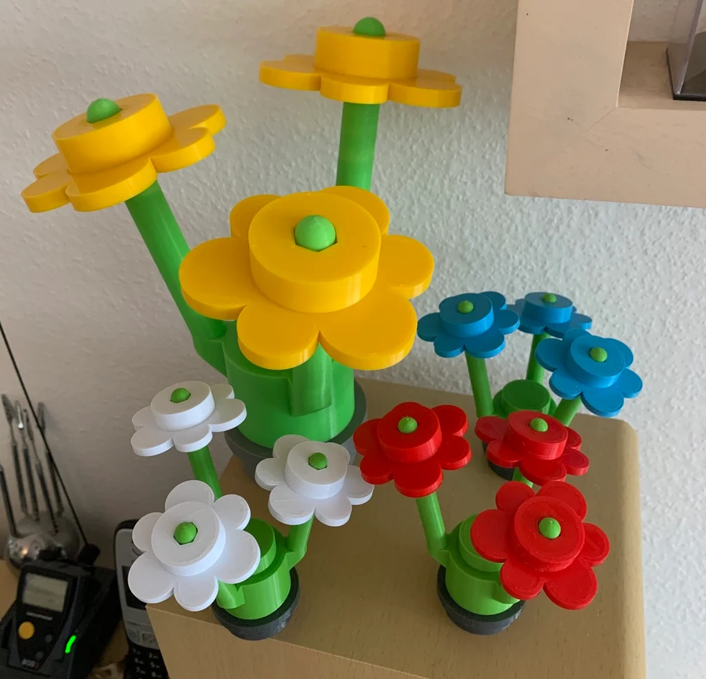**

## 2\. Preparing the Printer

Trainees will first ensure there is a printer not in use. Next they will note the printer name, as well as what 3D printing bed type is on it. Depending on your filament choice, some build plates will not work/be less suitable. For this project, I will use a mixture of PLA & PETG, therefore we require the “Bambu Textured PEI Plate”, but if only PLA was used, the smooth build plate may be used. (Not pictured is our cool plate, which only accepts PLA). Read the build plate and your material before usage. The name is printed on the device, or if you know your rock-stars, you can determine the name that way as well!

## 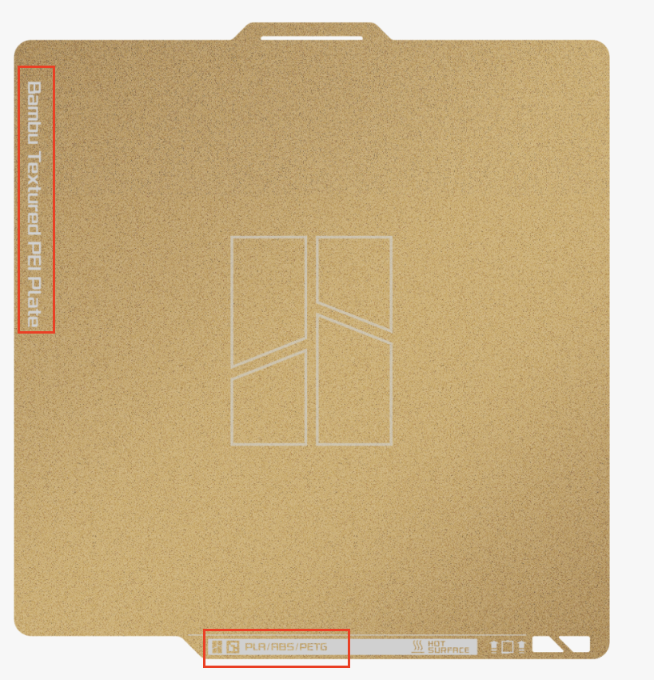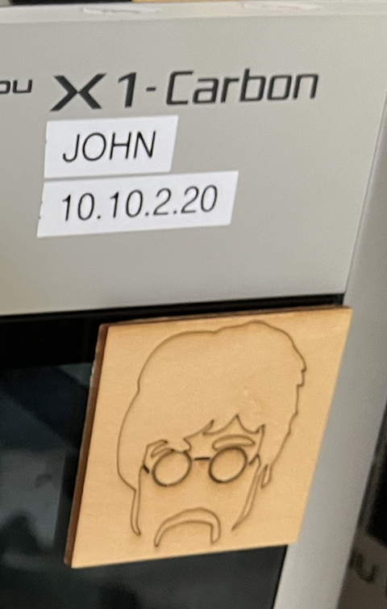

Now we will load the desired materials into the printer. I have decided I want the stem to be a majestic translucent green PETG, the petals red PLA, and the base white PLA. However, please pick whatever colors you like (it is recommended to stick to PLA/PETG materials for your first print, though).

By clicking on the filament icon (highlighted in green), and by visual inspection, only white was loaded into the X1C.

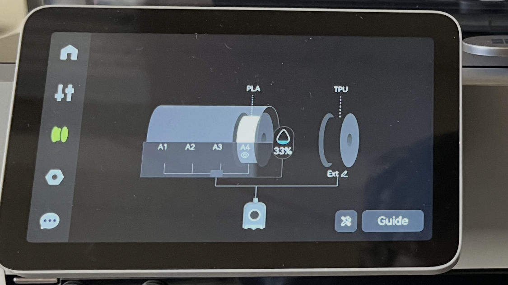

To load more filament, open the Automatic Material System (AMS) lid. There are two tabs which should need to be flipped to unlock the lid. Place the filament roll in and ensure the filament comes over the top of the roll and towards you, like pictured. Then place the filament into the gray holder like shown below, the AMS should start sucking in the filament automatically. This was done with a Bambu Labs filament, so the X1C & AMS will automatically know the filament type by use of an RFID tag, how helpful

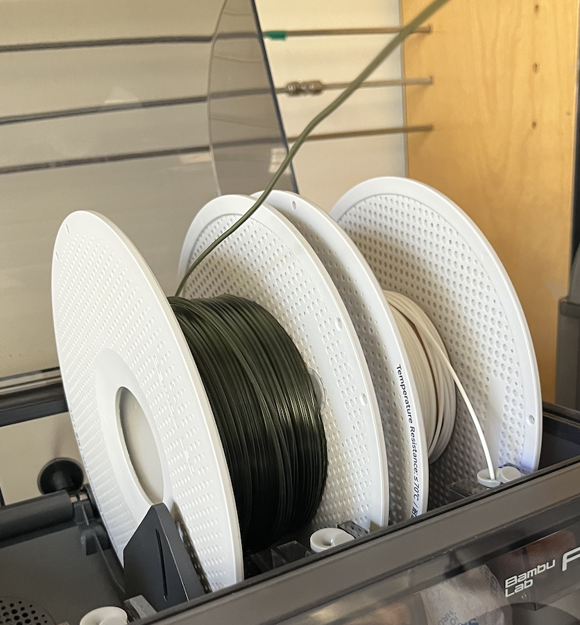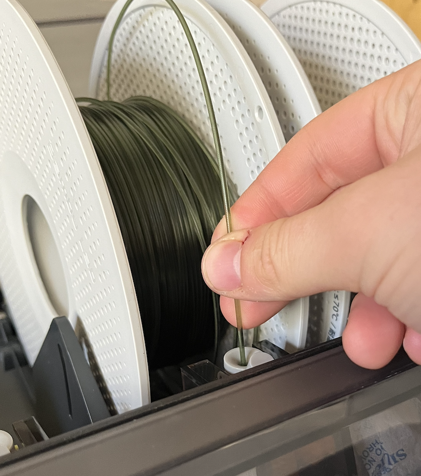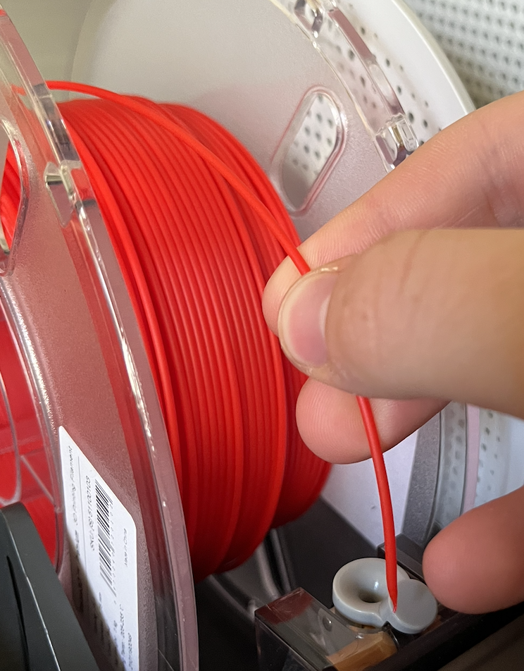

For non-Bambu Labs filament, the process is the same to load it (see the red above). But now, we need to tell the machine what it is. In that filament menu, instead of an eye icon, there should be a pencil icon indicating we can edit the filament. Tap on the filament and hit “edit”. For this case, we will leave all the default temperatures, and call it generic PLA, however we will set the color to be red and then hit “confirm”. Close the lid & relock the tabs.

## **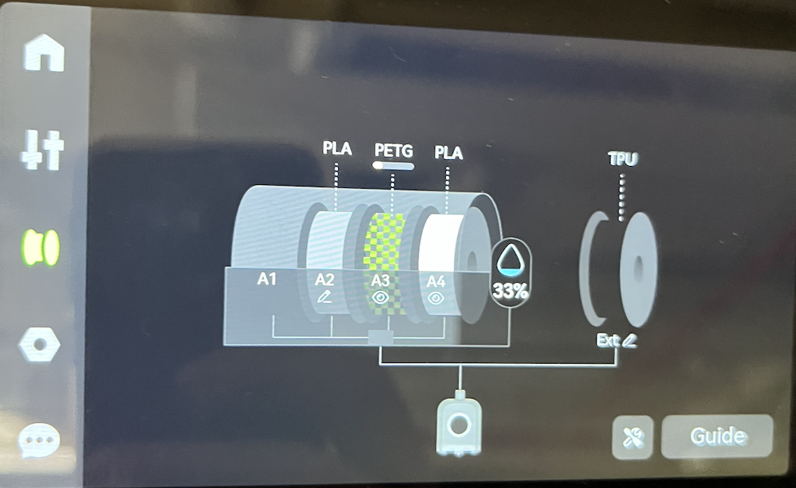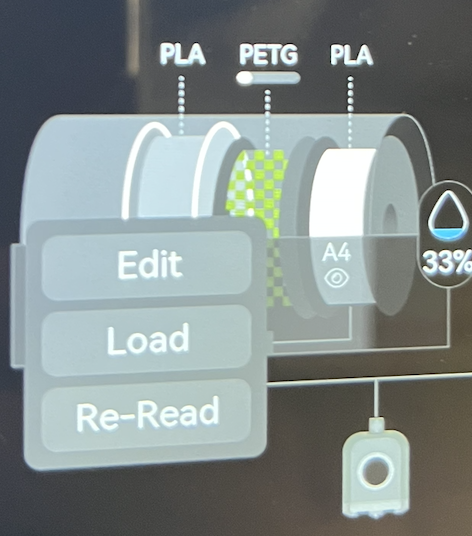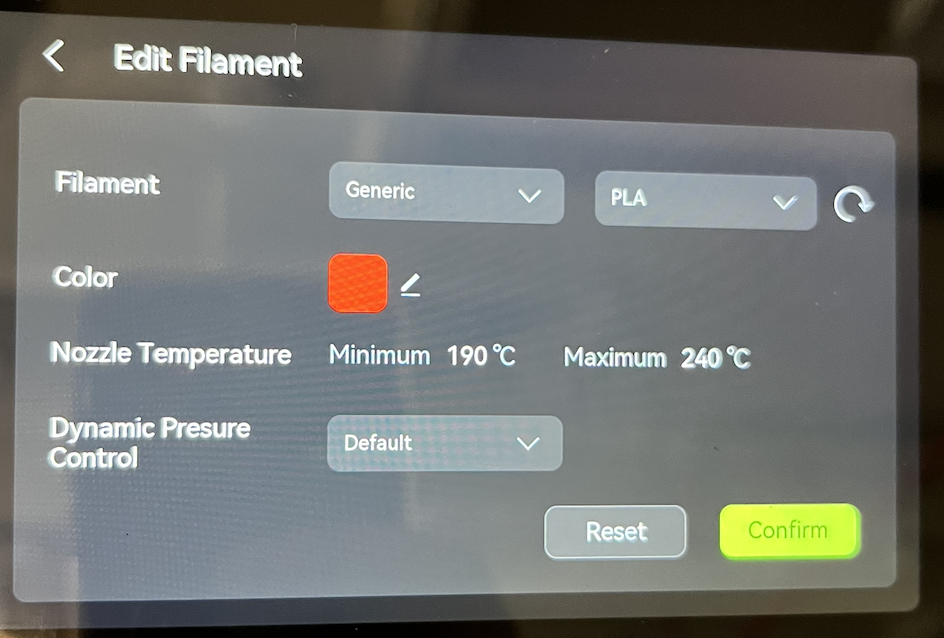**3\. Preparing the Slicer

Open Bambu Studio, go to the device tab (I). Click on the name in the top left corner (II), and then select the name of the printer you will use (III) – I will use John. Then go back to the “Prepare” page.

**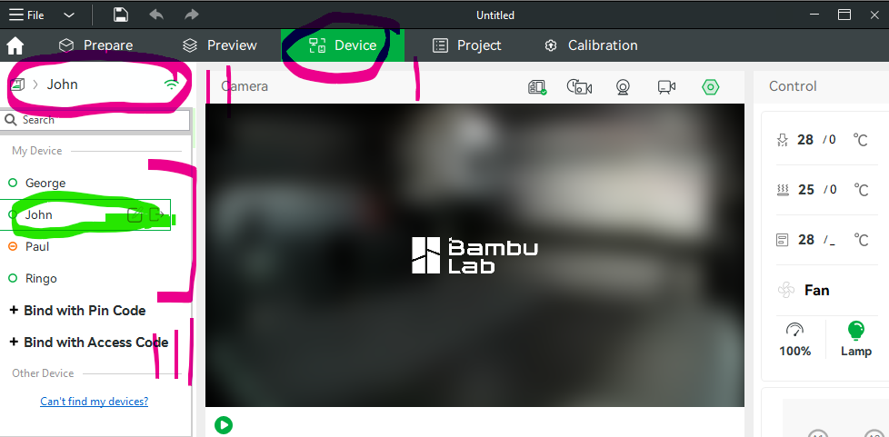**

On prepare (I), hit “Sync info” to get the data from the printer (II), this will ensure the filament is up-to-date. Then ensure the build plate is the correct type in the device, and which you want to use (III). DO NOT, change the device, diameter, or flow (indicated with blue crosses over them).

**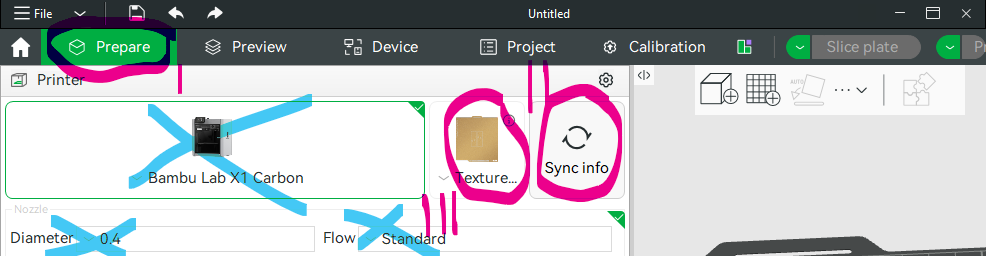**

**Under the Project Filament section, hit the "Synchronize filament list from AMS”, represented by an AMS icon. Then go to the “Overwrite” tab, and hit “Synchronize now”.**

****

## 4\. Importing Objects& Filament Type

Trainees will then procure the following files from this [link](https://www.thingiverse.com/thing:4283065/files) and open it on Bambu Studio.

  * Flower_Head.stl
  * 1x1_plate_round_open.stl
  * Flower_Base_v2.stl

Import the downloaded files by clicking on “File -> Import 3MF/STL/…” then selecting all three parts and hitting “open”. You will then be asked the following, select “No”.

**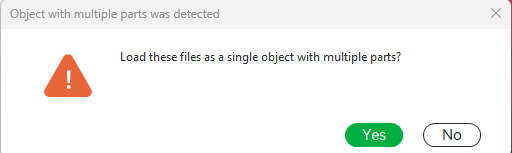**

If you select yes, then it will be more difficult to change filament types, etc…

All three parts will then load in at the center of the virtual build plate. If we were to print like this, they would all print on top of each other instead of separately. Either click each one and drag them apart manually or select the “Arrange all objects” button and hit “Arrange”.

**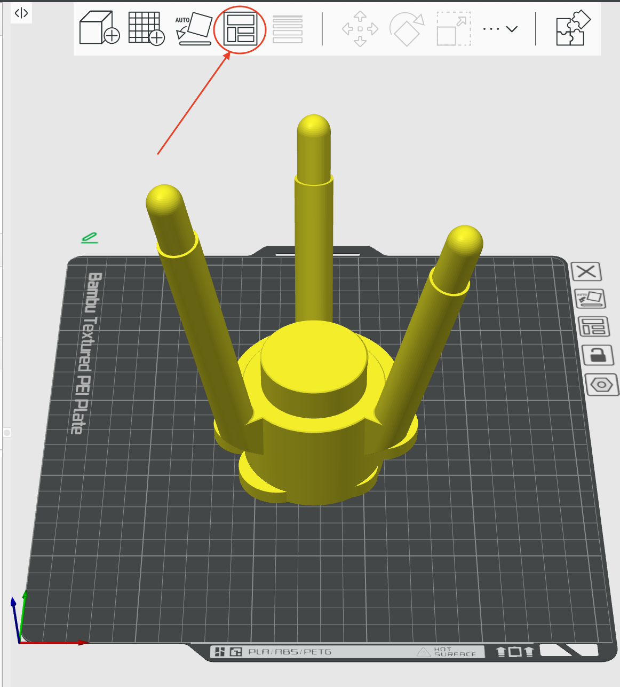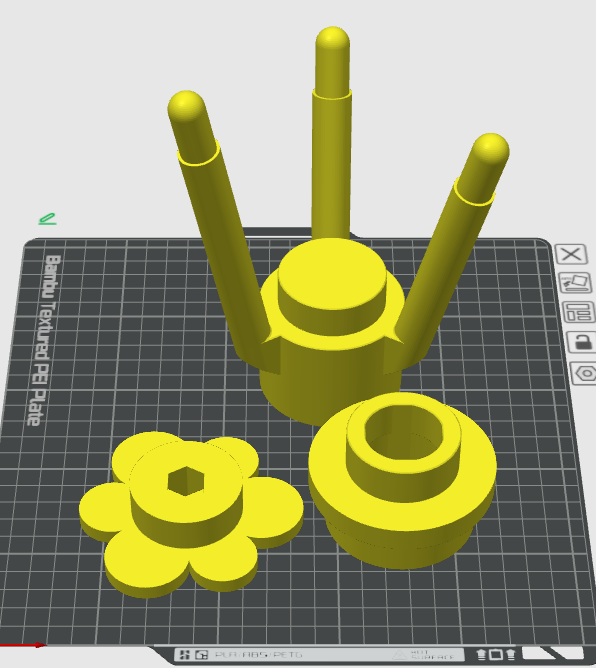**

This is great! However we need 3 total flower petals. Select the flower petal, right click on it when selected, and then hit “clone”. Then set it to make 2 copies, with the original component, there are now 3 total flower petals. Either separately or hit the arrange button again.

**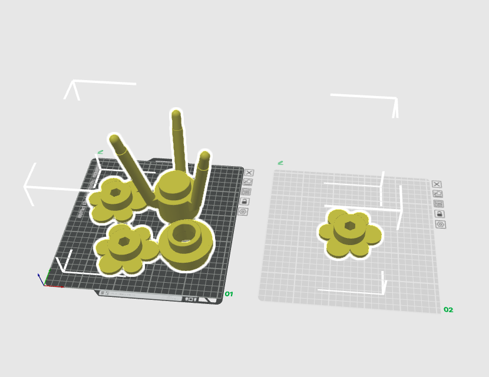**

You may now notice that one flower petal is all alone 😟. That is because all five objects will not fit on the same build plate. Since this is a training part, and we do not wish to waste filament, we will decrease the size. With them all selected, hit the “Scale” button, then set the scale to 25% and hit enter. Ensure that “uniform scale” is selected (it should be by default), this will scale it proportionally in all directions. Arrange them all again and notice how they all will fit onto one plate.

**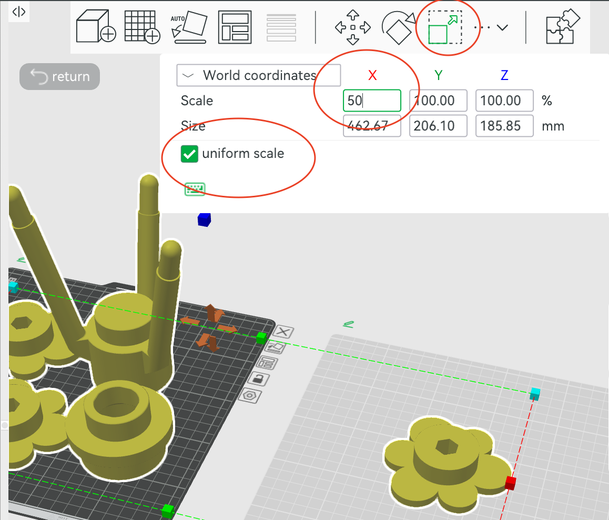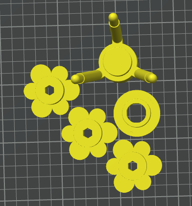**

Now in the process tab, select “Objects”. Under the “Fila.” column click an object's filament to set the desired filament. As mentioned before, my stem/base will be green, petals red, and 1x1 stud white. (Note you must be in the prepare window still)

**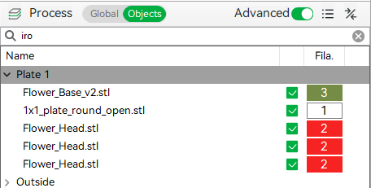**

This will generate a “purge tower”. When printing, a layer will print all of one color first. Then it will print the next color on the same layer, but it will purge the old filament color first into the purge tower. You could instead print this as 3 separate plates (as this model and final product allows it). It would save filament and time, however that doesn't teach you about multi-material prints!

## 

## 5\. Adding Support, and Other Features

By cutting open the base, it can be seen how there is an overhang! On the outside and inside. An overhang is when a part of the component is on top of air, which the printer could not print on. Now in all honesty, that should be fine, as this printer can handle overhangs of ~30 degrees without any issue, since it starts from a wall and then builds out, however for exercise, we will show you how to add support material.

**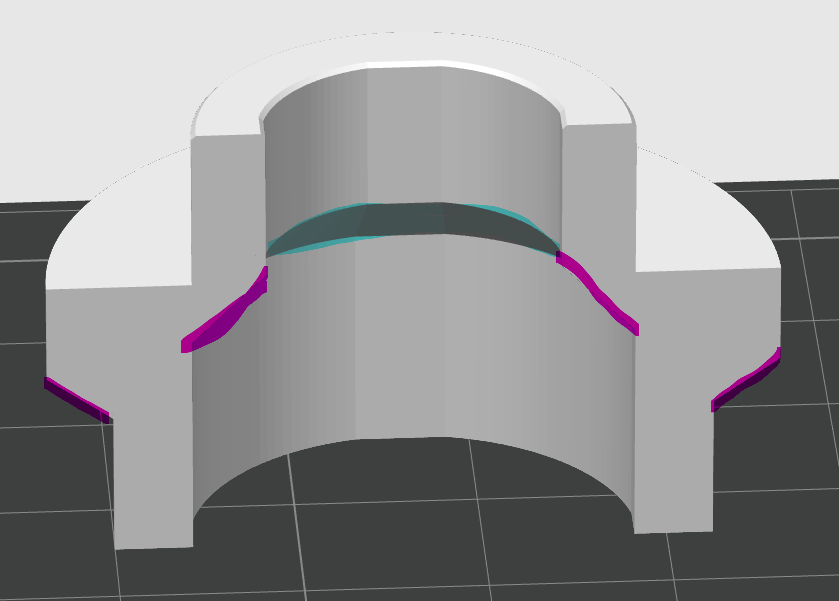**

To add support, go to the “Support” tab, check “Enable Support”, and set the threshold angle to “45”. There are many nuances and settings for support that YouTube & self learning will teach better than this manual. However to introduce them:

  * Wall loops: The number of external walls generated for a part – Helps with strength
  * Top/Bottom shells: The number of solid layers at the top/bottom – Helps with strength & aesthetics
  * Infill Pattern: The density of the part, how much plastic is inside the loops/shells, and what pattern it generates in – Helps with Strength
  * Infill Density: How much of the interior of the part is filled – 0% means hollow, 50% means 50% filled, 100% is entirely solid
  * Brim: Additional filament placed around the part – Helps with adhesion & stability on smaller parts
  * Skirt: Outlines the part – Helps with purging filament initially
  * Layer Height: Determines how thick each layer is – Helps with aesthetics & Strength

We will leave these all default for this project.

It is recommended if using support or any additional settings, to “arrange” the objects to avoid collisions

## 6\. The Print (Alpha to Omega)

“I am the Alpha and the Omega, the First and the Last, the Beginning and the End.”

-Revelations 22:13

This is the real part all the set-up has been for. To begin the print, hit the “Slice plate” button in the top-right. After the slicing is done, use the two sliders to inspect various parts of the print. Ensure everything looks correct with no interferences or issues. Give it a “Vibe-Check”.

Then hit the “Print plate” button in the top right. Ensure everything is correct, this is the last chance before stopping the prunt & wasting printer time and filament.

**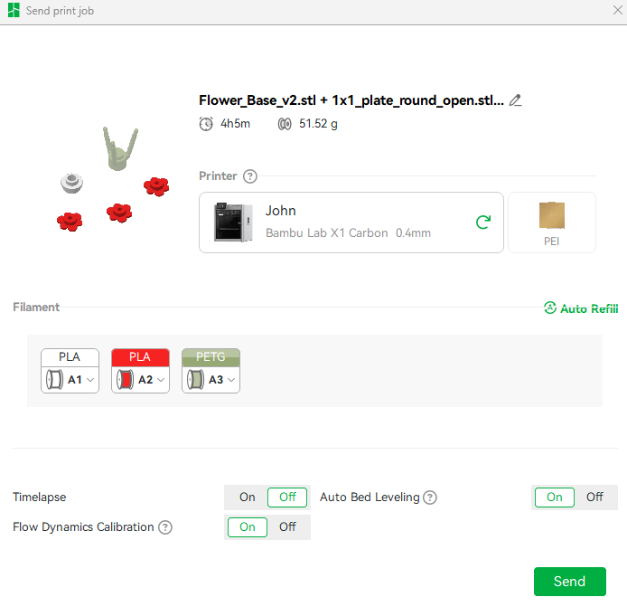**

If ready, hit “Send”.

Bamb Studio will automatically load the device page, allowing you to monitor the print. However, feel free to also look at the physical printer as well.

When the print is FULLY completed. Allow time for the device to cool down, as removing a print right after completion could warp flat areas. After it has cooled, lightly flex the build plate to remove the various printed pieces. Go ahead and wash the build plate following the directions for that build plate. Dry it and return it back to the printer.

Congratulations, you have completed your first print! Whoop!
