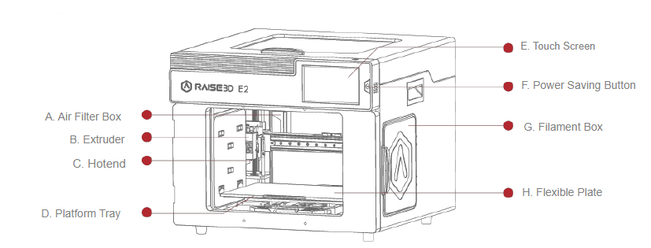
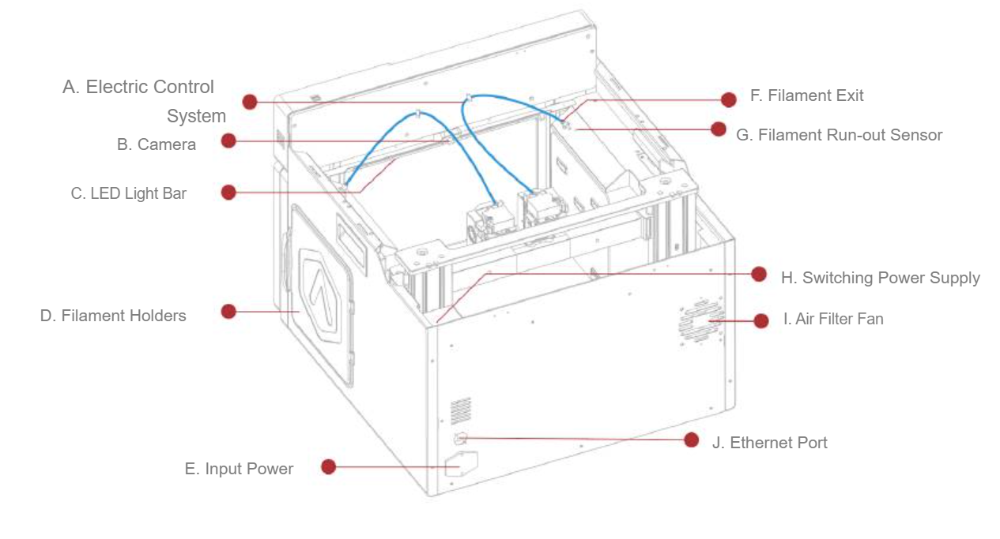
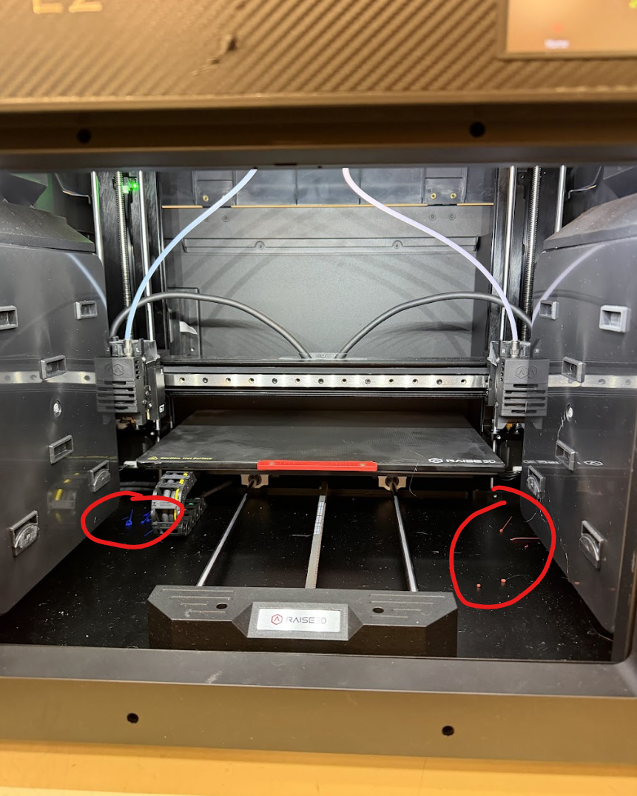
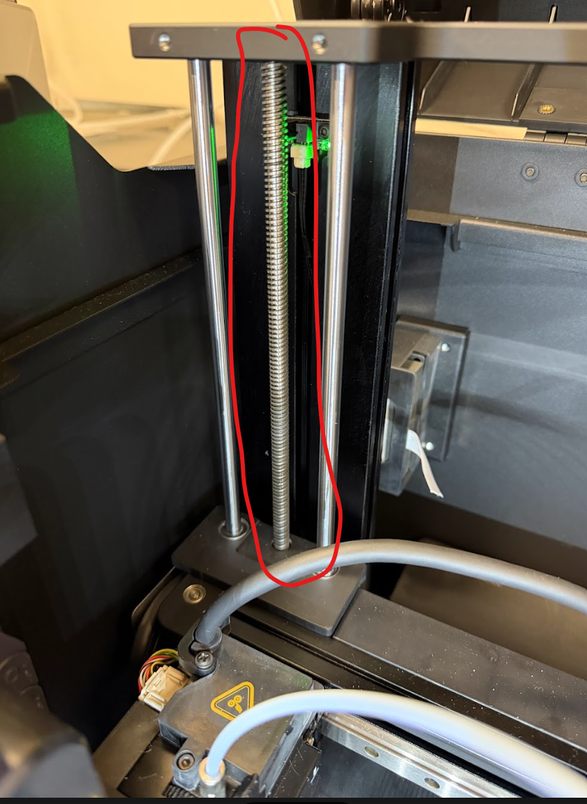
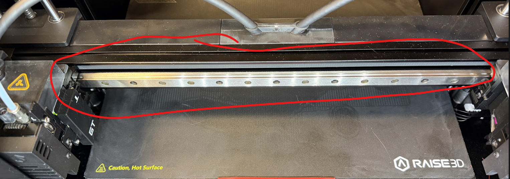
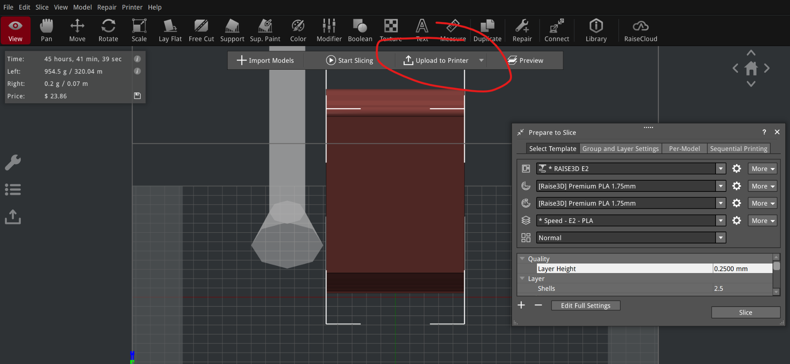

Raise3D E2 Dual Head 3D Printer Operations Manual

Machine Name: Raise3D E2

Location: The Fab Lab

Version: v1.0

Last Updated: 3/27/2026

Responsible Student Worker: Luca Nealon

Linked Safety Manual: [Raise3D E2 Printer Machine Safety Manual](/docs/fdm-printers/dual-head-fdm-printer/operations--safety-manual/raise3d-e2-printer-machine-safety-manual/)

## 1\. What This Machine Is For

Use this machine to:

  * Independent Dual Extrusion
  * Dual Material/Dual Color Prints
  * Mirrored Prints
  * Niche Support removal applications (i.e. water soluble supports)

## 2\. What This Machine Is Not For

Do not use this machine for:

  * Printing unknown/unapproved materials
  * Printing files not sliced in an approved version of IdeaMaker
  * Modifying printer profiles without staff permission

## 3\. What You Need Before You Start

Before operating this machine, ensure:

  * Trained Fab Lab staff present
  * [Raise3D E2 Printer safety manual](/docs/fdm-printers/dual-head-fdm-printer/operations--safety-manual/raise3d-e2-printer-machine-safety-manual/) acknowledgement
  * No loose hanging garments or jewelry that is at risk of catching in pinch points
  * Heat protective gloves (Optional)
  * STL file that has been properly sliced ([Slicing Instructions](/docs/fdm-printers/dual-head-fdm-printer/slicing-in-ideamaker/)) in [IdeaMake](<https://www.google.com/url?q=https://www.raise3d.com/download/&sa=D&source=editors&ust=1776804165570617&usg=AOvVaw24m-8U5zemXoBaUZ6rcMKp>)[r](<https://www.google.com/url?q=https://www.raise3d.com/download/&sa=D&source=editors&ust=1776804165570683&usg=AOvVaw3YBbiOshL4qkAsW3sx5Aps>) 

Ideamaker Logo

  * (found on the Fab Lab computer) and .gcode is uploaded to the Fab Lab Drive

## 4\. Machine Overview

A. Air Filter Box: Contains the air filter, which can filter out part of the harmful gas produced in the printing process.

B. Extruder: Feeds the filament into the hotend.

C. Hotend: The hotend consists of a nozzle, heater block, thermocoupler, heater rod, throat tube, and heat sink.

D. Platform Tray: The Platform Tray is highly magnetized to ensure that the build plate stays in place.

E. Touch Screen: On-board computing system to display printer status, error messages, and receive commands.

F. Power Saving Button: Quick press to put the screen and LED in sleep/wake mode; Long press for 10 seconds to restart.

G. Filament Box: Holds the filament that will be printed.H. Flexible Plate. You can easily remove your models after they've finished printing by bending the plate. Note there is a box on both sides of the printer.

A. Electric Control System: Includes screen components and the motion control panel. Do not open without permission.

B. Camera: Used to observe the operation of the printer.

C. LED Light Bar: Provides interior lighting of the chassis.

D. Filament Holder: Holds the filament spool, maximum weight 3 kg.

E. Input Power: AC input and switching.

F. Filament Exit: The filament leads from here to the extruder.

G. Filament Run-out Sensor: Detects when the material has run out

## 5\. Basic Operating Workflow

### 5.1 Start-Up

  1. Ensure the workspace is clean
  2. Check inside printer for any stray material on the build plate or elsewhere inside the case

Common locations of plastic debris

                -Wait for nozzles and bed to cool and remove all material while printer is OFF

  3. Visually inspect belts and axes for cleanliness

Inspect the z-axis for debris

Inspect the x axis for debris

-Disable the motors and remove the debris or have staff assist if you feel unsafe

  4. Slice desired file in [IdeaMaker](<https://www.google.com/url?q=https://www.raise3d.com/download/&sa=D&source=editors&ust=1776804165575683&usg=AOvVaw1SzBNYXtizV4rlBpMbKfej>) and upload to Fab Lab drive
  5. Power on the printer
  6. Check nozzles for any filament residue

        -Notify staff if nozzles need cleaning

  7. Ensure the heated bed is clean.

        -Fab Lab users may remove excess material from the bed as long as the bed is sufficiently cool (under 35 C) and the nozzles are not heated.

### 5.2 Running a Job

  1. Ensure proper filament is supplied to both print heads

        -If alternate filament material is desired, have a Fab Lab staff help you swap out filaments

  2. Ensure build plate is clear of any previous prints
  3. Find your file from the cloud and slice if you have not done so
  4. Using one of the lab computers, on IdeaMaker, after slicing, you can select ‘upload to printer’ on the top dropdown (the default is upload to USB)

        If the printer does not show up, ensure that both the printer and computer are connected to the Fab Lab Network

  5. On the printer, go to local storage, select your print, and start
  6. Supervise the printer for the first 5-10 minutes to ensure nozzles and bed get up to temperature and extrusion occurs correctly.
  7. Stop print if any strange or unexpected noises/movements occur
  8. Report all failed prints to a staff member

### 5.3 End-of-Job / Shutdown

  1. Wait for print to finish and make sure the print heads are clear from the print
  2. Remove the build plate and remove the print 

-If the nozzles or heat bed are still above 35 C, use the Castong heat protective gloves

  3. Turn the printer off
  4. Remove any excess filament from inside the printer (check everywhere, not just the bed; see the photo from 5.2)

        -use heat protective gloves if the nozzles and heat bed have not cooled down

  5. Return the build plate
  6. NEVER LEAVE A PRINT OR SUPPORT MATERIAL ON THE BUILD PLATE
  7. If print is missing, ask staff if they have moved it

## 6\. User Responsibilities After Use

After using this machine, you are responsible for:

  * Ensuring the printer is left clean and ready for next use
  * Heat protective gloves are left with the printer
  * Reporting any atypical behavior for the printer

        -includes print fails, leveling issues, temperature issues, etc.

## 7\. Stop Conditions

Stop immediately and notify Prototyping Studio staff if:

  * Abnormal noises or grinding occur
  * Smoke, sparks, leaks, or odors occur
  * Print/extrusion failure
  * Unsure of what to do

Do not attempt to troubleshoot major issues yourself.

## 8\. Common Issues & What To Do

  * Issue: Filament not extruding  
Action: Stop and notify staff
  * Issue: Print not sticking to bed  
Action: Stop the print. If the filament is not sticking from the start, the bed most likely needs to be leveled, which can be done by going to Utilities → Leveling. If the print pops off the bed, consider increasing the bed temperature. Otherwise, notify staff.
  * Issue: Print Quality Issue/failure  
Action: Stop print and discuss with staff for a solution
  * Issue: Part Malfunction (Ex: Nozzle not heating)  
Action: Notify Staff
  * Issue: Filament Runout  
Action: Ask staff to load more filament into the printer
  * Issue: Minor Stringing  
Action: Only a cosmetic issue, not a stop condition
  * Issue: Warping/lifting from build plate  
Action: Stop if severe and notify staff
  * Issue: Layer shifts  
Action: Stop and notify Staff

## 9\. Approved Materials

  * PLA                         \-         Approved
  * PETG                         \-         Approved but not supplied
  * TPU                        \-         Approved but not supplied
  * ABS                        \-         Approved but not supplied 
  * ASA                         -        Approved but not supplied 
  * Nylon, CF, filled        -        Approved (Up to 70A hardness) but not supplied

        

        Note: any print material resulting in detectable odor will be shut down

## 10\. Data Handling

  * Files must be uploaded to the printer; no hard drives are permitted
  * Do not delete other people’s files
  * Delete your file from the printer storage once your print is done
  * Follow the naming convention “[LASTNAME]_[PRINTNAME].gcode”

## 11. External Resources

For more detailed information, refer to:

  * [Slicing in IdeaMaker](/docs/fdm-printers/dual-head-fdm-printer/slicing-in-ideamaker/)
  * [User Manual](<https://www.google.com/url?q=https://drive.google.com/file/d/1hFhwoAXc_nZfEGcRR90xvQsZExhSBRz1/view?usp%3Ddrive_link&sa=D&source=editors&ust=1776804165585892&usg=AOvVaw1ZwnyOdZ40wu0Ss-Xuc5HU>)
  * [Support](<https://www.google.com/url?q=https://support.raise3d.com/list.html?cid%3D20%26pid%3D992&sa=D&source=editors&ust=1776804165586116&usg=AOvVaw37mb4RYK8NU1pdSql-Q0FI>) 
  * [Ideamaker Download](<https://www.google.com/url?q=https://www.raise3d.com/download/&sa=D&source=editors&ust=1776804165586334&usg=AOvVaw1xL9eLRPA0PKCQHZfbLpJ5>)

## 12\. Questions or Help

If you have questions or need assistance at any point, ask a Fab Lab staff member. Staff are always present during operating hours.

* * *

End of User Manual