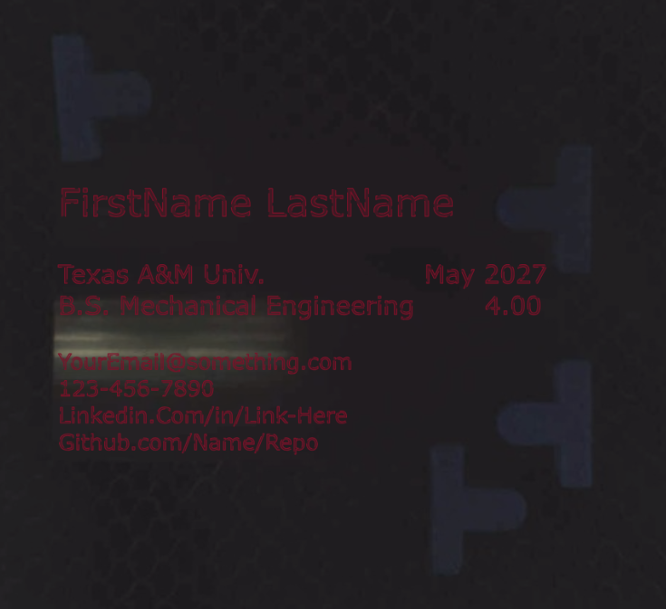
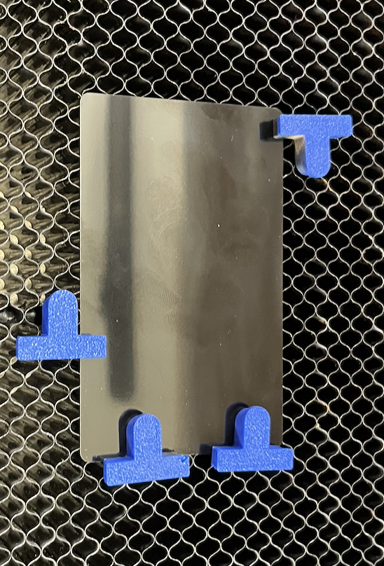
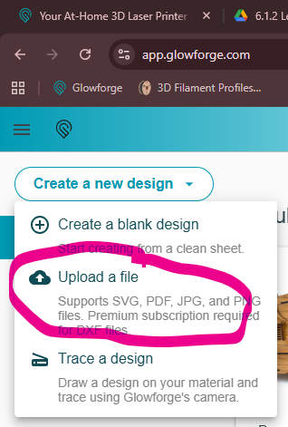
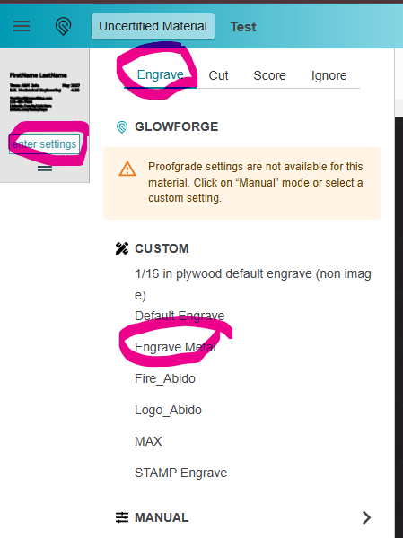
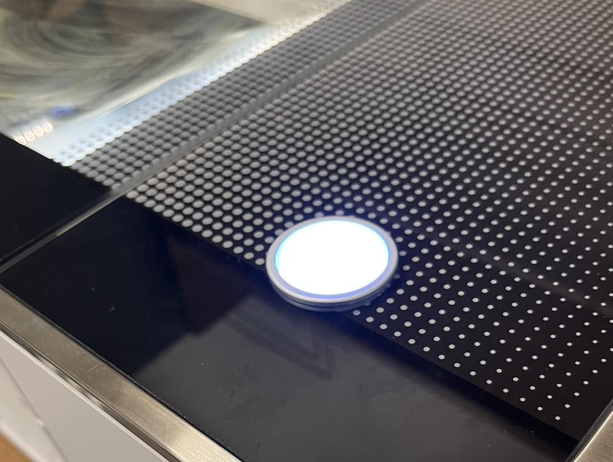

Engrave your own aluminum business card on the Glowforge. As an engineering student, a business card helps you stand out, and this one showcases your engineering skills.

**Read this first:** the [Laser Cutter (Glowforge Pro) manual](/docs/laser-cutter/laser-cutter-glowforge-pro/). It covers the machine's controls, the pre-flight and post-flight checklists, and what to do if something goes wrong.

:::caution
Finishing this activity **does not** qualify you to operate the laser without staff supervision. Only people who have completed the TAMU training may operate it, and only a trained staff member may start a job. To get certified, follow the safety manual's [Laser Safety Certification](/safety/#laser-safety-certification) section.
:::

You aren't really engraving the aluminum. You're removing the coloured coating on top of it.

## 1. Prepare your design

Download the [business card template](https://drive.google.com/file/d/1oqVoxlXpzHqtsd8s3paPAKwE7P8uhTPX/view?usp=sharing), and install **Inkscape** to edit it. This activity won't teach you Inkscape, but the basics you need are below.

1. Double-click the text box and change the text to describe yourself, however you see fit. If you're on a design team (SAE, DBF, and so on), consider adding a QR code or logo.
2. Select the text, then choose **Path → Object to Path**. This converts the text into shapes — the Glowforge software handles text badly, so it needs to be shapes.
3. Export the file as an **SVG**.

## 2. Load the blank

1. Check the machine isn't in use or about to be used by someone else.
2. Grab a business card blank in the colour you want.
3. Turn the Glowforge on if it isn't already.
4. Insert the blank and place the **hold-down pins** around it. They help align the blank, and they stop it moving — the laser alone provides enough force to shift a loose card.
5. Close the lid so the Glowforge camera can rescan the work space.

## 3. Upload and set up the job

1. Get your file onto the Fab Lab PC.
2. Open the Glowforge app on the Fab Lab computer — go to Google and click the starred **Glowforge** link.
3. Click **Create a new design → Upload a file**, then pick your file.

   

4. Drag the design until it lines up on the blank, clear of the plastic hold-down pins.
5. Set the material: click **Unknown Material → Use uncertified material → Set focus**, then click anywhere on the blank. This sets the thickness automatically. For a known material like wood or acrylic you'd pick that material instead.
6. Click **Enter settings** for the file, then **Engrave → Engrave Metal**. That preset is already tuned for metal.

   

7. Click **Print** in the top right to calculate the job.

:::tip
You can set a different preset for each operation in the same job — engrave a photo and then cut it out in a single run.
:::

## 4. Run the engrave

1. Work through the pre-flight checklist in the [manual](/docs/laser-cutter/laser-cutter-glowforge-pro/).
2. Make sure the fan is on so it extracts the fumes.
3. Get a staff member.

:::danger
Only a **trained** staff member may start a laser job. If the person with you isn't trained, do not start the job.
:::

The trained person presses the glowing button to start.

Watch the job while it runs and check everything looks right. The on-screen UI tells you when it's safe to open the lid.

## 5. Finish up

Once the website says the job is fully done — **not** "cooling down" — take the card out and clean up.

Metal cards need washing to remove the burned-off coating. Take yours to the sink and wash it by hand, and be careful not to rub the residue into your fingers or stain them.

:::note[Staff note — Glowforge lead]
The original draft asked for a few more photos here, including one of the slicer step. Add them when you next have the machine free.
:::
