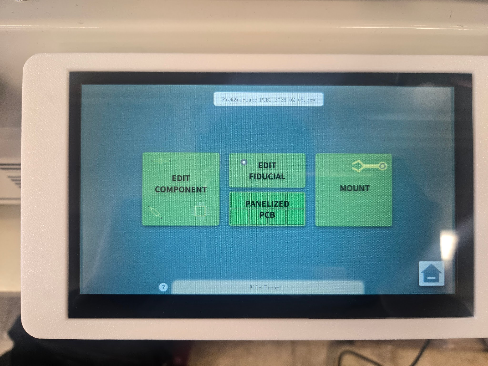
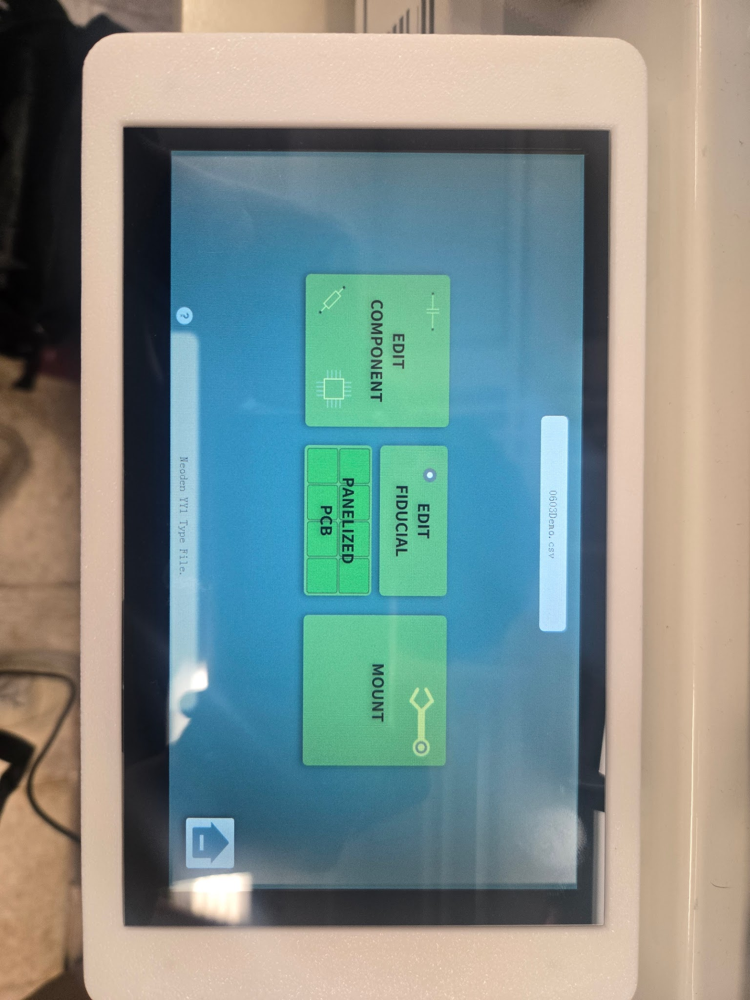
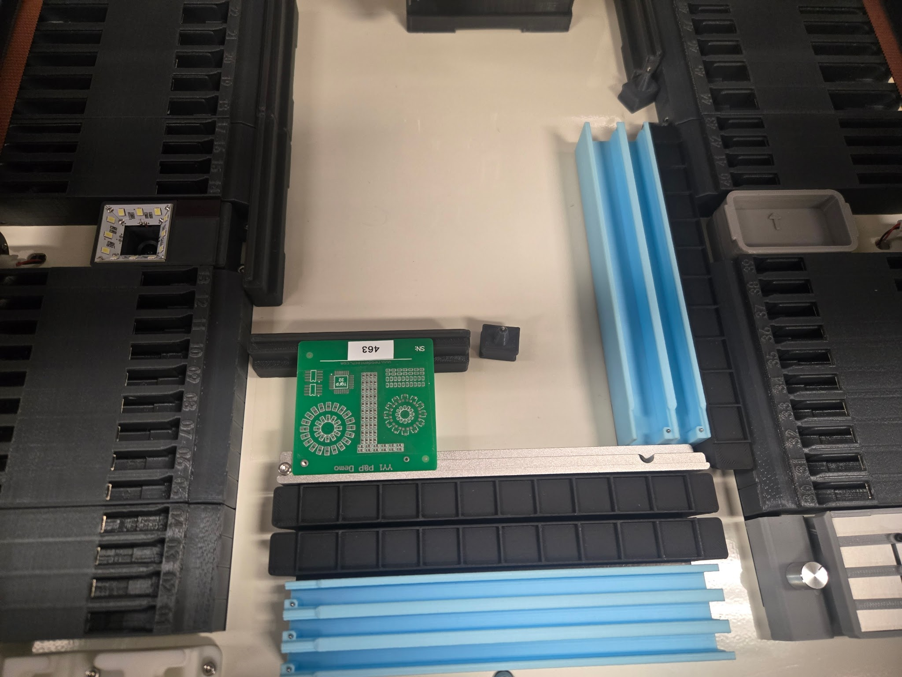
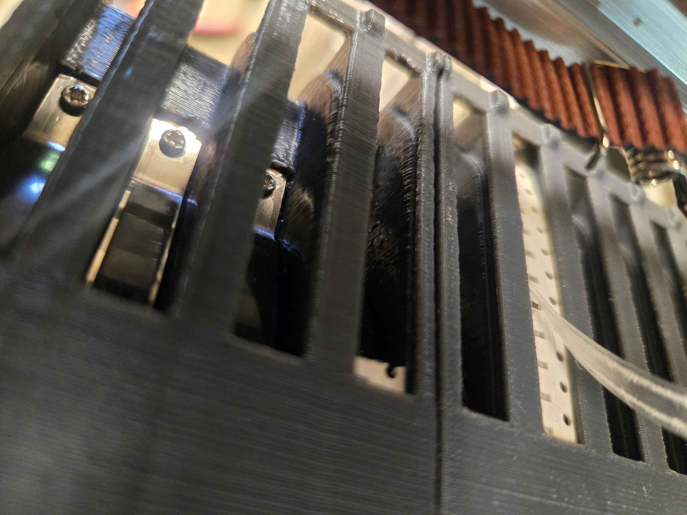
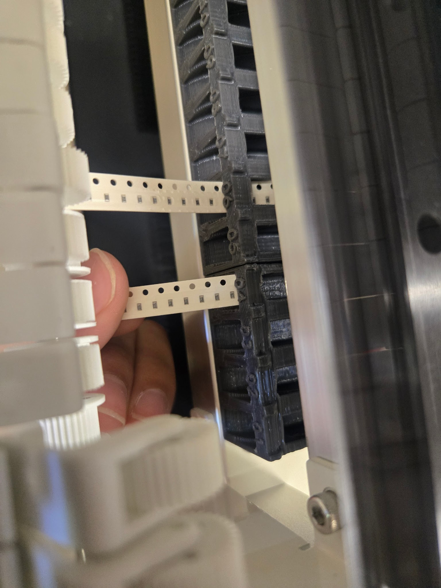
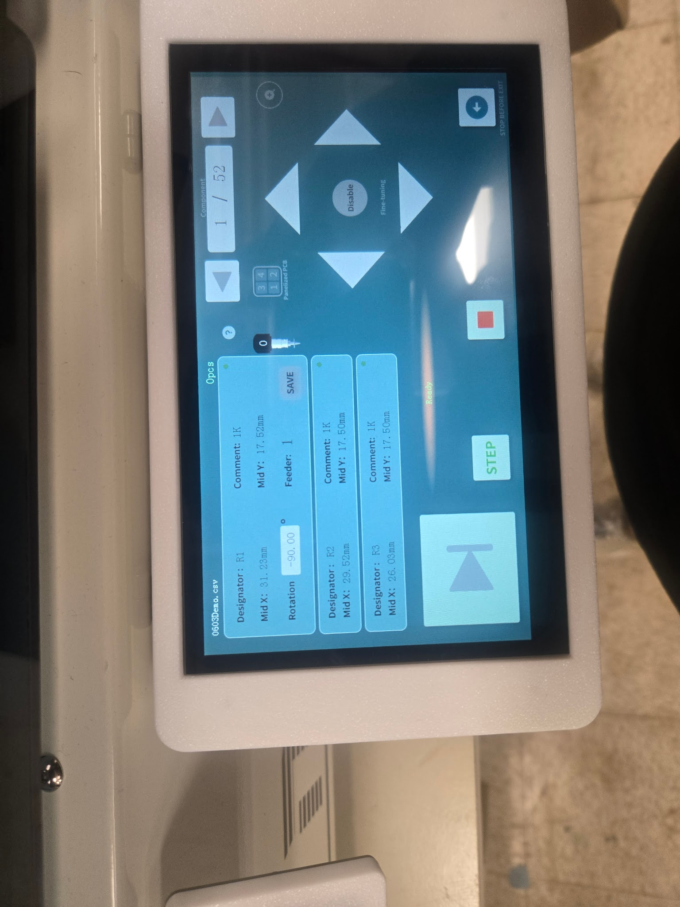

The NeoDen YY1 places surface-mount components onto a solder-pasted PCB using feeder-loaded parts and coordinate data from a YY1-compatible CSV file. It is the middle step of PCB assembly: after [solder paste is stenciled onto the board](/docs/pcb-machines/neoden-solder-stencil/operations--safety-manuals/neoden-fp2636-machine-operation-manual/) and before [the reflow oven](/docs/pcb-machines/novastar-solder-reflow-oven/solder-reflow-oven-ddm-novastar-gf-c2/) permanently solders the parts. It is intended for prototype and low-volume assembly on boards up to **315 mm x 350 mm**. If you are not sure this is the right machine for your project, see [Which Machine?](/docs/which-machine/).

## Safety considerations (read first)

> [!WARNING]
> **A trained staff member must be present** whenever this machine is in use.

> [!WARNING]
> **Keep hands clear whenever the machine is moving.** The placement head moves quickly across the bed and can change direction without warning.

> [!WARNING]
> **Do not bypass covers or reach into the machine during an active job.** Load boards, reels, and the SD card only while the machine is idle.

:::caution[EMERGENCY STOP]
To stop motion, tap **Stop** on the touchscreen. To remove machine power immediately, flip the **ON/OFF switch** at the right-rear side of the machine. Notify staff after any emergency stop.
:::

:::caution[STOP IMMEDIATELY IF]
Stop the job and get staff if you observe unexpected noise or vibration, feeder jams, out-of-bounds head movement, smoke, sparks, burning odor, software freeze, or a damaged power cable.
:::

## Before you start

- Your board must already have **lead-free solder paste** applied.
- Board size must be within **315 mm x 350 mm**.
- Use a **YY1-compatible CSV** and copy it to an SD card.
- Confirm every part in the CSV is loaded in the feeder slot specified in that file.
- Verify feeder availability and preloaded parts in the [feeder slot chart](https://docs.google.com/spreadsheets/d/18dMiUAIPoFiYq0AChLLP8tyWiuEx4bR4EatctU6wq48/edit?usp=sharing).
- No special PPE is required beyond standard Fab Lab attire.

## Machine overview


1. **Placement head**: Moves in X/Y to pick and place components.
2. **Left peeler**: Removes cover tape from feeder strips.
3. **Nozzle**: Vacuum pickup tip for component handling.
4. **Left feeder bank**: Reel slots for component tapes.
5. **ANC nozzle station**: Automatic nozzle storage and exchange area.
6. **Camera displays**: Upward/downward vision feedback for alignment.
7. **Peeler holder**: Supports and guides peeled tape path.
8. **Safety cover**: Shields operator from moving mechanism.
9. **Right peeler**: Cover tape removal on the right feeder side.
10. **Sticker feeder**: Supports short cut strips instead of full reels.
11. **Touchscreen**: Main machine UI for file loading and job control.
12. **SD card slot**: File transfer input for YY1 CSV jobs.
13. **ON/OFF switch**: Main power switch.
14. **DC power input**: 24 V power input connector.

## Software download

Use the lab YY1 formatter package set (Windows, macOS, and Linux installers are in this folder):

<a class="tfl-download-button" href="https://drive.google.com/drive/folders/1sAP2mopvaOA5MnSG3K4IRKvyih8gP3C5?usp=drive_link">Dowload Software</a>

## YY1 CSV format (required)

The YY1 does not accept a generic CAD pick-and-place CSV. The CSV must match YY1 structure, including the file header rows, panel/fiducial rows, nozzle-change rows, and full component columns.

> [!NOTE]
> Export from your EDA tool as **CSV with mm units**, then run it through the YY1 formatter so the output matches this structure.

Required component columns in the YY1 section are:

- **Designator**
- **Comment**
- **Footprint**
- **Mid X(mm)**
- **Mid Y(mm)**
- **Rotation**
- **Head**
- **FeederNo**
- **Mount Speed(%)**
- **Pick Height(mm)**
- **Place Height(mm)**
- **Mode**
- **Skip**

Reference structure (from a known working YY1 file):

```csv
NEODEN,YY1,P&P FILE,,,,,,,,,,,
,,,,,,,,,,,,,
PanelizedPCB,UnitLength,0,UnitWidth,0,Rows,1,Columns,1,
,,,,,,,,,,,,,
Fiducial,1-X,0,1-Y,0,OverallOffsetX,0,OverallOffsetY,0,
,,,,,,,,,,,,,
NozzleChange,OFF,BeforeComponent,2,Head1,Drop,Station1,PickUp,Station3,
NozzleChange,OFF,BeforeComponent,1,Head1,Drop,Station3,PickUp,Station1,
NozzleChange,OFF,BeforeComponent,1,Head1,Drop,Station1,PickUp,Station1,
NozzleChange,OFF,BeforeComponent,1,Head1,Drop,Station1,PickUp,Station1,
,,,,,,,,,,,,,
Designator,Comment,Footprint,Mid X(mm),Mid Y(mm) ,Rotation,Head ,FeederNo,Mount Speed(%),Pick Height(mm),Place Height(mm),Mode,Skip
C1,0.1uF,CAPC3216X135,81.25,68.99,0.00,0,1,100,0.0,0.0,1,0
```

If this structure is not matched, the YY1 can show **File Error** and refuse to run.



## Operating

1. Confirm the machine bed is clear and no leftover components are in the work area.
2. Turn on machine power using the right-side panel switch.

   

3. Wait for startup to complete.

   

4. Load any missing reels into free feeder slots and align tape with the feeder rail.

   

5. Advance each tape to pickup position using tweezers, aligned with the marked line.

   

6. Insert the SD card until it clicks. Verify your file appears in the UI.
7. Select the file. A valid file should load as **Neoden YY1 Type File** and expose editing/mount options.

   

8. If needed, use **Edit Component** to confirm feeder mapping and key values before running.

   

9. Tap **Mount**, then place your PCB at the board origin (bottom-left reference screw) with the same orientation used in your design.
10. Position the magnetic board holder to secure the PCB.

   

11. Press **Start** to begin placement.

> [!WARNING]
> Stay at the machine for the full run. If anything abnormal happens, tap **Stop**, keep hands clear, and notify staff.

12. At **Placement Complete**, wait for the head to return to home before reaching inside.

## Finishing up

- Remove the PCB by the edges so wet solder paste placements are not disturbed.
- Inspect for missing, mis-rotated, or shifted components before reflow.
- Send the board to [the reflow oven](/docs/pcb-machines/novastar-solder-reflow-oven/solder-reflow-oven-ddm-novastar-gf-c2/).
- Clean loose components from the bed using a brush only.
- Return reels to their designated storage locations.
- Exit on the touchscreen, then power the machine off.
- Report broken nozzles, feeder jams, crashes, or repeat placement errors to staff.
- Take your project and materials with you; the lab has no storage.

## Common problems

**The screen shows File Error when selecting a CSV.** The file format does not match YY1 requirements. Re-export as CSV in mm, run it through the YY1 formatter, and verify header and column structure in [YY1 CSV format (required)](#yy1-csv-format-required).

**A component is not being picked correctly.** Check tape indexing first. Then confirm feeder mapping and nozzle suitability for that package. If pick failures persist, stop and notify staff.

**Vision alignment warning appears during setup or run.** Gently clean the vision area with a microfiber cloth and verify the board is flat and well lit. Re-run setup, then call staff if the warning remains.

**Placed parts look offset on the board.** Confirm board orientation at origin, re-check fiducial/edit screen values, and verify feeder assignments match the intended designators before starting the next run.
