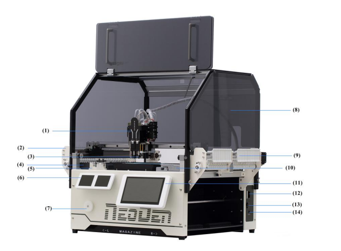
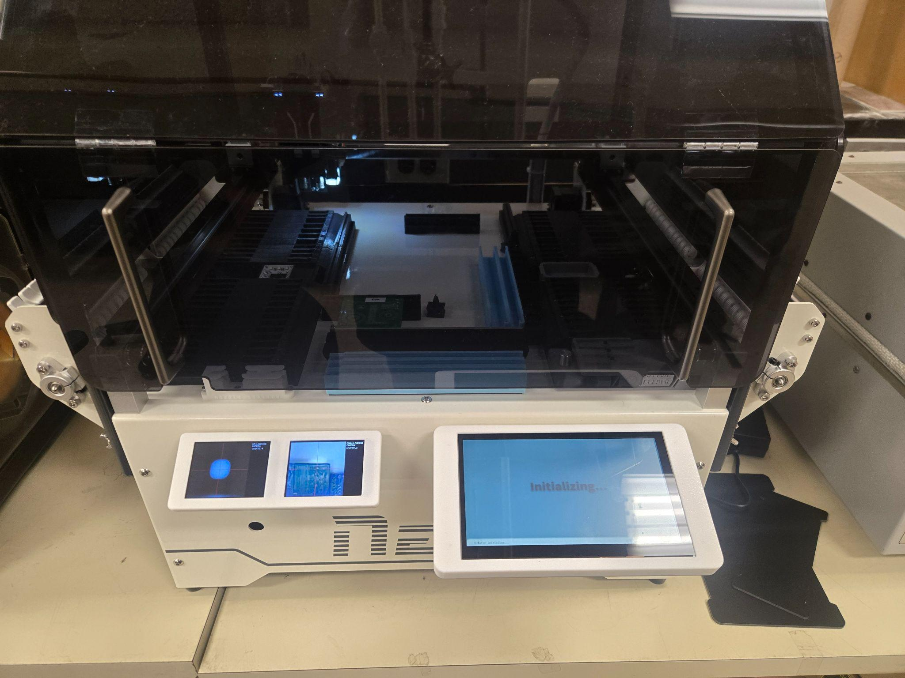

The NeoDen YY1 places surface-mount components onto a circuit board for you. Give it a placement file from your PCB design software and load your parts into its tape feeders, and its vacuum nozzle picks up each component and sets it at the exact coordinates from your design — far faster and steadier than tweezers. It's the middle step of PCB assembly: after [solder paste is stenciled onto the board](/docs/pcb-machines/neoden-solder-stencil/operations--safety-manuals/neoden-fp2636-machine-operation-manual/) and before [the reflow oven](/docs/pcb-machines/novastar-solder-reflow-oven/solder-reflow-oven-ddm-novastar-gf-c2/) melts the paste to lock everything in place. It's built for prototypes, class projects, and small research batches on boards up to **315 mm × 350 mm** — not for production runs, and not for advanced packages (BGA, CSP, flip-chip) that need finer placement than its vision system can deliver.
<!-- TODO: link /docs/which-machine/ at the end of the intro once that page exists -->

> [!WARNING]
> **A trained staff member must be present** whenever the machine is in use.

> [!WARNING]
> **Keep your hands out of the machine while it's running.** The placement head sweeps quickly across the whole bed without warning. Load boards, reels, and the SD card only while the machine is idle, and never reach past the safety cover during a job.

:::caution[EMERGENCY STOP]
This machine has no emergency-stop button. To stop a running job, tap **Stop** on the touchscreen. To kill all power, flip the **ON/OFF switch** at the rear of the machine's right side. Then notify staff.
:::

## Before you start

- Your board must already have **lead-free solder paste** applied — that's the [solder paste stencil machine](/docs/pcb-machines/neoden-solder-stencil/operations--safety-manuals/neoden-fp2636-machine-operation-manual/)'s job, done just before this one.
- Your board must fit within **315 mm × 350 mm**.
- Bring your placement file as a **NeoDen YY1–format CSV** — see [Preparing your placement file](#preparing-your-placement-file) below. You'll load it into the machine on an SD card.
- Every component in your file must be loaded in the machine, in the feeder slot the file says it's in. The [feeder slot chart](https://docs.google.com/spreadsheets/d/18dMiUAIPoFiYq0AChLLP8tyWiuEx4bR4EatctU6wq48/edit?usp=sharing) lists which parts are preloaded where and which slots are free for your own reels.
- No special PPE is needed — regular clothes are fine.

## Machine overview

1. **Placement head** — moves across the bed to pick up and place components.
2. **Peeler (left)** — strips the plastic cover tape off the component tape to expose the parts.
3. **Nozzle** — the vacuum tip that holds each component in transit.
4. **Tape feeders (left)** — the slots where reels of components load.
5. **Nozzle station (ANC)** — a rack of nozzle sizes the machine swaps between automatically to match each component.
6. **Camera displays** — live views from the machine's upward- and downward-looking cameras, used for component alignment and finding the board's fiducial marks.
7. **Peeler holder** — guides the waste cover tape away from the picking area.
8. **Safety cover** — the clear shield over the moving parts.
9. **Peeler (right)** — same as (2), for the right-side feeders.
10. **Sticker feeder** — holds short cut strips of tape instead of full reels.
11. **Touchscreen** — where you load files, run jobs, and watch progress.
12. **SD card slot** — how placement files get into the machine.
13. **ON/OFF switch** — main power, at the rear of the machine's right side.
14. **Power cord (DC 24 V)** — connects the machine to its external power brick.

## Preparing your placement file

The machine reads exactly one thing: a CSV file in **NeoDen YY1 format**, with these columns for every component:

| Designator | Footprint | Mid X (mm) | Mid Y (mm) | Layer | Rotation (°) | Feeder |
| :---: | :---: | :---: | :---: | :---: | :---: | :---: |
| R1 | 0603 | 10.5 | 20.3 | Top | 90 | 1 |

PCB design programs don't export this format directly — their placement exports all name and order the columns differently. The lab's **NeoDen YY1 Formatter**, a free Windows app, converts them for you:

> [!NOTE]
> **Export your placement file as a CSV, with units set to mm.** The formatter accepts no other file type, and the machine needs all coordinates in millimeters — set both in your design software *before* exporting.

1. In your PCB design software (Fusion 360, KiCad, Altium, EasyEDA, and others all work), set the units to **mm** and export your board's placement file — also called a **pick-and-place** or **centroid** export — as a **CSV**.
2. Download the formatter and run it on your own computer (or a lab PC):

   <a class="tfl-download-button" href="/files/PCB%20Machines/NeoDen%20Pick%20%26%20Place/NeoDen%20YY1%20Formatter%20%28Windows%29.zip">⬇ Download the NeoDen YY1 Formatter — Windows</a>

3. Drag your CSV into the formatter, then assign each component the **feeder slot** its parts are loaded in — the [feeder slot chart](https://docs.google.com/spreadsheets/d/18dMiUAIPoFiYq0AChLLP8tyWiuEx4bR4EatctU6wq48/edit?usp=sharing) says what's where.
4. Export. The formatter saves a `…_yy1.csv` file ready for the machine — copy it onto the SD card.

## Operating

1. Check that the bed is clear — no boards or stray components left from the last job.
2. Turn on the **ON/OFF switch (13)** at the rear of the machine's right side. The machine initializes: the **touchscreen (11)** and **camera displays (6)** come on, and the head homes itself.

   

3. Load any of your own components that aren't already in the machine: feed the reel into a **free feeder slot (4)**, line the tape up with the internal rail, and use tweezers to gently advance it until it reaches the marked line.
4. Insert your **SD card** into the slot **(12)** on the right side of the machine, just above the power switch, until it clicks. Your files appear on the touchscreen.
5. Select your file. If it's compatible, the screen shows **"Neoden YY1 Type File"** at the bottom center. If it shows **"File Error"** instead, the file isn't in YY1 format — see [Common problems](#common-problems).
6. Tap **Mount**.
7. Place your board against the **origin** — the screw at the bottom-left of the bed — oriented the same way as in your PCB design. Slide the **black magnetic holder** up against the board to hold it in place.
8. Press **Start**. The job runs automatically.

> [!WARNING]
> Stay at the machine while the job runs. If anything goes wrong — unexpected noise or vibration, the head moving somewhere it shouldn't, a jammed feeder, smoke or a burning smell — tap **Stop**, don't reach in, and get a staff member. Never troubleshoot a running machine yourself.

9. When the screen shows **"Placement Complete"**, wait for the head to return to its home position before reaching in.

## Finishing up

- Slide your board out of the rails carefully, holding it by the edges — the components are only sitting in wet solder paste and smear easily. Look it over for misplaced or missing parts, then take it to [the reflow oven](/docs/pcb-machines/novastar-solder-reflow-oven/solder-reflow-oven-ddm-novastar-gf-c2/) to make the placements permanent.
- Brush any dropped components off the bed with a brush — never compressed air or your breath, which blows parts into the machine's lead screws.
- Return component reels to their moisture-barrier bags or storage bins.
- Tap the **Exit** icon on the touchscreen, then flip the power switch off.
- Report anything that broke or misbehaved — bent nozzles, feeder jams, software freezes — to staff.
- Take your board and materials with you — the lab has no storage.

## Common problems

**The screen shows "File Error" when you select your file.** The CSV isn't in NeoDen YY1 format. Re-export the placement file from your design software as a CSV with units in mm, run it through the [formatter](#preparing-your-placement-file) again, and copy the new `…_yy1.csv` to the SD card.

**A component isn't being picked up.** The feeder tape may not be advanced to the pickup point, or the nozzle may be too small for the part. Check the tape indexing first; if it keeps failing, tell staff.

**The screen warns about vision alignment failure.** The upward-looking camera lens is probably dusty — wipe it gently with a microfiber cloth.

**The machine can't find the board's fiducials.** Check that the board is sitting flat against the bed and the room lighting is adequate, and tell staff if it still fails.
