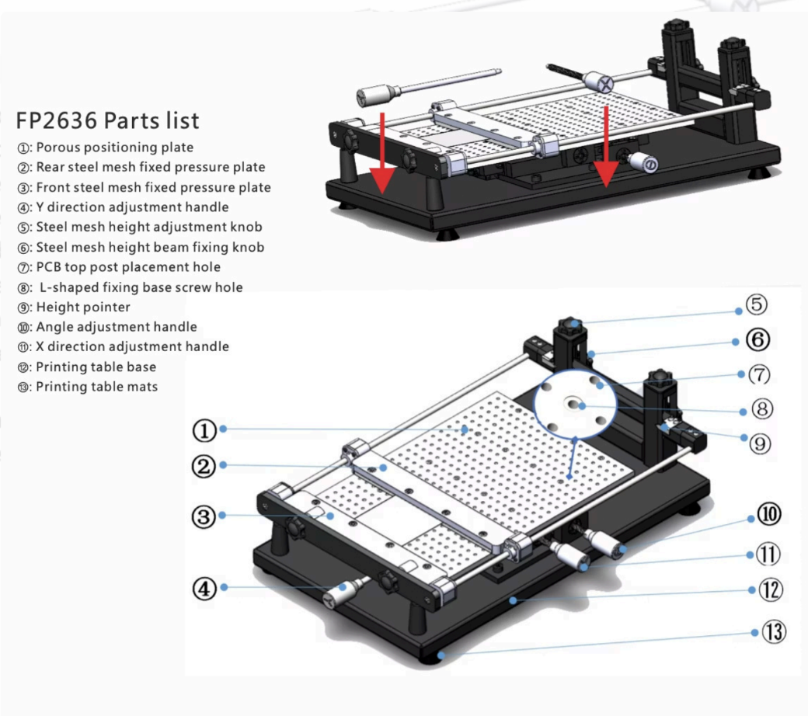

The FP2636 prints solder paste onto a circuit board. You clamp your board on its bed, clamp a thin metal stencil above it, line the stencil's openings up with the board's pads, and drag paste across the stencil with a squeegee — the paste goes through the openings and nowhere else, leaving a neat deposit on every pad at once. It's the first step of surface-mount PCB assembly: paste first, then [the pick and place machine](/docs/pcb-machines/neoden-pick--place/pick-and-place-machine-neoden-yy1/) sets the components into the wet paste, then [the reflow oven](/docs/pcb-machines/novastar-solder-reflow-oven/solder-reflow-oven-ddm-novastar-gf-c2/) melts it to lock everything down. It takes boards up to **280 mm × 380 mm** and stencils up to **260 mm × 360 mm**. It has no motor, no power cord and no software — every part of it is hand-cranked, and the whole job takes a few minutes once your board is clamped. If you're not sure this is the right machine for your project, see [Which Machine?](/docs/which-machine/) or ask a staff member.

> [!WARNING]
> **A trained staff member must be present** whenever the machine is in use.

> [!WARNING]
> **Lead-free solder paste only.** Leaded paste (such as Sn63/Pb37) is prohibited on this machine.

> [!WARNING]
> **Solder paste is a chemical hazard, not just a sticky mess.** Wear **nitrile gloves** the entire time you handle it, keep it off your bare skin, and never eat, drink or touch your face at the machine. Wash your hands with soap and water when you're done, gloves or not.

:::caution[IF PASTE GETS ON YOUR SKIN OR IN YOUR EYES]
Stop what you're doing and rinse the area thoroughly with soap and water — eyes for a full 15 minutes at the eyewash station. Tell a staff member either way, even if it seems minor; for anything worse, staff follow the Fab Lab [emergency procedures](/safety/).
:::

## Before you start

- Bring **your own stencil**, cut to match your board. Add it to your order when you have the PCB fabricated — most board houses will make one alongside it. The lab is currently experimenting with cutting stencils in-house on the laser cutter and the Cricut, so ask staff whether that's an option for your board before you pay for one.
- Your board must fit within **280 mm × 380 mm**, and your stencil within **260 mm × 360 mm**. The machine takes a board bigger than the largest stencil it can clamp, so if your board is near the top of that range, keep the pads you need to paste inside the area a 260 mm × 360 mm stencil can cover.
- **Solder paste, a squeegee, isopropyl alcohol and lint-free wipes are all lab-supplied** — ask staff and they'll get them out for you. Don't bring your own paste.
- Check your paste before you start: within its expiration date, warmed to room temperature, and stirred according to the instructions on the jar. Cold or unmixed paste prints badly.
- Your board should be clean, dry, and free of oxidation on the pads, with as little warp as you can manage. Handle it by the edges from here on — fingerprints on pads cause solder defects.
- Look your stencil over: flat, no bends or creases, no tears around the openings, and no dried paste blocking any of them.
- Roll up loose sleeves and take off dangling jewelry — nothing here can grab them, but they will drag through wet paste and spread it across your board.

## Machine overview

1. **Porous positioning plate** — the perforated bed your board sits on. The holes are where the L-shaped seats and pins screw in.
2. **Rear steel mesh fixed pressure plate** — clamps the back edge of the stencil.
3. **Front steel mesh fixed pressure plate** — clamps the front edge of the stencil.
4. **Y direction adjustment handle** — nudges the board front-to-back for alignment.
5. **Steel mesh height adjustment knob** — raises and lowers the stencil, and keeps it level.
6. **Steel mesh height beam fixing knob** — locks the stencil at the height you set.
7. **PCB top post placement hole** — where a top post screws in to hold down a board that flexes.
8. **L-shaped fixing base screw hole** — where the L-shaped seats that locate your board mount.
9. **Height pointer** — shows the stencil's current height.
10. **Angle adjustment handle** — rotates the board slightly to square it up with the stencil.
11. **X direction adjustment handle** — nudges the board left-to-right for alignment.
12. **Printing table base** — the frame everything is built on.
13. **Printing table mats** — the feet, which grip the bench and damp out vibration.

## Operating

1. Wipe the **porous positioning plate (1)** with a lint-free wipe dampened with isopropyl alcohol. Clear off dust, debris and any dried paste from the last job, and check that the perforations are open. Anything left on the bed presses into the underside of your board and tilts it, which shows up as uneven paste. Let the bed dry completely before going on.
2. Screw the **L-shaped seats** into the **L-shaped fixing base screw holes (8)** and fit the **positioning pins** so your board will sit roughly where the stencil's openings will land. Get this close — the X and Y handles only have a small range of adjustment to make up the difference.
3. Place your board on the bed, pads facing up, holding it by the edges. If the board flexes when you press gently at its center, screw a **PCB top post** into one of the **top post placement holes (7)**, or ask staff for a support to go underneath — a board that bows will print thin in the middle.
4. Slide the **side rails** — the two rails running along the left and right of the bed, which the diagram above doesn't number — in against the board's edges until they make solid contact, and lock them. Even pressure on both sides: enough to stop the board moving, not enough to bend it.
5. Pick up your stencil by the frame edges only — don't touch the middle — and set it into the **front (3)** and **rear (2)** pressure plates with the paste side facing up. Center the pattern of openings over your board's pads by eye before you tighten anything.
6. Tighten the clamps a little at a time, alternating left and right so the tension stays balanced. Stop when the stencil is held firmly; over-tightening warps the frame.
7. Look across the stencil. It should be flat and evenly tensioned over the whole print area — no sagging, ripples or distortion. If it isn't, loosen the clamps and reseat it.
8. Turn the **steel mesh height adjustment knob (5)** to lower the stencil until it is just short of touching your board, reading the **height pointer (9)** as you go. Lock it there with the **steel mesh height beam fixing knob (6)**.

> [!WARNING]
> Keep your fingers clear of the stencil frame and the height beam while you lower and clamp them. They come down with real force and will pinch hard.

9. Now align. Look down through the stencil's openings at the pads underneath, and use the **X (11)** and **Y (4)** handles to slide the board and the **angle adjustment handle (10)** to rotate it, until the openings sit centered on the pads. Aim at the **fiducials** if your board has them — the small round alignment targets etched in the copper. If it doesn't, use the finest-pitch footprint on the board, usually an IC.
10. Check the alignment in at least three places: two opposite corners and the center. Every one should show the opening sitting symmetrically over its pad. If alignment is good in one spot and bad in another, that isn't an alignment problem — the board or the stencil is warped, so go back and fix that first.
11. Lock every adjustment so nothing drifts during the print, and give the whole thing one last look.
12. Raise the stencil back to its upper position and lay a bead of solder paste along one edge of it, just short of the first row of openings. About **10–15 mm** across, running the full width of the print area, continuous with no gaps.
13. Lower the stencil slowly until it sits flat against the board across its whole area. Any gap between stencil and board lets paste spread sideways under the stencil.
14. Hold the squeegee at **30–60°** to the stencil — 45° works for most jobs — and make **one smooth, continuous pass** across the whole stencil at roughly **25–50 mm per second**. Press down firmly and evenly, just hard enough to shear the paste into the openings. Don't stop partway, don't change speed, and don't go back over an area you've already passed.
15. Lift the stencil **straight up** in one smooth motion — quick but controlled, with no sideways movement. This is called snap-off, and it's what gives you clean, sharp deposits instead of smears.

If you've never done this before, [this stencil printing video](https://www.youtube.com/watch?v=1tkFluE98RU) shows what the squeegee stroke and snap-off should look like. It's a different machine, and it aligns the stencil far more casually than you should — but the paste technique is the same.

## Checking your print

Before you move the board, look it over carefully — ideally under magnification. All four of these have to be true:

- **Every pad has paste on it.** Go over the board systematically, especially fine-pitch parts and small passives. One bare pad is one component that won't solder.
- **The edges are sharp.** Each deposit should be a crisp copy of the opening that made it. Rounded or fuzzy edges mean the snap-off dragged or there was too much paste.
- **No bridges between pads.** Any paste connecting two adjacent pads is a reject — it'll short in the oven. Bridging usually means misalignment, too much paste, or too much squeegee pressure, and it shows up on fine-pitch parts first.
- **The thickness is even across the board.** Deposits should look the same at the corners as in the middle, and roughly as tall as your stencil is thick. Variation means uneven stencil contact, a warped board, or pressure that changed during your stroke.

If anything fails, don't try to patch it by hand — clean the board and print again. See [Starting a failed print over](#starting-a-failed-print-over) below.

## Finishing up

- Loosen the clamps, lift the stencil clear, and take your board out by the edges. The paste is wet and smears with almost no provocation, so move it flat and set it down somewhere it won't get knocked. Its next stop is [the pick and place machine](/docs/pcb-machines/neoden-pick--place/pick-and-place-machine-neoden-yy1/).
- Clean your stencil on **both** sides with isopropyl alcohol and lint-free wipes while the paste is still wet. The underside matters most — paste left there dries into the openings and ruins your next print.
- Wipe the squeegee clean, and wipe down the bed and any paste that got onto the machine.
- Put the solder paste back in the toolbench the stencil printer sits on, and return the squeegee, alcohol and wipes with it.
- Used wipes go in the regular trash. Take your gloves off last, then wash your hands with soap and water.
- Take your board and your stencil with you — the lab has no storage.

## Common problems

**Some pads have no paste, or the deposits are only partly filled.** The stencil wasn't sitting flat against the board, there wasn't enough paste on the squeegee, or the openings were blocked before you started. Clean the stencil's underside, check the openings are clear, and reprint with a fuller bead and firmer, even pressure.

**Paste bridges between adjacent pads.** Usually misalignment — the openings weren't centered on the pads, so paste landed between them. It can also come from too much squeegee pressure forcing paste sideways under the stencil, or from paste already on the stencil's underside. Clean everything and reprint after re-checking alignment at all three points.

**The deposits are smeared or have fuzzy edges.** The stencil moved sideways during snap-off. Lift it straight up next time, in one motion, and make sure every adjustment was locked before you started the stroke.

**Paste thickness varies across the board.** The stencil wasn't in even contact — often a warped board, an unevenly clamped stencil, or pressure that changed during the squeegee pass. Re-seat the board with a top post or a support underneath, retighten the stencil clamps alternately, and make the next stroke at one steady speed and pressure.

**An adjustment handle or knob won't turn smoothly, or something on the machine looks damaged.** Stop and get a staff member. Don't force it.

### Starting a failed print over

A failed print is recoverable, but only if you restart from a genuinely clean board and stencil — paste left anywhere will reproduce the same defect.

1. **Get the board out now,** before the paste starts drying. Raise the stencil fully, loosen the rail clamps, and lift the board out by the edges.
2. **Clean the board completely.** Lint-free wipes dampened with isopropyl alcohol, working systematically across every pad. Check under magnification for residue — it usually takes several wipes.
3. **Clean the whole underside of the stencil,** not just the area that went wrong. Any paste that stuck to it during the bad print will transfer straight into the next one.
4. **Reinstall the board and re-check alignment** at all three points from scratch. Alignment drift is the most common cause of a failed print, so don't assume the old setup was fine.
5. **Print again**, paying particular attention to whatever went wrong the first time, and inspect it just as carefully before accepting it.
