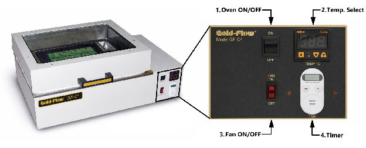
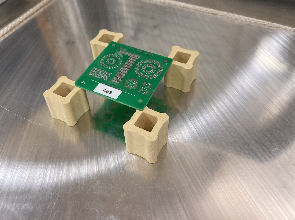
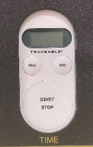
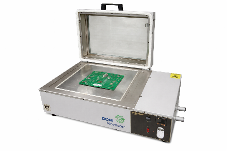

The reflow oven melts solder paste to permanently attach surface-mount components to a circuit board — the last step of PCB assembly, after paste has been stenciled on and components placed. It's a combined conduction/convection oven: a **12" × 12" hotplate** heats from below while a fan circulates hot air under the glass hood, and it can also run as a plain hotplate for preheating and rework. Boards up to the full plate size fit, with about **3"** of height clearance under the closed hood. A typical board reflows in under a minute once the oven is at temperature. If you're not sure this is the right machine for your project, ask a staff member.
<!-- TODO: link /docs/which-machine/ at the end of the intro once that page exists -->

> [!WARNING]
> **A trained staff member must be present** whenever the oven is in use, and you must stay at the machine the entire time it's on — never leave it running unattended.

> [!WARNING]
> **Burn hazard.** The hotplate, hood, and outer surfaces are hot enough to cause serious burns during use — and they stay hot for a long time after the oven is switched off. Wear heat-resistant gloves and eye protection whenever the hood is open, and handle boards only with tongs.

> [!WARNING]
> **Lead-free solder only.** Leaded solder (such as Sn63/Pb37) is prohibited in this oven.

> [!WARNING]
> **Circuit boards and their components only.** Never use the oven to heat anything else — no acrylic sheets, 3D-printed parts, or other materials.

:::caution[EMERGENCY STOP]
There is no dedicated emergency-stop button. To shut the oven down immediately, flip the **Oven ON/OFF rocker switch** on the front panel to **OFF** — and if it's safe to reach, unplug the machine at the wall. Then notify staff.
:::

:::caution[FIRE PROCEDURE]
A faint flux odor during reflow is normal. A strong burning smell or visible smoke is not: stop the timer, turn the oven **OFF**, and get a staff member immediately. If anything catches fire, alert everyone nearby and use the room's fire extinguisher — it's kept in a clearly marked, easy-to-reach spot.
:::

## Before you start

- **A trained staff member must be present** to oversee operation.
- Use **lead-free solder paste** (SAC305 is the usual choice). If your paste has a manufacturer's datasheet, its reflow profile beats the generic starting settings below.
- Your board must fit the **12" × 12" hotplate**, with about **3"** of height clearance under the closed hood.
- Look the machine over before powering on: the chamber is clean and free of debris, the cord and plug are undamaged, and the glass hood and its handle are intact. It should be securely plugged into its **115 V, 20 A** receptacle. If anything looks damaged, don't use the oven — tell staff.
- Wear the right PPE whenever the hood is open:
  - **(Required)** Heat-resistant gloves.
  - **(Required)** Protective eyewear (safety glasses or goggles).
  - **(Recommended)** Smock or heat-resistant apron.
- Get the **tongs** — and, for full-convection jobs, the **ceramic standoffs** — from their toolbox.

## Machine overview

1. **Oven ON/OFF** — rocker switch for main oven power.
2. **Temperature controller** — displays and sets the hotplate/chamber temperature, always in °C.
3. **Fan ON/OFF** — rocker switch for the convection fan. **ON** for reflow, **OFF** for hotplate-only use.
4. **Timer** — a **standalone battery-powered countdown timer** bolted to the panel. It isn't wired into the oven and controls nothing: the oven keeps heating whether or not the timer is running. You use it to time the reflow yourself, and it just beeps when the time runs out (up to 99 min 99 sec — minutes first, then seconds).

## Choosing a heating mode

There are three ways to run the oven:

- **Standard reflow** — board flat on the hotplate, hood closed, fan **ON**. The default for most boards: the hotplate conducts heat from below while the fan circulates hot air above.
- **Full convection reflow** — board elevated **1/2–1 in (12–25 mm)** on ceramic standoffs, hood closed, fan **ON**. Elevating the board exposes both faces to the circulating air instead of direct hotplate contact, for more even top/bottom heating. Use it for dense boards, uneven reflow, or when the underside of the board overheats.
- **Hotplate only** — hood open, fan **OFF**. For preheating, rework, and special cases; not preferred for repeatable full-board reflow.

### Starting settings

These are starting points only — when your solder paste has a datasheet, follow it instead. Start the timer only once the **ACTUAL** temperature reading has reached **SET**.

| Mode | Setup | Start temperature | Time | Notes |
|---|---|---|---|---|
| Standard reflow (SAC305) | Hood closed, fan ON | 235–245 °C | About 45–60 s above liquidus | Good default for most lead-free boards |
| Full convection (SAC305) | Hood closed, fan ON, board on 1/2–1 in standoffs | 235–245 °C | About 45–60 s above liquidus | Most even top/bottom heating |
| Hotplate only | Hood open, fan OFF | Case-dependent | Case-dependent | Preheat and rework, not repeatable reflow |

## Operating

**Reflow a board:**

1. With the hood **closed**, flip the **Oven ON/OFF (1)** and **Fan ON/OFF (3)** rockers to **ON**.
2. Set your temperature on the **temperature controller (2)**: press and hold the **SET** key to display the set temperature, and while still holding it, press the **UP**/**DOWN** keys to adjust. When you release the keys, the display returns to the **ACTUAL** temperature.
3. Dial in your reflow time on the **timer (4)** — press the **MIN** and **SEC** keys until the display shows the duration you'll run (first two digits minutes, last two seconds). This is a **standalone battery-powered timer that only beeps when the time is up; it doesn't run the oven or switch off the heat**, so don't start it yet — you'll start it in step 6, once the board is in and back up to temperature.

   

4. Wait for the **ACTUAL** temperature to climb to the **SET** temperature. The oven is now ready.

> [!WARNING]
> From here on, the hotplate, hood, and everything near them can cause serious burns. Put on your gloves and eye protection before opening the hood, and touch boards only with the tongs.

5. Lift the hood by its **handle** and place your board **centered** on the hotplate — or, for full convection, on the ceramic standoffs. Keep the hood open as briefly as you can so the oven doesn't lose heat.

   

6. Close the hood and let the **ACTUAL** temperature recover back to **SET**, then press the timer's **START/STOP** button.
7. When the time is up, an alarm sounds (for up to a minute) — press **START/STOP** to silence and reset it.
8. Put your PPE back on, lift the hood, and remove the board **with the tongs**. Set it on a heat-safe surface to cool — the board and its solder joints stay hot for a while.
9. Running more boards? Close the hood, let **ACTUAL** return to **SET**, and repeat from step 5. Otherwise flip the **fan and oven rockers** to **OFF**.

**Use as a plain hotplate:**

1. Lift the hood to its fully open position.
2. Flip the **Oven ON/OFF rocker (1)** to **ON** and leave the **Fan ON/OFF rocker (3)** **OFF**.
3. Set the temperature — and the timer, if you want it — the same way as above.
4. When you're finished, flip the **Oven ON/OFF rocker** to **OFF**.

## Finishing up

- Flip the **fan and oven rocker switches** to **OFF**.
- The hotplate and surfaces stay hot long after power-off — warn anyone working nearby, and don't start cleaning until the oven is **completely cool**.
- Once cool, wipe the hotplate and outer surfaces with a **soft, damp cloth**. The tempered glass (only when cool) can be cleaned with alcohol or glass cleaner. Never scrape or use abrasives.
- Return the tongs, standoffs, and anything else you used to their toolbox.
- Report any unusual machine behavior to staff before you leave.
- Take your boards and materials with you — the lab has no storage.

## Common problems

**The oven won't turn on** — no lights, display, or fan. Check that it's securely plugged into its 115 V, 20 A receptacle and that the oven rocker is ON. If it still won't power up, stop and tell staff — never open panels or attempt electrical repairs yourself.

**The fan isn't running, or airflow seems weak, during a reflow job.** Confirm the fan rocker is ON — both reflow modes need it. If it still won't run, stop the job and tell staff; don't finish a convection cycle without the airflow it was set up for.

**ACTUAL takes forever to reach SET, or the temperature drops a lot when the hood opens.** That's heat loss. Keep the hood closed whenever possible, load boards quickly, and always let ACTUAL recover to SET before starting (or restarting) the timer.

**The timer won't start or count down.** Re-enter the time with the MIN/SEC keys and press START/STOP. If it still misbehaves, don't guess the cycle by feel — time it with your phone and tell staff so the timer can be checked. If the end-of-cycle alarm won't stop, press START/STOP; failing that, turn the oven off and tell staff.

**The board is scorching, or the solder paste is burning.** Stop the timer immediately and remove the board with your PPE and the tongs. For the next attempt, lower the SET temperature and/or the time — and consider full convection on standoffs to reduce direct hotplate heating.

**Cold joints, or grainy paste that never fully melted.** Make sure the oven had actually reached SET before the timer started and that the hood stayed closed for the whole cycle. Check the board sat flat and stable — and for full convection, that it was elevated on the standoffs with the fan ON. If everything was right, increase the time slightly.

**One area of the board reflows and another doesn't.** Center the board on the hotplate and make sure nothing blocks the airflow. For more even top/bottom heating, switch to full convection on standoffs.

**Dirty glass, or residue on the hotplate.** Clean only when the oven is completely cool: alcohol or glass cleaner on the tempered glass, a soft damp cloth on the hotplate and outer surfaces. Don't scrape or use abrasives, and tell staff about persistent buildup or unknown material.
