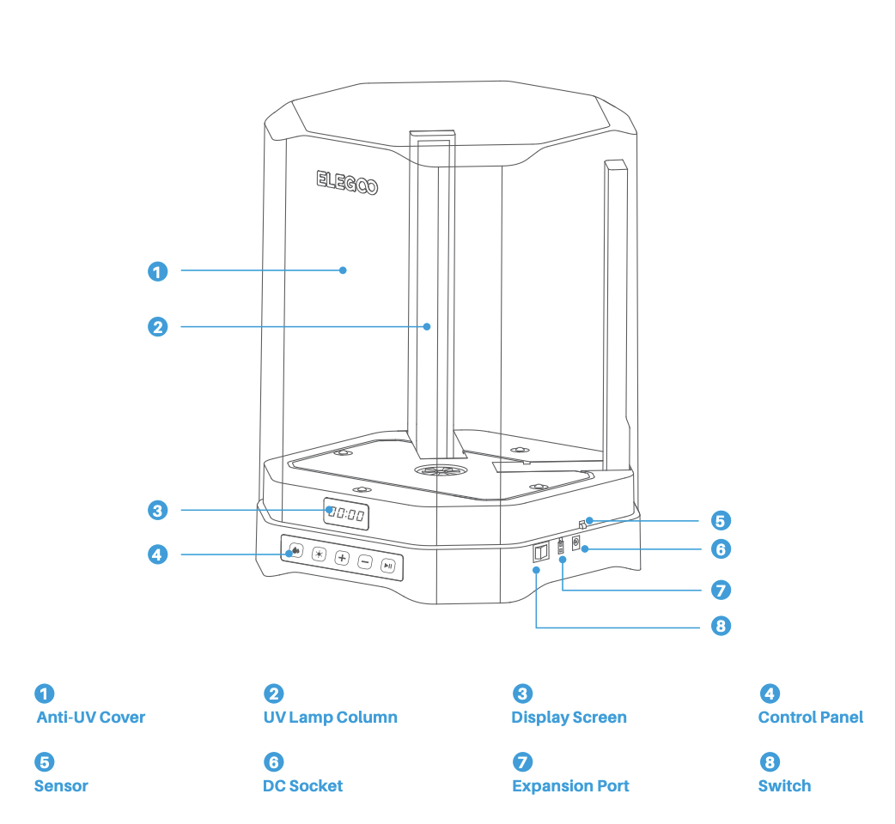
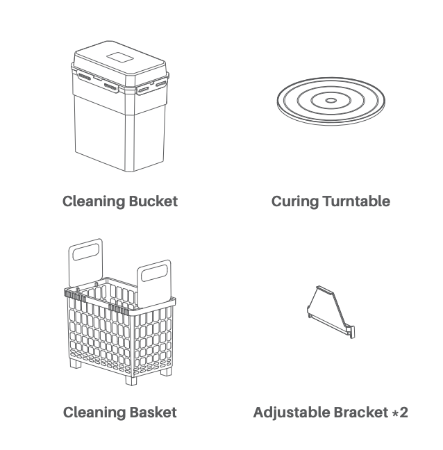
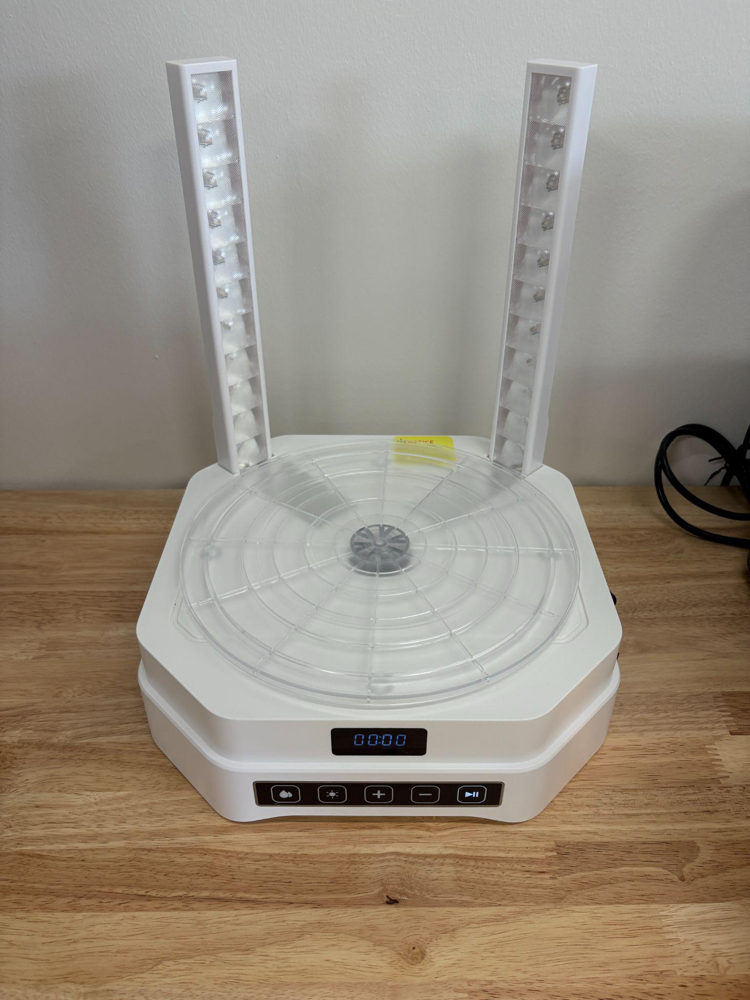
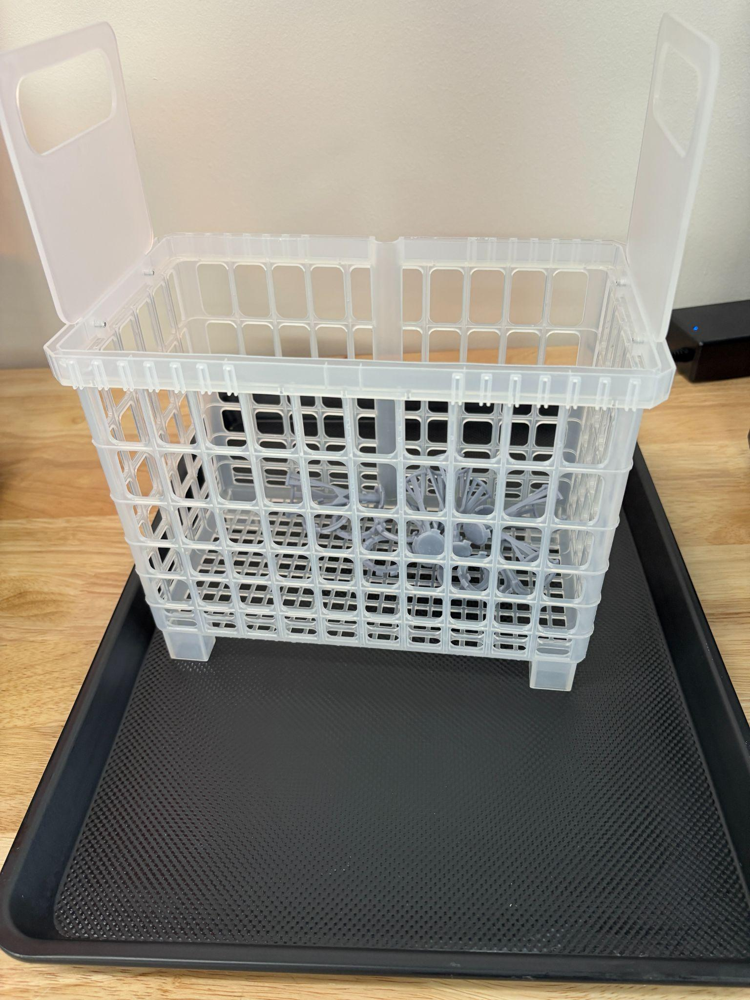
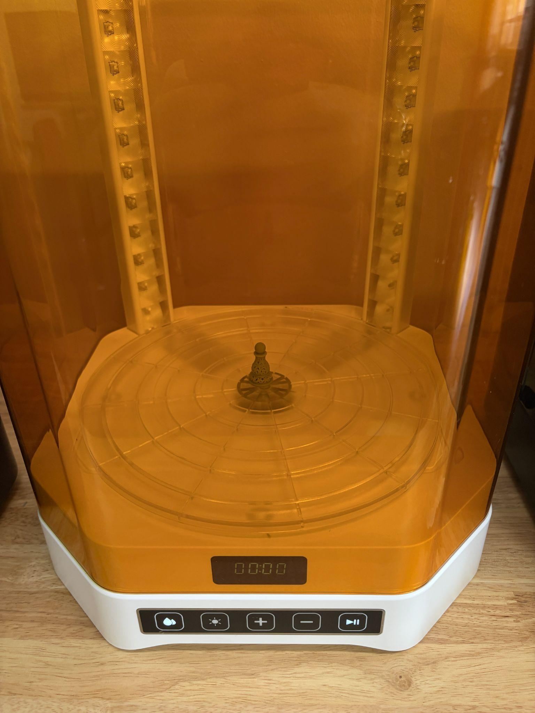
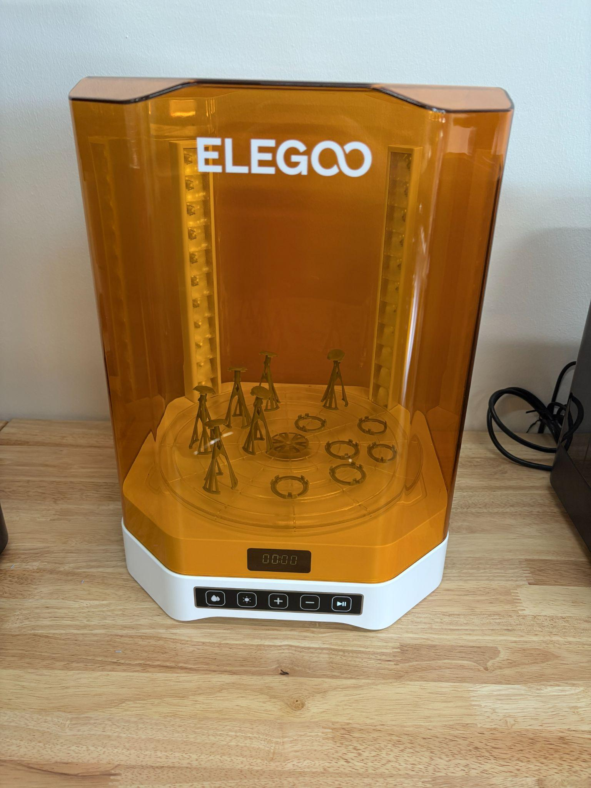
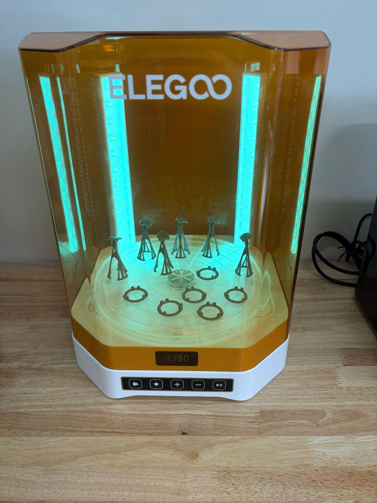

Every part that comes off a resin printer arrives coated in liquid resin and only partly hardened. The Mercury 3.0 Plus finishes the job in two stages: it **washes** the part in isopropyl alcohol to strip the uncured resin off it, and then it **cures** the part under UV lamps to harden it the rest of the way through. It's one machine that does both — you swap the wash bucket for the curing turntable on the same base. This is not an optional polishing step. A part that skips it stays soft, stays tacky, and stays a skin irritant. Anything the resin printer can print fits: the wash basket takes a part up to **230 × 135 × 260 mm**, and the curing turntable up to **250 mm across and 290 mm tall**.

This page covers the wash and cure station itself. For the printer that feeds it, see the [Resin 3D Printer (Elegoo Saturn 4 Ultra 16K)](/docs/sla-printers/elegoo-saturn-4-ultra-16k-resin-3d-printer/resin-3d-printer-elegoo-saturn-4-ultra-16k/).

> [!WARNING]
> **A part that has not been washed and cured is still covered in liquid resin.** Wear **nitrile gloves** from the moment you take it off the build plate until it comes out of the curing cycle. Never touch uncured resin with bare hands, and never touch anything else with resin on your gloves.

:::caution[RESIN OR ALCOHOL ON SKIN OR IN EYES]
**On skin:** take off contaminated clothing and shoes immediately, wash the area with plenty of water for **at least 15 minutes**, and see a physician if you feel unwell afterwards.
**In eyes:** flush with plenty of water for **at least 15 minutes** and call a physician immediately.
Tell a staff member either way. Those are the resin manufacturer's own instructions, and 15 minutes is much longer than it feels — use a timer.
:::

> [!WARNING]
> **The wash bucket is full of isopropyl alcohol, which is flammable and gives off vapour.** Keep the lid on it whenever you're not actively putting something in or taking something out, keep it away from anything hot or sparking, and keep it on the resin bench — it doesn't travel around the lab.

> [!WARNING]
> **Keep the cover closed while the machine is running, and don't reach into it.** The wash cycle spins an impeller in the bottom of the bucket, and the cure cycle runs UV lamps bright enough to damage your eyes. The cover blocks both.

:::caution[EMERGENCY STOP]
This machine has **no emergency stop button**. Stop a cycle with the **start/pause button** on the control panel. If that doesn't work, flip the **power switch** on the side of the base or unplug it. Tell a staff member either way.
:::

> [!WARNING]
> **Liquid and electronics share this bench.** If IPA or resin spills onto the base, the control panel, or the power socket, don't run the machine — turn it off and get a staff member.

## Before you start

- **No training or checkout is required.** Read this page, then go. Staff are happy to walk through it with you the first time.
- **Wear nitrile gloves.** Everything you're about to handle is wet with resin.
- You need a **part fresh off the build plate**, with the excess resin already dripped back into the vat and the part scraped free — see [Operating](/docs/sla-printers/elegoo-saturn-4-ultra-16k-resin-3d-printer/resin-3d-printer-elegoo-saturn-4-ultra-16k/#operating) on the printer page.
- **Leave the supports on for now.** They come off between washing and curing, when the part is clean but not yet hard and brittle.
- The wash bucket should already hold **IPA** within its marked range. If it's below the markings or has gone cloudy and grey, tell a staff member rather than running a part through it.
- Have a **baking sheet and shop towels** ready — the basket drips alcohol when it comes out.
- **Budget about 20–30 minutes.** Washing, drying, snipping supports, and curing all take real time, and drying in particular can't be rushed.

## Machine overview

 

The base does the work; what sits on it decides which job it's doing.

- **Cleaning bucket** — the tall container of IPA, with volume markings up its side and **MAX 7.5 L** at the top. It sits on the base for washing, with its lid on.
- **Cleaning basket** — the perforated basket that drops into the bucket and holds your parts so they're not rolling loose in the alcohol.
- **Curing turntable** — the clear disc that replaces the bucket for curing, and rotates so the UV lamps reach every side of the part.
- **Anti-UV cover** — the orange hood. It goes over whichever of those is in place, and stays on while the machine runs.
- **Control panel** — five buttons under the display: a **droplet** for wash mode, a **sun** for cure mode, **+** and **−** to set the time, and **start/pause**. The display counts the time down.

## Operating

### Wash

1. **Check the alcohol level.** The bucket is marked up its side from 1 L to **MAX 7.5 L**; the IPA should be somewhere in that range and clear enough to see the bottom of the bucket through. If it's low or cloudy, get a staff member rather than running your part through it.

2. **Put your part in the basket** and lower the basket into the bucket. Make sure it's actually submerged — anything above the alcohol line comes out still coated.

   

3. **Put the cover on**, press the **droplet** button for wash mode, set **2–5 minutes** with **+** and **−**, and press **start**. Small, simple parts need 2; anything with deep recesses or fine detail wants closer to 5.

4. When the cycle ends, **lift the basket out and stand it on a towel-lined baking sheet** so the alcohol drains off it rather than onto the bench.

   

5. **Feel the part** — still wearing gloves. If it's slippery or glossy, there's uncured resin left on it; put it back and run another short wash. A properly washed part feels matte and slightly draggy, not slick.

### Dry

6. **Let the alcohol evaporate completely.** Air-drying is fine and a fan speeds it up; a light pat with a shop towel helps too. Wipe the baking sheet down while you wait.

   > [!NOTE]
   > **Don't cure a wet part.** Alcohol left on the surface cures into white blotches, tacky patches, and an uneven finish, and it's the single most common reason a finished print looks bad.

### Remove the supports

7. **Snip or peel the supports off now**, while the part is washed but not yet fully cured — it's at its most forgiving. Twist gently rather than forcing anything, and trim the little nubs left behind. After curing, the same supports snap instead of bending and take chunks of the part with them.

### Cure

8. **Swap the bucket for the turntable.** Put the lid on the wash bucket, lift it off the base, set it aside, and put the curing turntable in its place.

9. **Stand your part in the middle of the turntable** and check it's clean, dry, and support-free.

   

10. **Close the cover fully.** The lamps won't run otherwise, and they're the part you don't want to look at.

    

11. **Press the sun button for cure mode, set the time, and press start.** Go by size:

    | Part | Cure time |
    |---|---|
    | Small (under about 30 mm across) | 2–3 minutes |
    | Medium | 3–5 minutes |
    | Large, or thick and complex | 5–7 minutes |

    

12. **Check it when the cycle ends.** A cured part is dry, hard, and not tacky anywhere. If it's still slightly tacky, cure again in short bursts rather than one long one.

    > [!NOTE]
    > **Don't overcure thin or detailed parts.** Extra UV keeps hardening the resin past the point it should stop, and thin walls, fine detail, and delicate features go brittle and snap. Short bursts, checking between them.

13. **Your part is finished.** Once it's cured it's safe to handle with bare hands, and you can sand or paint it from here. If you sand it in the lab, sand over a trash can and clean up the dust.

## Finishing up

- **Put the lid back on the wash bucket** and set the bucket back on the base, so the next person finds the machine ready to wash.
- **Wipe up any spills** on the machine and bench with a shop towel and bin it. Uncured resin and alcohol never get left on the bench.
- **Never pour resin or IPA down a drain.** Solid resin waste goes in the trash; used alcohol goes to staff.
- **Turn the machine off** when you're done with it.
- **Bin your gloves** and wash your hands.
- Tell a staff member if the alcohol has gone cloudy, if a lamp flickered, or if anything else looked off.
- **Take your part with you** — the lab has no storage.

## Common problems

**The part is still sticky or slippery after washing.** There's uncured resin left on it. Run another wash of a couple of minutes and check again. If a second wash doesn't fix it, the alcohol is probably saturated with dissolved resin — tell a staff member, it needs changing.

**The part came out of the curing cycle with white marks or a chalky film.** Alcohol was still on the surface when the UV hit it. Dry parts fully next time; on this one, a light wash and a proper dry before re-curing usually improves it.

**One side cured and the other didn't.** The part was shadowing itself on the turntable. Reposition it — stood up rather than lying down, and away from the edge — and run another short cycle.

**The alcohol has gone cloudy and grey.** It's holding as much dissolved resin as it can and isn't cleaning parts properly any more. Tell a staff member; don't top it up yourself and don't tip it out.

**A detailed part snapped while I was removing the supports.** Supports come off between washing and curing, not after. A fully cured part is hard and brittle, and forcing a support off one takes surface with it.

**The machine won't start, or the display is blank.** Check the cover is fully closed and the power switch on the base is on. If it still won't run, tell a staff member — don't open the base.
