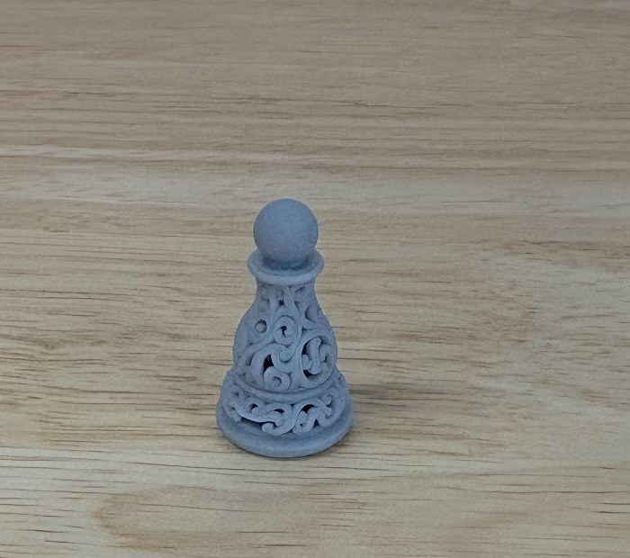
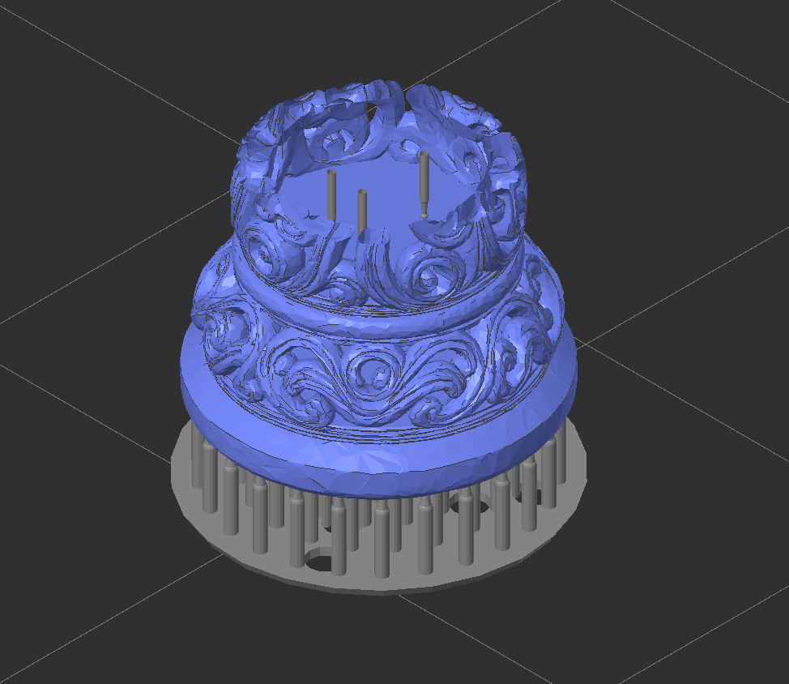
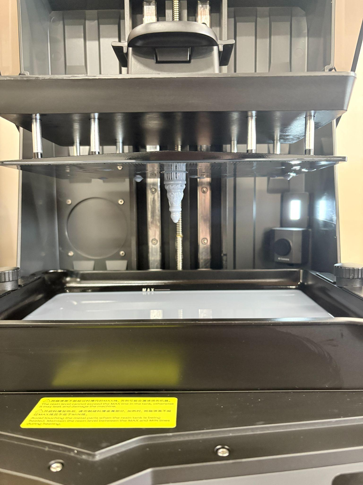

Print one ornate chess piece in resin, and go through the whole SLA loop once — hollowing, supports, printing, washing, drying, and curing — on a part small enough that a mistake costs you an hour rather than an evening.

That scrollwork is the point. Print the same model on a filament printer and most of it disappears into the layer lines.

**Read this first:** the [Resin 3D Printer (Elegoo Saturn 4 Ultra 16K) manual](/docs/sla-printers/elegoo-saturn-4-ultra-16k-resin-3d-printer/resin-3d-printer-elegoo-saturn-4-ultra-16k/), especially [Slicing in SatelLite](/docs/sla-printers/elegoo-saturn-4-ultra-16k-resin-3d-printer/resin-3d-printer-elegoo-saturn-4-ultra-16k/#slicing-in-satellite), and then the [Wash and Cure Station manual](/docs/sla-printers/elegoo-mercury-30-plus-washing-and-curing-machine/wash-and-cure-station-elegoo-mercury-30-plus/). This activity assumes both, and the second one is where half the work is.

## The activity

Pick a piece and download it:

[Pawn](/files/SLA%20Printers/Elegoo%20Saturn%204%20Ultra%2016K%20Resin%203D%20Printer/Learning%20Assignments/Activity%201/ornate_chess_pawn2.stl) ·
[Rook](/files/SLA%20Printers/Elegoo%20Saturn%204%20Ultra%2016K%20Resin%203D%20Printer/Learning%20Assignments/Activity%201/ornate_chess_rook2.stl) ·
[Knight](/files/SLA%20Printers/Elegoo%20Saturn%204%20Ultra%2016K%20Resin%203D%20Printer/Learning%20Assignments/Activity%201/ornate_chess_knight2.stl) ·
[Bishop](/files/SLA%20Printers/Elegoo%20Saturn%204%20Ultra%2016K%20Resin%203D%20Printer/Learning%20Assignments/Activity%201/ornate_chess_bishop2.stl) ·
[Queen](/files/SLA%20Printers/Elegoo%20Saturn%204%20Ultra%2016K%20Resin%203D%20Printer/Learning%20Assignments/Activity%201/ornate_chess_queen2.stl) ·
[King](/files/SLA%20Printers/Elegoo%20Saturn%204%20Ultra%2016K%20Resin%203D%20Printer/Learning%20Assignments/Activity%201/ornate_chess_king3.stl)

Start with the **pawn** if you're not sure — it's the shortest print of the six.

Then take it through SatelLite and the printer. What you're aiming for:

- **Sitting flat on the plate.** Import it, select it, right-click, **On Plate**.
- **Hollowed to a 2 mm wall.** These pieces are solid models; printed as-is one piece would drink resin for no benefit.
- **A drain hole** somewhere in the base, so the resin trapped inside the hollow can get out.
- **Automatic supports, with Generate Internal Support for Shell ticked.** The hollow needs supports inside it as well as under it.
- **A slice you have actually looked at** — step through the layer slider and check the supports reach the overhangs and the first layers form a solid raft.

Then print it, and finish it properly: wash, dry, **pull the supports off while it's still soft**, and cure. Sand and paint it afterwards if you like.

## Hints

- **Check the Project panel before you do anything else.** It should say **ELEGOO Saturn 4 Ultra 16K** and **Grey Standard 2.0**. Half of all failed first prints are somebody slicing for the wrong machine.
- **Change the baseboard settings** described in the [note in the manual](/docs/sla-printers/elegoo-saturn-4-ultra-16k-resin-3d-printer/resin-3d-printer-elegoo-saturn-4-ultra-16k/#support-it) before you slice. The stock raft is thick enough that getting the piece off the plate becomes a fight, and fighting a chess piece with a scraper usually ends with a broken chess piece.
- **Slice it once without hollowing, just to look at the resin volume**, then hollow it and slice again. Seeing the two numbers next to each other explains why anyone bothers.
- **Height is the whole cost.** If you want a second piece later, printing both together takes barely longer than printing the taller one alone — the screen cures a whole layer at once.
- **Don't cure it wet.** The most common way this activity ends in a disappointing-looking pawn is curing before the alcohol has fully evaporated.
