The Elegoo Saturn 4 Ultra builds parts out of liquid resin instead of plastic filament. A UV light source under the resin tank shines up through an LCD screen that blacks out everything except the shape of the current layer, hardening that whole layer at once against the build plate, which lifts 50 microns and does it again. That's stereolithography — SLA. What you get out of it is detail no filament printer in the lab can touch: crisp text, thin walls, smooth curves, and layers you mostly can't see. What you pay for it is mess. Resin is a liquid you have to wear gloves around, and every part that comes off this machine has to be washed and cured on the [wash and cure station](/docs/sla-printers/elegoo-mercury-30-plus-washing-and-curing-machine/wash-and-cure-station-elegoo-mercury-30-plus/) before it's finished — that step is not optional. Your part has to fit within **211 × 118 × 220 mm**, which is a tall, narrow box rather than a cube. If you're not sure this is the right machine for your project, see [Which Machine?](/docs/which-machine/) or ask a staff member.

> [!WARNING]
> **Liquid resin irritates skin and eyes, and you don't get to find out whether yours is sensitive.** Wear **nitrile gloves** any time you're near the open machine, the vat, the build plate, or an unwashed print. Never touch uncured resin with bare hands, and never touch your face, your phone, a door handle, or anyone else's things with gloves that have resin on them.

:::caution[RESIN ON SKIN OR IN EYES]
**On skin:** take off contaminated clothing and shoes immediately, wash the area with plenty of water for **at least 15 minutes**, and see a physician if you feel unwell afterwards.
**In eyes:** flush with plenty of water for **at least 15 minutes** and call a physician immediately.
Tell a staff member either way. Those are the resin manufacturer's own instructions, and 15 minutes is much longer than it feels — use a timer.
:::

> [!WARNING]
> **Keep the anti-UV cover closed while a print is running.** It's what stops the UV light reaching your eyes, keeps the resin smell contained, and keeps your hands out of the way of the build plate, which drops and lifts on its own throughout the print.

:::caution[EMERGENCY STOP]
This printer has **no emergency stop button**. To stop a print, use the **touchscreen** on the front. If the touchscreen won't respond, or something is actually going wrong, flip the **power switch on the back** of the machine. Tell a staff member either way.
:::

> [!WARNING]
> **Never use a metal scraper or a knife on the build plate, and never put anything metal into the resin vat.** A scratch in the plate ruins adhesion for everyone after you, and a puncture in the clear film at the bottom of the vat leaks resin into the machine. Plastic and silicone scrapers only.

## Before you start

- **No training or checkout is required.** Read this page, then go print. If it's your first time, staff are happy to stand with you — just ask.
- **Wear nitrile gloves.** They're the one piece of PPE this machine actually requires. Safety glasses are recommended on top of that, and a mask is optional.
- Bring a **3D model file** — an `.stl` is what the slicer expects.
- **To get your file onto a lab computer**, email it to **meloy.FabLab@gmail.com**, then open Gmail on a lab computer and download it there. A USB drive works too.
- Your part must fit within **211 × 118 × 220 mm**. That's the build plate's X and Y and the Z travel — tall is easy on this machine, wide is not.
- **The lab's Grey Standard 2.0 resin is the only resin allowed in this printer, and it's free.** Don't bring your own. Mixing resins means draining and cleaning the vat, which is a staff job, and the slicer's settings are tuned for the grey.
- **Resin prints take hours, and height is what costs you.** The screen cures an entire layer at once, so five small parts on the plate take almost exactly as long as one — but a part twice as tall takes twice as long. If a print is going to be too slow, the thing to reduce is its height, not the number of parts.
- **You are not finished when the print is.** Budget another 20–30 minutes at the [wash and cure station](/docs/sla-printers/elegoo-mercury-30-plus-washing-and-curing-machine/wash-and-cure-station-elegoo-mercury-30-plus/) for washing, drying, removing supports, and curing. Don't start a print at closing time.

## Machine overview

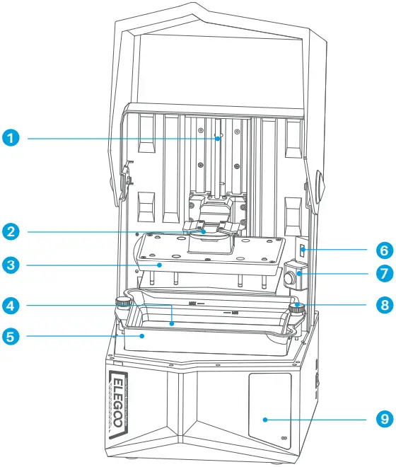 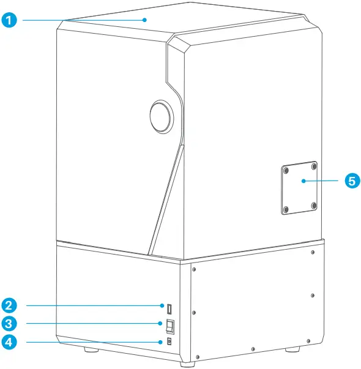

The parts you'll actually touch:

- **Touchscreen (front, 9)** — every control the machine has. Starting and stopping prints, checking progress, and the tool menus all live here.
- **Build plate (front, 3)** — the textured metal plate your part grows downward from. Its **handle (2)** releases it and lifts it out, and it goes back in the same way.
- **Resin tank (front, 5)**, also called the vat — the black tray holding the resin, clamped down by a **screw knob (8)** on each side. It has **MAX** and **MIN** lines marked on the inside. Look at it before you print; don't reach into it.
- **Power switch (rear, 3)** — the way to cut power in a hurry. The **USB interface** next to it takes a sliced file on a stick if you'd rather not send one over the network.

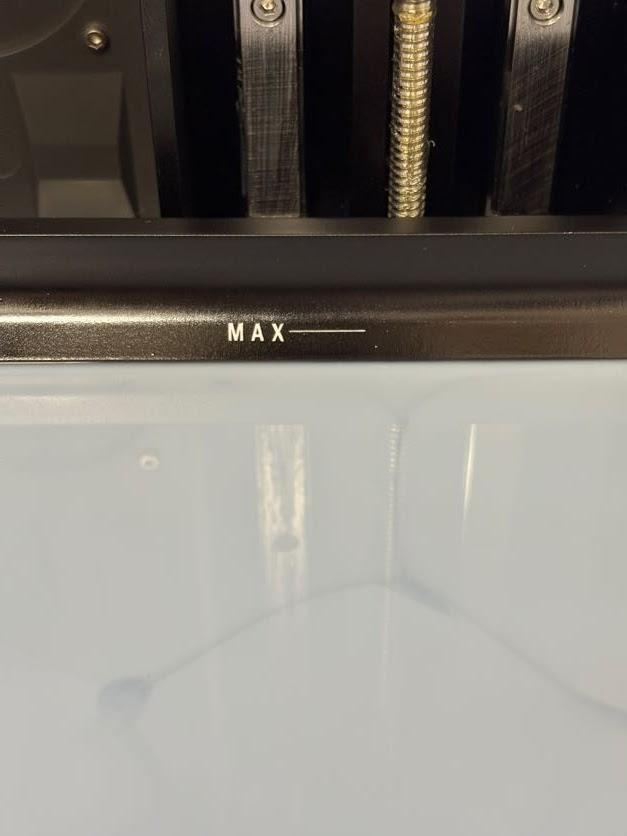

Everything else — the Z axis, the screen under the tank, the chamber light and camera — is calibrated or fragile. Leave it alone.

## Slicing in SatelLite

Resin printing needs two things from you that filament printing doesn't: **hollowing**, so a solid model doesn't become an expensive brick, and **supports**, because the part hangs upside down from the plate the whole time. Both live in **ELEGOO SatelLite**, which is already installed on the lab computers and signed in to the lab account.

Open it and you land on the **Prepare** tab. The **open-file button** is at the top of the left-hand toolbar; the transform tools (**On Plate**, **Move**, **Rotate**, **Scale**, **Mirror**) run down it underneath. The model tools — **Hollow**, **Holes**, **Repair**, **Support** — sit along the top. On the right, the **Project** panel should already read **ELEGOO Saturn 4 Ultra 16K** and **Grey Standard 2.0**; if it doesn't, fix that before anything else, because every setting below depends on it.

### Sit the model on the plate

Import your model, select it, right-click, and choose **On Plate**. That drops it flat onto the build plate so nothing is floating, which is where you want to start from.

### Hollow it

A solid model printed in resin is a waste of resin and a genuinely worse part: thick solid sections shrink as they cure and can warp or crack. Select the model, click **Hollow**, and set a **wall thickness of 2–3 mm** — 2 mm is the default and fine for most things. Leave **Hollow Type** on **Inward** and click **Confirm**.

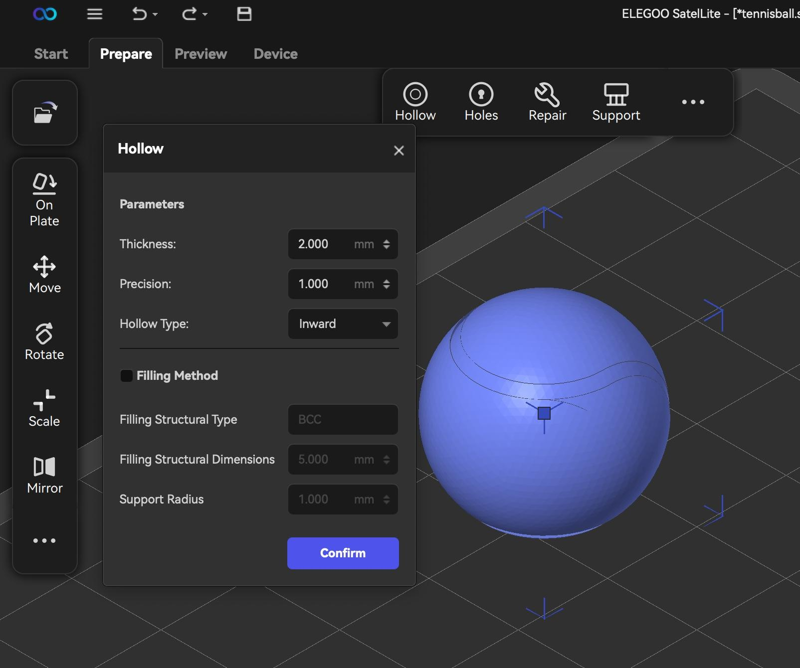

Hollowing leaves a sealed cavity full of liquid resin, which is why the **Holes** tool sits next to it — a drain hole or two in a face that won't show lets that resin escape back into the vat instead of rattling around inside your finished part.

### Support it

Click **Support**, then **Generate Automatic Supports**. The defaults (**Critical Angle 50°**, **Support Spacing 2 mm**) are sensible, and the generated supports are good enough for nearly everything — use them rather than placing supports by hand.

If you hollowed the model, tick **Generate Internal Support for Shell** first. The inside of a hollow part has overhangs too, and without internal supports its roof prints into thin air and collapses.

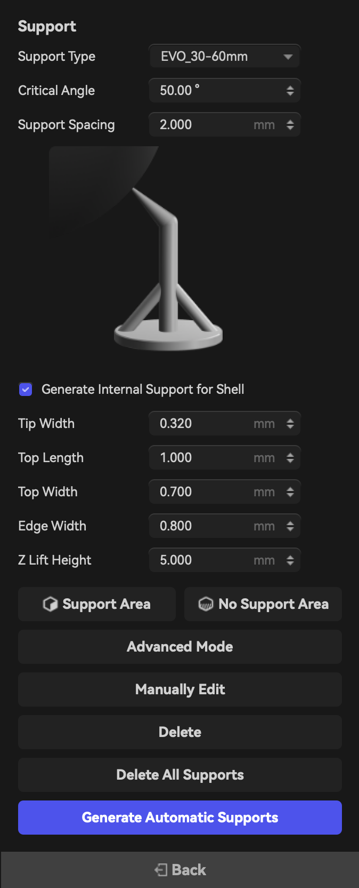 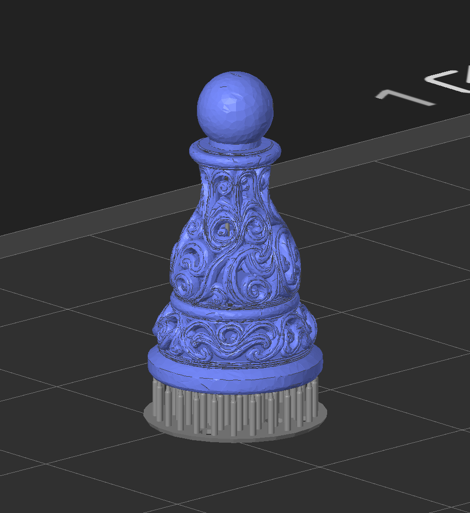

> [!NOTE]
> **The stock support settings make prints very hard to get off the build plate.** Worth changing before you slice: open **Advanced Mode** in the Support panel and set **Baseboard Height** to **0.2 mm** (from 0.5 mm), **Bottom Angle** to **45°** (from 60°), and **Baseboard Type** to **projected area** or **minimal area**. That thins the raft the supports sit on so a plastic scraper can get under it.

### Slice and check

Click **Slice**. You land on the **Preview** tab, where the layer slider on the right walks you through the print one layer at a time. Look at three things: the supports reach everything that overhangs, the hollow is actually hollow, and the first few layers are a solid raft rather than a scatter of unconnected islands.

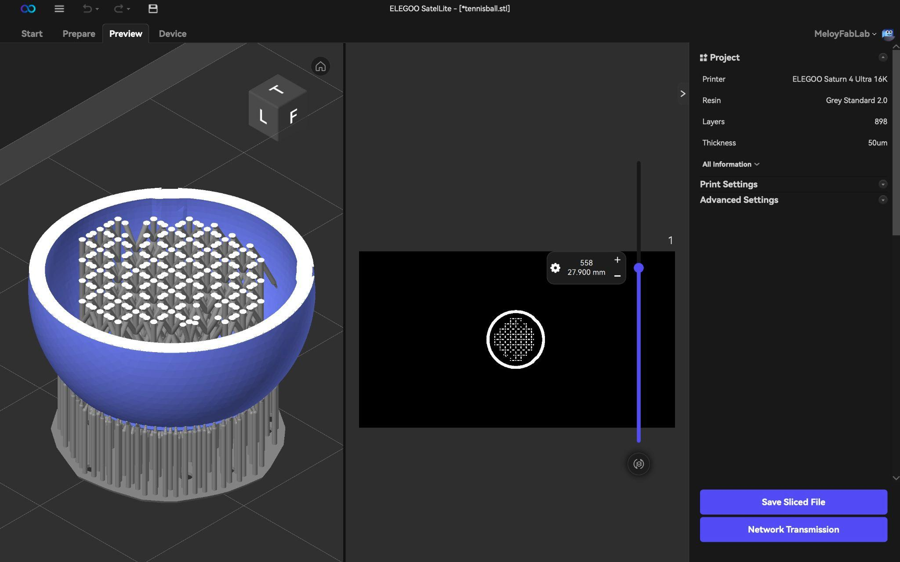

## Operating

1. **Turn the printer on** with the switch at the back and wait for the touchscreen to boot.

2. **Look into the vat before anything else.** You want clear grey resin with the level between the **MIN** and **MAX** lines, no lumps, and no cured flakes drifting in it.

   > [!WARNING]
   > If you can see cured pieces, skins, or flakes in the resin, **stop and get a staff member**. Printing over a hardened lump presses it into the film at the bottom of the vat and punctures it, which leaks resin into the machine — and cleaning the vat is a staff job, not yours. See [Vat cleaning](#vat-cleaning-a-staff-job) below for what they'll do.

3. **Top up the resin if the level is below the MIN line.** Ask a staff member for the Grey Standard 2.0 bottle, fit the plastic drip tray around the vat, and pour slowly until the level sits between the lines. Close the bottle and hand it back. Never fill past **MAX** — the vat overflows into the machine.

4. **Check the build plate is on and clean.** It should be free of cured resin and locked firmly in place by its handle. A part that comes loose mid-print is usually a plate that wasn't seated properly.

5. **Slice your file** — see [Slicing in SatelLite](#slicing-in-satellite) above.

6. **Send the file to the printer.** On the **Preview** tab, click **Network Transmission**. The **Device List** opens with the Saturn listed; check that it says **Online** and **Idle**, tick it, and click **Send**.

   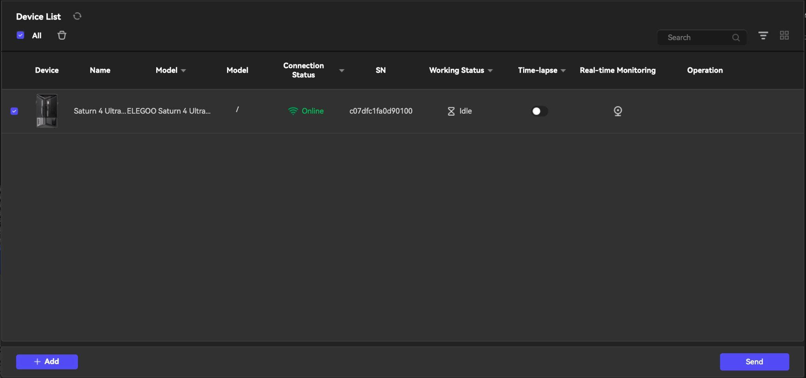

7. **Wait for the transfer to reach 100%.** The **Print** button on the right turns blue when the file has landed.

8. **Close the cover**, then start the print.

9. **Stay for the first few layers.** The plate dips into the resin, pauses while the screen cures the first layer, and lifts with a peel you can hear. What you're watching for is a raft that's actually stuck to the plate. Watching through the orange cover is fine — that's what it's for.

   > [!WARNING]
   > Stop the print from the touchscreen and get a staff member if you hear grinding, if the plate is moving unevenly, if you can see resin outside the vat, or if the first layers clearly aren't sticking. A print that fails at the bottom keeps running for hours, curing resin onto the film the whole time — and that damages the vat.

10. Once the first layers are down cleanly, **you're free to leave**. The touchscreen shows the remaining time. Come back for your part before the lab closes.

11. When the print finishes, **leave the plate in place for about a minute** so the resin still clinging to your part drips back into the vat.

12. **Fit the plastic drip tray around the vat**, then line a baking sheet with shop towels and set it beside the printer. This is where the plate is about to go, and it will drip.

    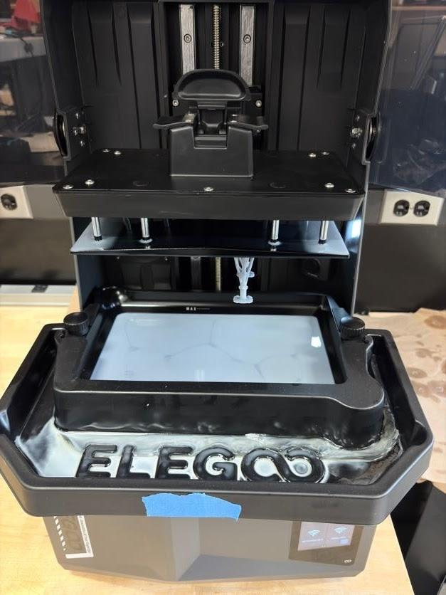 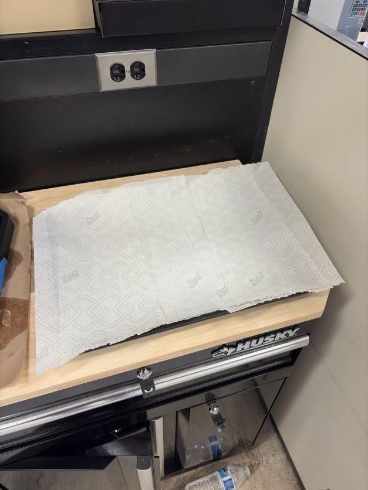

13. **Take the build plate out** by its handle, keeping it tilted so resin runs back into the drip tray rather than down the outside of the machine, and carry it to the lined baking sheet. Go slowly.

    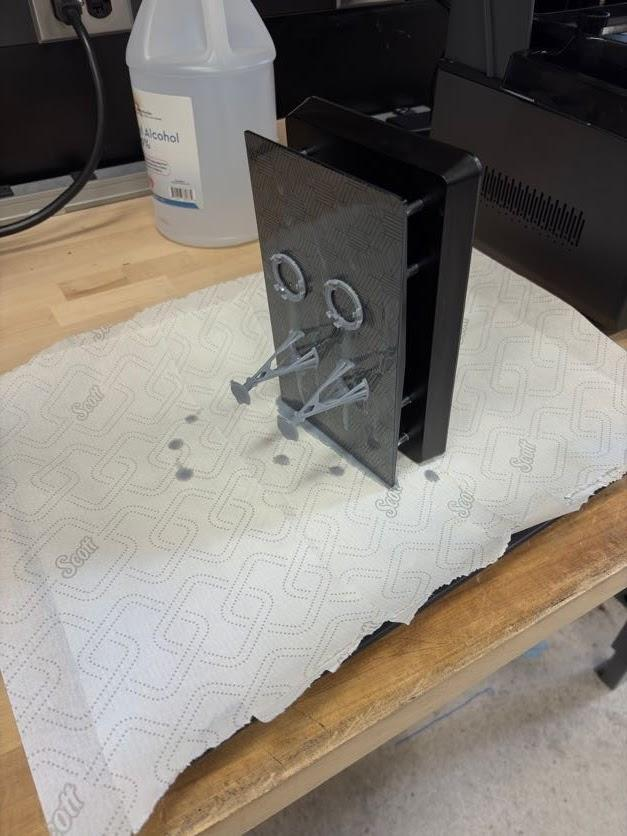

14. **Scrape the part off** with the plastic scraper. Start at an edge or under the support raft, keep the blade low and flat to the plate, and push with steady pressure until it releases. Never pry toward your own hand. If it won't budge, tap the scraper handle or give the part another minute and try again.

    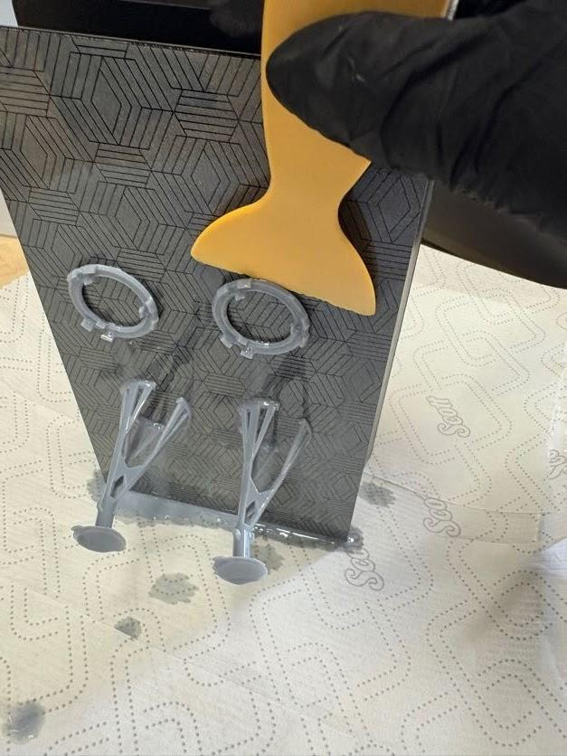

15. **Take the part straight to the [wash and cure station](/docs/sla-printers/elegoo-mercury-30-plus-washing-and-curing-machine/wash-and-cure-station-elegoo-mercury-30-plus/)** — it's still coated in liquid resin and is not safe to handle bare-handed until it has been washed and cured.

## Finishing up

- **Wipe the build plate clean** with shop towels until no resin is left on it, then dry it completely and lock it back onto the printer.

  > [!WARNING]
  > **Don't put alcohol on the printing face of the build plate.** IPA is fine on the sides and the back, but on the textured top surface it ruins adhesion for the next print. Towels only, and don't scratch it.

  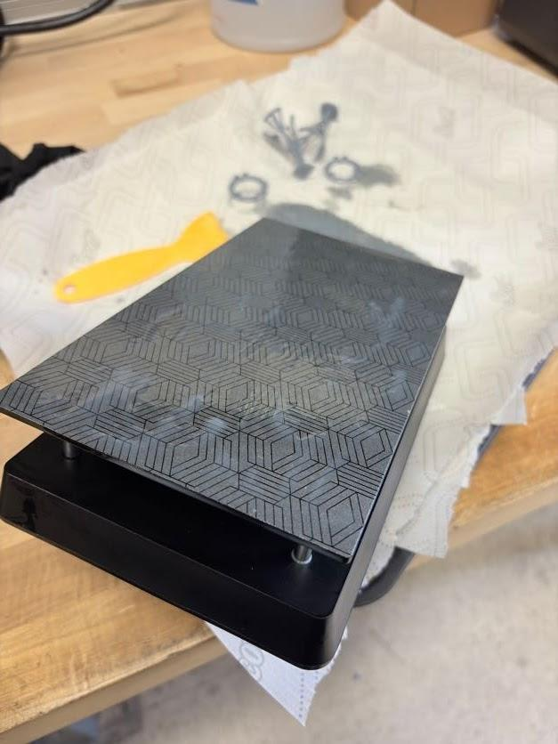

- **Take the drip tray off**, wipe it down, and put it back where you found it.
- **Wipe up every drip** on the machine, the bench, and the floor with shop towels dampened with IPA, and bin the towels. **Uncured resin never gets left in the work area** — that's the one rule in the resin corner that has no exceptions.
- **Never pour resin or IPA down a drain**, and never rinse anything resin-covered in a sink. Resin waste goes in the trash, and used IPA goes to staff.
- **Leave the vat with resin in it**, between the MIN and MAX lines, for the next user. Don't drain it.
- **Bin your gloves** before you touch anything else, and wash your hands.
- Tell a staff member about anything that went wrong or looked off, even if you worked around it.
- **Take your project with you** — the lab has no storage.

## Vat cleaning (a staff job)

Cured debris in the resin is what kills vats, so the tank gets cleaned out periodically and after any failed print. **Students don't do this** — if the resin looks wrong, tell a staff member. It's written down here so you know what's happening to the machine when you see it mid-procedure, and so staff have the steps to hand.

The trick is that the printer cures a single sheet of resin across the whole bottom of the tank, sweeping up anything solid floating in it, and two printed **stems** are used as handles to lift that sheet out.

1. On the touchscreen, go to **Tools → Manual → Return Home** to raise the build plate clear.
2. Fit the plastic drip tray around the vat, and line a baking sheet with shop towels.
3. Snap a **circle** onto the base of each **stem**.

   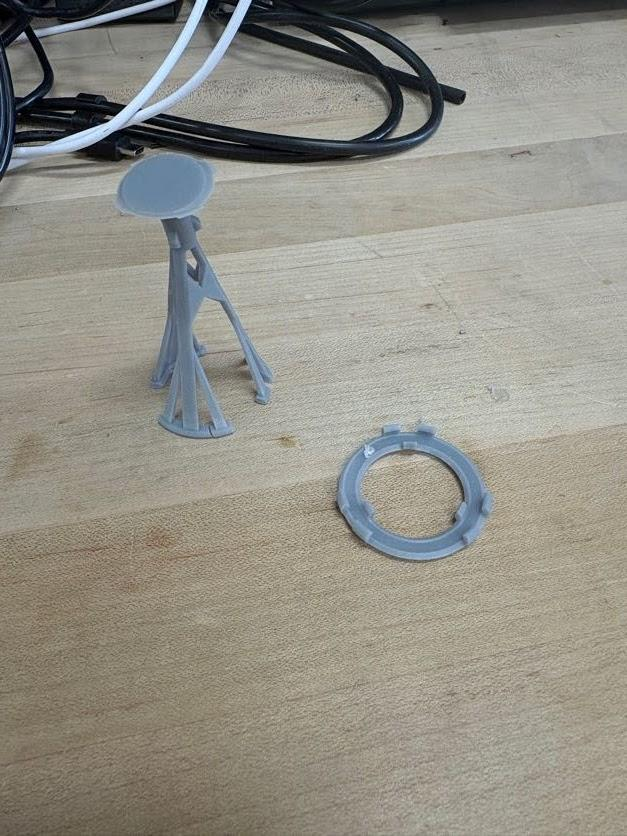 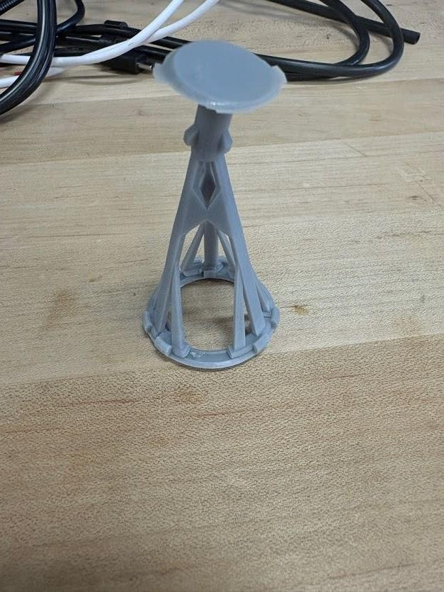

4. Stand the two stems in the resin tank at the front corners of the screen.

   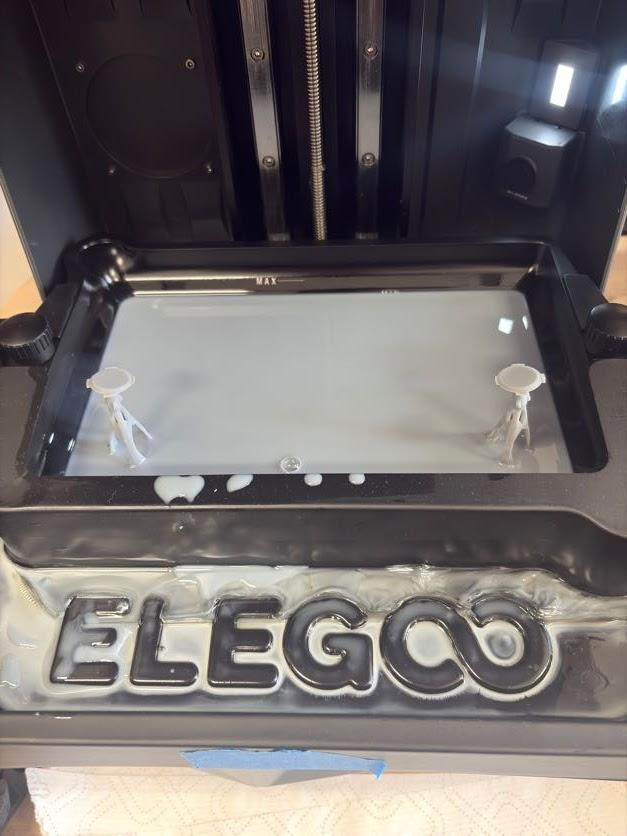

5. Run **Tools → Tank Cleaning** with the exposure set to **15 seconds**.

   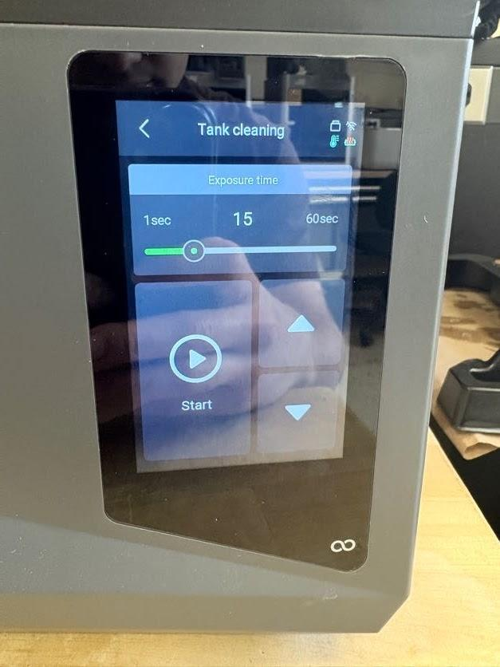

6. When it finishes, wiggle both stems gently while pulling up until the corners of the cured sheet release from the film, then raise it slowly.

   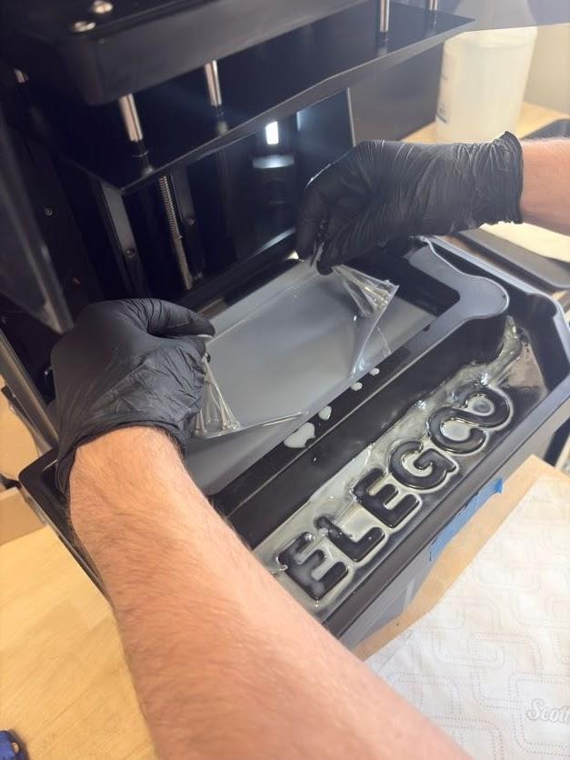

7. Hook the knobs at the top of the stems over the build plate so the sheet hangs above the vat and drips.

   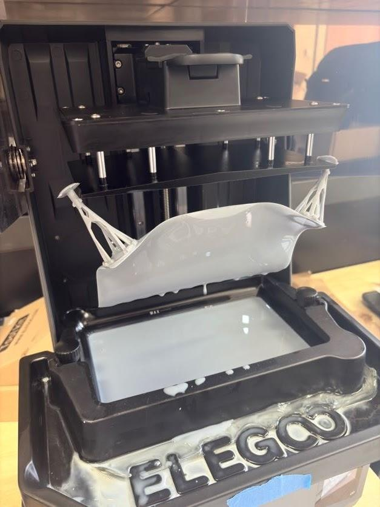

8. Hold the lined baking sheet underneath, resting it on the vat's screw knobs, unhook one stem, and lower the sheet onto the towels.

   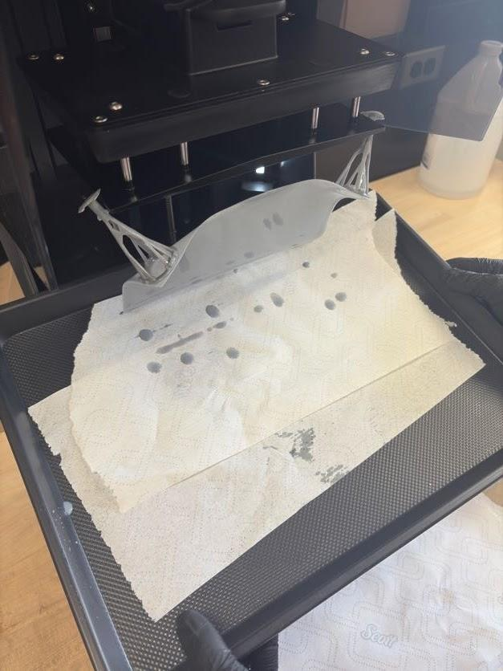 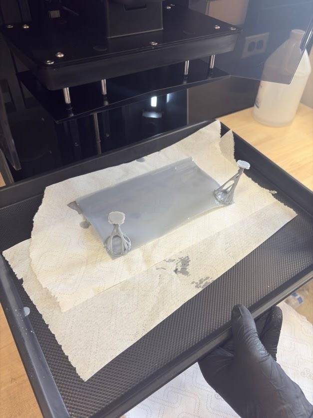

9. Hold the circle down with the plastic scraper and pull the stem away to separate them. **Bin the sheet and the circles.** Leave the stems on towels for 10 minutes, then wash them in the IPA station for 2 minutes — they're reusable.

   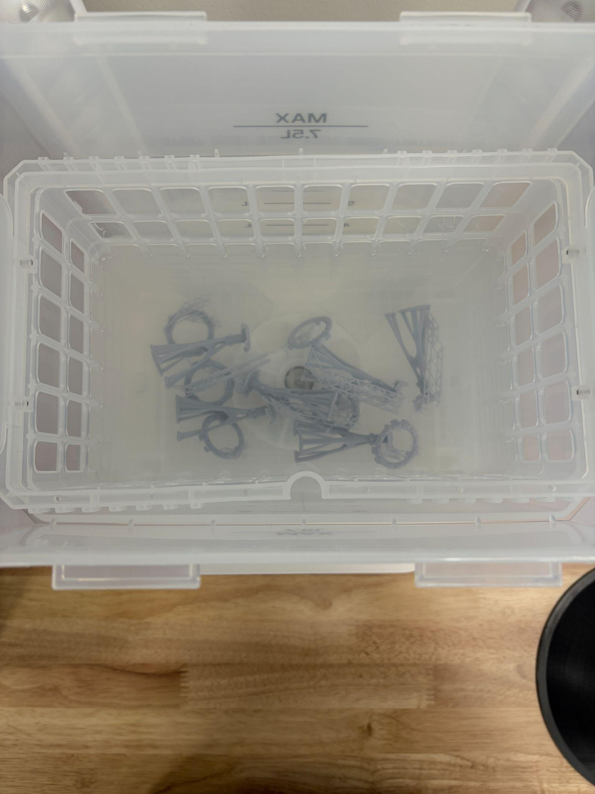

10. Wipe the build plate clean and dry — towels only, no alcohol on the printing face — and lock it back on.

## Common problems

**The print isn't sticking to the build plate.** Almost always the plate: check it's clean, dry, free of cured resin, and screwed down tight, and remember that alcohol on the printing face causes exactly this. Confirm the slicer is set to **Saturn 4 Ultra 16K** with **Grey Standard 2.0** — the wrong profile gets the first-layer exposure wrong. If it fails a second time, stop and get a staff member rather than burning another few hours of resin.

**The print came off the plate and there's a solid lump in the vat.** Stop the printer and get a staff member. Don't fish around in the resin, and don't start another print on that vat — a cured lump under the plate punctures the film.

**The part came out hollow where it shouldn't be, or the layers are separating.** Check the printer model selected in the slicer, then look again at the sliced preview. Missing internal supports in a hollowed model is the usual cause: the roof of the cavity had nothing under it.

**There's a white, milky patch on the clear film at the bottom of the vat.** That's cured resin stuck to the film. Tell a staff member — it needs the vat cleaning above before the machine is used again.

**The touchscreen shows an error I don't understand, or the print won't start.** Don't work around it. Get a staff member; it's often a software update the machine is waiting on.

**The finished part is sticky, soft, or slightly tacky.** It isn't finished — it's washed too briefly or not cured enough. See [Common problems](/docs/sla-printers/elegoo-mercury-30-plus-washing-and-curing-machine/wash-and-cure-station-elegoo-mercury-30-plus/#common-problems) on the wash and cure page.
