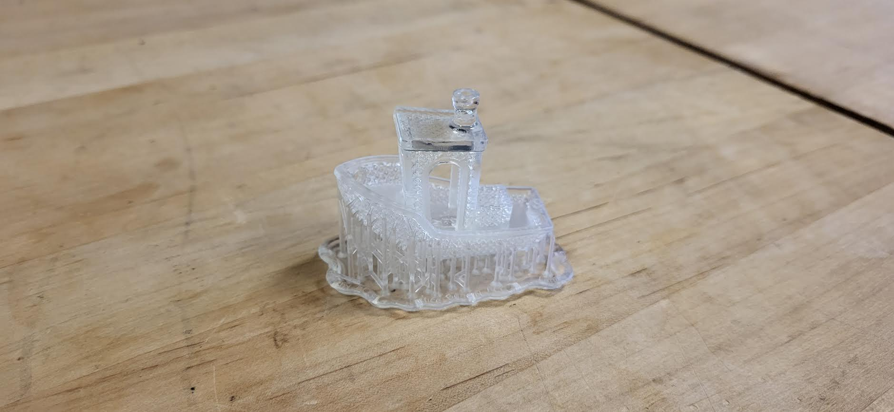
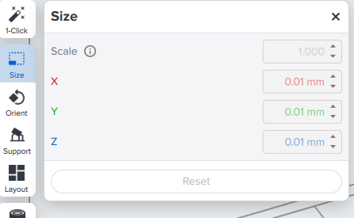
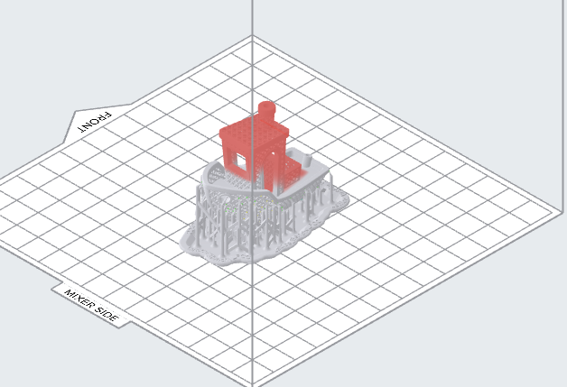

Print a lattice Benchy — the little tugboat that 3D printers are traditionally tested on, rebuilt as an open mesh. It's a deliberately awkward part: overhangs everywhere, a hollow hull, and hundreds of thin struts that the printer has no chance of producing unless you support and orient it properly. Getting it out in one piece means you've understood supports, rafts, and the Print Validation panel, which is the whole point.

**Read this first:** the [Resin 3D Printer (Formlabs Form 3) manual](/docs/sla-printers/formlabs-form-3-resin-printer/resin-3d-printer-formlabs-form-3/), especially [Preparing your file in PreForm](/docs/sla-printers/formlabs-form-3-resin-printer/resin-3d-printer-formlabs-form-3/#preparing-your-file-in-preform). You'll also need [Form Wash and Form Cure](/docs/sla-printers/formlabs-form-3-resin-printer/form-wash-and-form-cure/) afterwards. This activity assumes both.

## The activity

Download **`Lattice_Benchy_FCC.stl`** from **[model download link — ask a staff member]** and open it in [PreForm](https://formlabs.com/software/preform/).

What you're aiming for:

- **Scaled to 50%.** Open the **Size** tool and set the scale to **0.5**. At full size this is a long print for a practice part, and the lattice reads just as well at half scale.

  

- **Supports and a full raft, auto-generated.** Open the **Support** tool. Under **Touchpoint Placement**, leave everything ticked on **Auto Placement**. Under **Support Structure**, set **Raft** to **Full Raft** and **Pillars** to **Classic**, and turn **Allow Internal Supports on Model** **off** — internal supports inside a lattice are close to impossible to remove without snapping struts. Then click **Auto-Generate All**.

- **Print Validation read and understood.** A lattice throws warnings; that's expected on this model, and you can print it with them showing. Before you do, click through each one and work out *why* PreForm is complaining and what it would take to fix. That's the exercise.

Then print it, and take it through wash and cure.

## Hints

- **Orientation is doing most of the work here.** Lay the boat flat and the hull becomes one enormous unsupported overhang; stand it dead vertical and the first layers have almost nothing to grip. Tilted off both axes, as in the picture above, is what you want — every layer then has some of the layer below it to build on.
- **Don't fight the warning count.** Chasing Print Validation to zero on a lattice means burying the model in supports you then can't get out. Aim to understand them, not eliminate them.
- **Leave the supports on until after curing.** Washed-but-uncured resin is soft, and those struts will tear. Flush cutters, after the curer.
- **Look at the hull before you print.** It's a mesh, so it drains on its own and doesn't need a drain hole — which is exactly the contrast worth noticing against a solid hollowed model, where a sealed cavity would ruin the part.

## Questions worth thinking about

1. How would you print this with less mess and less cleanup?
2. Could you get this part off the platform without a raft? What would you change?
3. Which faces came out cleanest, and what did that have to do with where the supports landed?
4. What is this machine genuinely better at than the [FDM printers](/docs/fdm-printers/bambu-labs-x1c-3d-printer/fdm-3d-printer-bambu-lab-x1-carbon/) — and where would you have been better off using one of those instead?

When you're done, follow [Finishing up](/docs/sla-printers/formlabs-form-3-resin-printer/resin-3d-printer-formlabs-form-3/#finishing-up) in the manual and take your boat with you.
