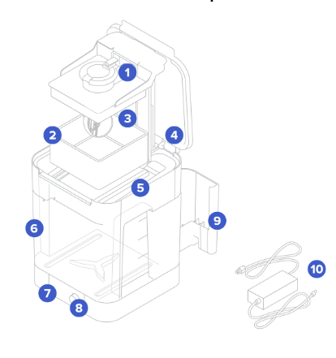
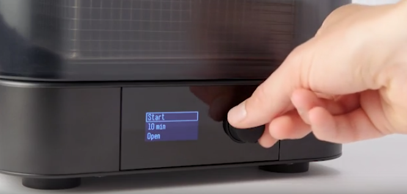
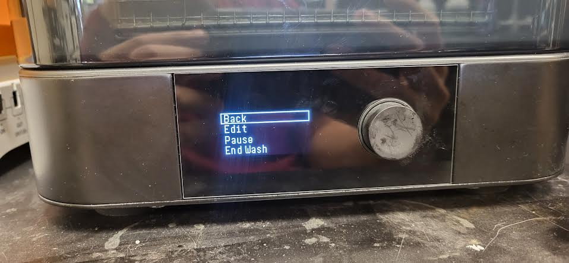
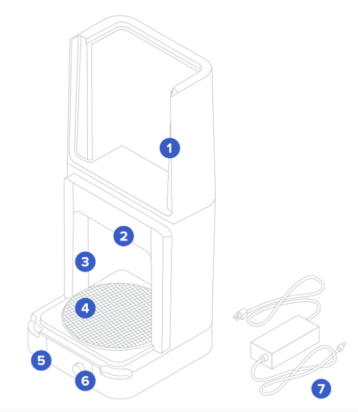
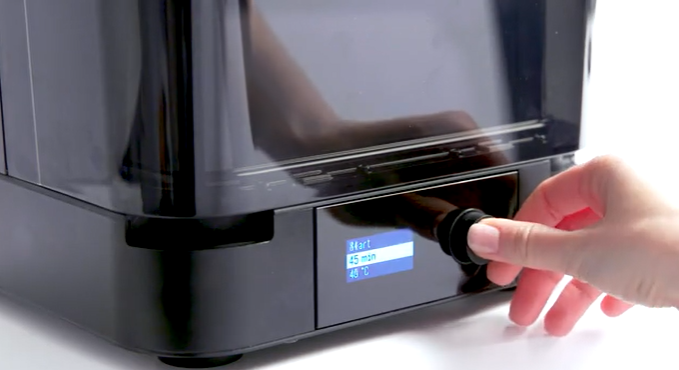
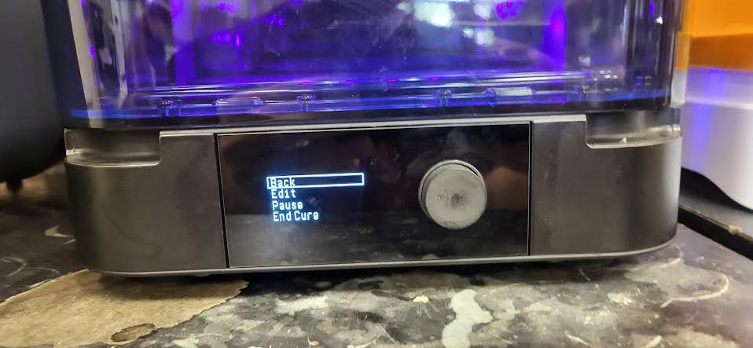
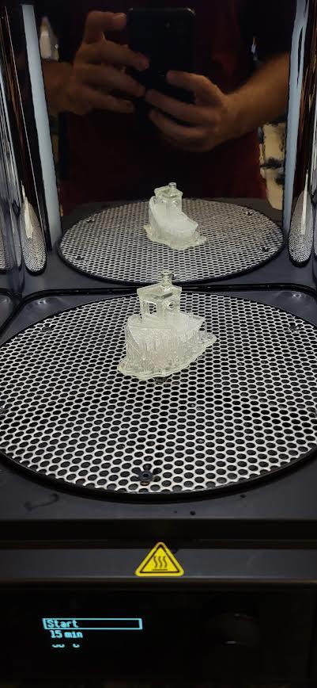

A part that comes out of the [Form 3](/docs/sla-printers/formlabs-form-3-resin-printer/resin-3d-printer-formlabs-form-3/) is not finished. It's coated in liquid resin, it's softer than it should be, and it's still an irritant you shouldn't be handling without gloves. Two machines fix that, in this order: the **Form Wash** swirls the part through isopropyl alcohol to strip the uncured resin off it, and the **Form Cure** heats it under UV light to finish the reaction the printer started. Washing without curing leaves a soft, permanently tacky part; curing without washing bakes a sticky skin onto it for good. Both steps, every time, in that order.

> [!WARNING]
> **Wear nitrile gloves for everything on this page, and keep them on until the part comes out of the curer.** The part is coated in liquid resin right up to the moment it's washed, and still slightly active until it's cured. Resin on skin comes off with **soap and water** — never alcohol or hand sanitizer.

> [!WARNING]
> **The wash bucket holds over eight litres of isopropyl alcohol, and IPA is flammable.** No flames, no soldering irons, no heat guns near this bench. Keep the outer lid shut when the washer isn't in use — that's what stops the whole bucket evaporating into the room.

> [!WARNING]
> **Nothing with resin or alcohol in it goes down the drain.** Used solvent and resin-soaked towels are hazardous waste and staff dispose of them as such. If the washer needs emptying, that's a staff job.

## Form Wash

You operate the whole machine with **one knob**: turn it to move through the options, push it to choose one. The display shows three lines when it's idle — **Start**, the **time**, and a third line that toggles: it reads **Open** while the basket is down, and **Sleep** once the basket is up.

You can wash a part two ways. Dropping it in the **basket (2)** is the normal one, and it's what to do if you've already pried the raft off the platform. Hanging the whole **build platform** on the **platform mount (1)** with the part still attached works too, and saves a step for a part you'd rather not handle yet.

1. **Set the time first.** Turn the knob to the time line, push, turn to the number you want, push again. See [How long to wash](#how-long-to-wash) below.
2. Select **Open** and push. The basket rises out of the alcohol and the inner lid opens.
3. **Put your part in the basket**, supports and raft still attached, and make sure it's sitting low enough that the lid can shut over it.
4. Select **Start** and push. The basket lowers and the timer runs.
5. While it runs, turning the knob offers **Back**, **Edit** to add time, **Pause** to lift the basket, and **End Wash** to finish early.

   

6. When the timer ends the basket lifts itself clear. **Leave the part to drip for a minute or two** so the alcohol runs off, then take it out.
7. **Check the basket for anything left behind** before you close up — a snapped-off support sitting in the basket ends up in someone else's print. Fish it out with the tweezers.
8. Select **Sleep** and push, to send the basket back down so the lid closes over the bucket. (That third menu line reads **Sleep** now rather than **Open** — the basket is up.)

### How long to wash

Use this table if you just want a part that's clean. It covers the resins the lab runs and is deliberately simple:

| Resin | Wash time |
|---|---|
| Clear | 10 minutes |
| Tough 2000 | 10 minutes, then 10 more in fresh alcohol |
| Elastic 50A | 10 minutes on the build platform, then 10 more off it in fresh alcohol |
| Durable | 20 minutes — and no longer |
| Anything else | Start at 10 minutes. If it's still tacky, give it up to 10 more. |

Two things that are true for every resin on that list:

- **Longer is not better.** Alcohol soaks into resin parts and softens them. Past about 20 minutes you're degrading the part, not cleaning it, and thin features suffer first.
- **A part that's still tacky after a full wash usually means dirty solvent**, not too short a cycle. Tell a staff member rather than running it again.

> [!NOTE]
> Formlabs publishes an exact per-resin, per-version table — some materials want a specific alcohol concentration or a particular two-stage routine. If you're printing something where material properties actually matter, use [Form Wash Time Settings](https://formlabs.com/support/Form-Wash-Time-Settings/) and check the version printed on the cartridge label, not the table above.

## Form Cure

Inside is a ring of thirteen 405 nm UV LEDs, a heater, and a turntable that spins the part so every face gets the same exposure. Same single knob, and the idle display shows three lines: **Start**, the **time**, and the **temperature**.

1. **Let the part dry first.** A minute or two out of the washer. Curing a part with alcohol still pooled on it leaves cloudy patches.
2. **Set the time and the temperature** — turn to each line, push, turn to the value, push again.
3. **Open the cover** by the corner grips and **stand the part near the middle of the turntable**, so it turns under the LEDs evenly. Several small parts at once are fine; just don't let them shadow each other.
4. Select **Start** and push. The chamber lights up violet and the turntable begins to rotate.
5. While it runs the knob offers **Back**, **Edit**, **Pause**, and **End Cure**.

   

6. When it finishes, take the part out and look it over. **A properly cured part is dry and hard, with no tackiness anywhere.** If a spot is still tacky, run a short additional cycle rather than a full second one.

   

7. **Wipe the chamber out** if the part left anything behind, taking care around the central spindle.
8. **Now** snap or cut the supports off with the **flush cutters** or the **metal scraper** — the part is at full strength, so supports break cleanly instead of tearing chunks out of it.

### How long to cure

**Cure time and temperature are specific to your resin and its version**, and getting them wrong costs you the mechanical properties you printed in that material for. Look yours up in Formlabs' official table:

**[→ Formlabs post-cure settings for every resin](https://formlabs.my.site.com/customerV2/resource/cure_settings_multilang?language=en_US)**

Find the resin **and the version number** on the cartridge label — **Clear V4** and **Clear V5** don't want the same cure, and neither do **Tough 2000 V1** and **V2**. If you can't find the label or the version, ask a staff member instead of guessing; over-curing makes parts brittle and yellow, and under-curing leaves them weak.

## Finishing up

- Put the **basket** back in the washer with the lid closed, and leave the curer's cover shut.
- Return the **tweezers, flush cutters, and scrapers** to their slots in the washer's tool storage.
- **Bin resin-contaminated towels and gloves in the resin waste bin** at the finishing station, not the regular trash.
- Wipe the bench down — alcohol and resin drips both leave residue.
- Tell a staff member if the alcohol looked cloudy, the parts came out tacky, or either machine threw an error.
- **Take your part with you** — the lab has no storage.

## Common problems

**The part is still tacky after washing and curing.** Nearly always saturated alcohol in the wash bucket: it can't dissolve any more resin, so it leaves a film behind that then cures into a sticky skin. Tell a staff member the solvent needs changing. Running longer cycles in dirty solvent makes this worse, not better.

**The part came out cloudy or white-filmed.** Either it went into the curer wet, or it sat in alcohol well past its wash time. Let parts drip and dry before curing, and don't leave anything soaking.

**A hollow part is weeping resin after curing.** Uncured resin was sealed inside with no way out — the wash never reached it. Nothing to be done for this one; re-slice with a drain hole and check PreForm's **Cups** warning, as described in [Preparing your file in PreForm](/docs/sla-printers/formlabs-form-3-resin-printer/resin-3d-printer-formlabs-form-3/#preparing-your-file-in-preform).

**The part warped or cracked in the curer.** Too hot, too long, or both for that resin. Check the settings against Formlabs' table for the exact resin version you printed.

**A thin or flexible part snapped when I removed the supports.** Supports come off *after* curing, not before. A washed-but-uncured part is soft enough to tear.

**The washer's basket won't come up, or the display is dark.** Don't take the bucket out or reach into the machine — get a staff member.
