The Formlabs Form 3 builds parts out of liquid resin, curing one thin layer at a time with a violet laser drawn across the bottom of a tank — stereolithography, or SLA. It is the lab's detail machine: where the [FDM printers](/docs/fdm-printers/bambu-labs-x1c-3d-printer/fdm-3d-printer-bambu-lab-x1-carbon/) lay down visible strands of plastic, the Form 3 resolves features you need good light to see. Reach for it for miniatures, jewelry, fine-toothed gears, snap-fit enclosures, smooth display models, and anything where layer lines would ruin the part. Your model has to fit inside **145 × 145 × 185 mm**. The lab has **one**, and it answers to the name **TimelySatyr** — you will need to pick that name in the slicer. If you're not sure this is the right machine for your project, see [Which Machine?](/docs/which-machine/) or ask a staff member.

> [!WARNING]
> **Liquid resin irritates skin and eyes, and repeated contact can sensitize you to it for good.** Wear the **nitrile gloves** any time you touch the build platform, a wet print, the tank, or a tool that has been near resin. If resin gets on your skin, **wash it off with soap and water** — never with hand sanitizer, alcohol, or any other solvent, which drive it into your skin rather than lifting it off. Resin in your eyes is an eye-wash-station trip and a staff conversation, not something to rub out.

> [!WARNING]
> **Never touch the clear film on the bottom of the resin tank, and never put anything into the tank.** No fingers, no tweezers, no scrapers. That film is what the laser fires through, and a scratch or a puncture in it ends the tank and can leak resin into the machine. If a print, a support, or any fragment ends up loose in the tank, stop and get a staff member.

> [!NOTE]
> **The laser is Class 1 — enclosed and eye-safe.** It only fires with the orange cover closed, and the cover's interlock stops the print the moment you lift it. No goggles, no laser certification, nothing to do. The orange tint on the cover is a UV filter protecting the resin from daylight, not your eyes from the laser.

:::caution[EMERGENCY STOP]
This machine has **no emergency stop button**. On the **touchscreen**, **Pause** finishes the current layer and lifts the platform clear; **Abort** ends the print outright. To cut power completely, reach around the **back of the printer, left-hand side as you face it**, and pull the power cord. Pause if you want a closer look, abort if something looks wrong, pull the cord if something is being damaged — and tell a staff member either way.
:::

## Before you start

- **No training or checkout is required.** Read this page and go print. Staff are in the lab and will happily stand with you for your first one — just ask.
- **Wear nitrile gloves.** They're on the finishing bench. They're the only PPE this machine needs; a mask is available if you'd rather use one, but nothing about normal operation requires it.
- Bring a **3D model file**: `.stl`, `.obj`, `.3mf`, or `.form`. PreForm, the Formlabs slicer, opens all of them.
- **To get your file onto a lab computer**, email it to **meloy.FabLab@gmail.com**, then open Gmail on a lab computer and download it there. A USB drive works too.
- Your part must fit inside **145 × 145 × 185 mm**, and it needs supports and a raft — read [Preparing your file in PreForm](#preparing-your-file-in-preform) before you slice.
- **Resin is free**, but it's far more expensive per part than filament. Check with a staff member before committing to a print that will drink most of a cartridge.
- **Whatever resin is loaded is what you print in.** Swapping the tank and cartridge is a staff job — if you need a different material, ask rather than doing it yourself.
- **Budget time for washing and curing.** A resin part comes out of the printer wet, soft, and still chemically active. It is not finished, and it is not safe to handle bare-handed, until it has been through the [Form Wash and Form Cure](/docs/sla-printers/formlabs-form-3-resin-printer/form-wash-and-form-cure/). Plan on 20–60 minutes for that after the print ends.

## Machine overview

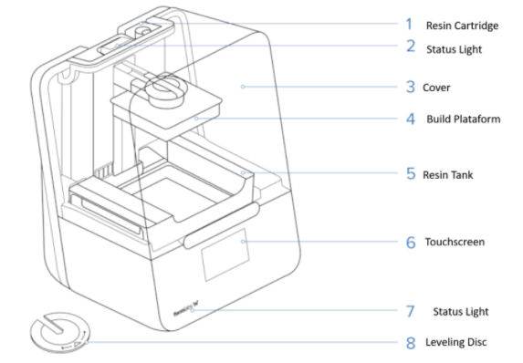

Four of those eight are yours to touch:

- **Touchscreen (6)** — everything you control at the machine itself: resin levels, print status, pausing and aborting. Tap it once to wake it from sleep.
- **Cover (3)** — the orange lid. Lift it to get the build platform out; it stops the print if you lift it mid-job.
- **Build platform (4)** — the grey plate your part grows down from, hanging upside down over the tank. Unlock the handle to lift it out.
- **Resin cartridge (1)** — the tall bottle at the back that tops the tank up. There's a small vent valve on top of it that has to be open for resin to flow.

The **resin tank (5)**, the **leveling disc (8)**, and everything inside the case are staff-only. The tank especially: see the warning at the top of this page.

The touchscreen's home view is the one to learn. It tells you what's loaded and how much is left:

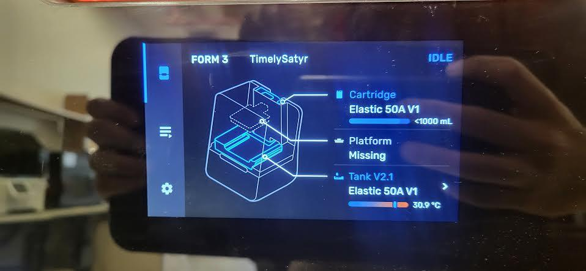

**Cartridge** is your reserve and **Tank** is what's in the machine right now. If the cartridge bar is near empty, tell a staff member before you start rather than discovering it four hours in.

## Preparing your file in PreForm

Resin printing is less forgiving than filament at the slicing stage. An FDM part sits on a bed and builds upward; a resin part hangs upside down from the platform and gets peeled off the tank film after every single layer. Orientation and supports are what decide whether it survives that.

You can do this on a lab computer or at home — [PreForm is a free download](https://formlabs.com/software/preform/) and you don't need a printer to use it.

1. Open your model with **File → Open**.

   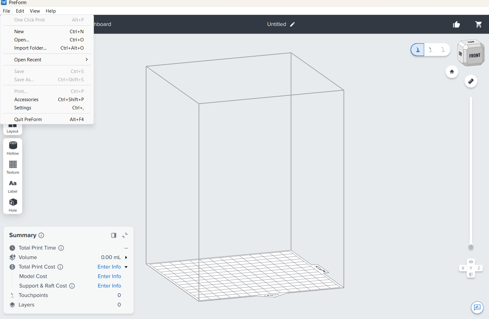

2. The tools run down the left edge. **Size** scales, **Orient** rotates, **Support** generates the scaffolding, **Hollow** empties a solid model out, and **Hole** punches a drain hole.

   

3. **Hollow anything chunky.** A solid resin part is expensive, slow, and prone to warping as it cures. **Hollow** turns it into a shell — but check the result over, because hollowing can thin a load-bearing wall to nothing.

4. **Every hollow part needs a drain hole.** Use the **Hole** tool, or build one into your model. A sealed hollow shell traps uncured resin inside, which will not wash out, will not cure, and will eventually seep through the wall and ruin the part.

5. **Add supports and a raft.** Open **Support** and click **Auto-Generate All**. Leave **Raft** set to **Full Raft** — the raft is what gets pried off the platform, so the part itself never meets a scraper.

   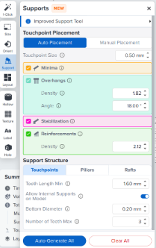

   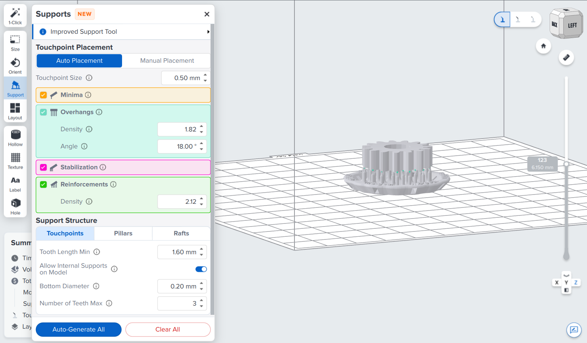

   Auto-generated supports are good enough for most parts. If you need a particular face to come out clean, rotate the model in **Orient** so the supports land somewhere you don't mind sanding.

6. **Read the Print Validation panel** on the right before you do anything else. It is the single most useful thing in PreForm, and it flags the three failures that actually happen:

   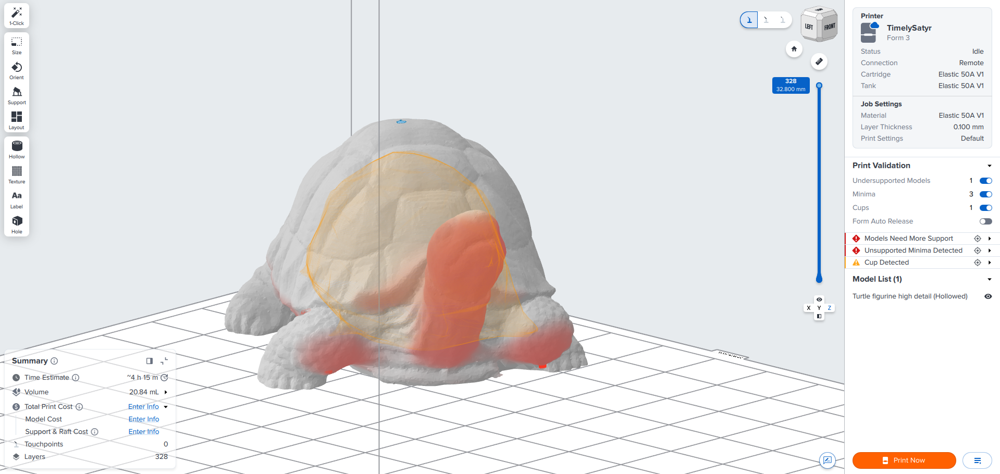

   - **Undersupported models** — a region the supports don't hold. It will sag or detach.
   - **Minima** — an island: a spot where the print starts a new, unconnected blob of resin in mid-air. Unsupported minima fall into the tank.
   - **Cups** — a pocket that will fill with resin and can't drain, shown here as the orange bubble inside the turtle. Rotate it or add a hole.

   Click any warning to jump to the spot it's complaining about. Fix them before you print; none of them get better on their own.

7. Check the **Summary** panel at the bottom left for print time, volume, and layer count. A resin print of any size is measured in hours — know what you're signing up for before you send it.

   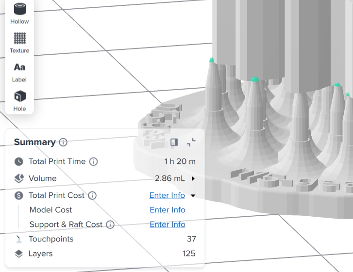

8. **Set the material to match what's actually in the machine.** Click the printer bar at the top, pick the resin and layer thickness, and click **Apply**. PreForm will happily slice for a resin the printer doesn't have, and the printer will refuse the job when you send it.

   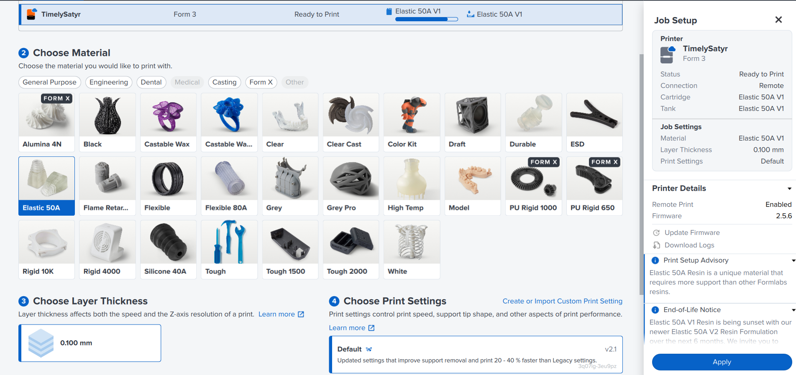

   Thinner layers mean finer detail and a longer print. **0.100 mm** is a sensible default; drop to 0.050 mm only when the detail genuinely needs it.

## Operating

1. **Check the machine is free and clean.** Tap the touchscreen to wake it. It should read **IDLE**, with the build platform in place and nothing left in the tank.

   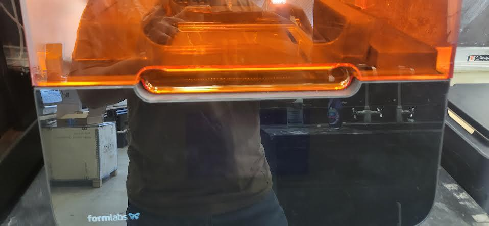

2. **Check the resin.** On the home screen, confirm the **Cartridge** and **Tank** both show enough for your print, and that the **vent valve on top of the cartridge is open** — resin can't flow into the tank with it shut.

   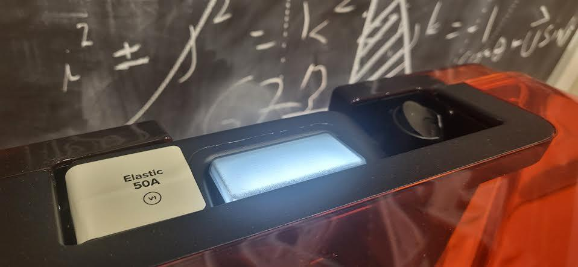

3. **Send the job.** In PreForm, confirm **TimelySatyr** is the selected printer and the material matches, then click **Print Now**. The job appears in the printer's queue.

4. **Start it at the machine.** Select your job on the touchscreen and confirm. Leave the cover closed.

5. **Stay and watch the opening sequence and the first few layers.** The platform dips into the tank, the mixer sweeps across, and the first layers go down onto the raft. What you're checking:

   - The calibration sequence completes and the print begins.
   - The platform moves down and back up smoothly, without grinding, banging, or shuddering.
   - The raft is forming on the platform — not falling off into the tank.
   - Resin stays in the tank and nothing is leaking.

   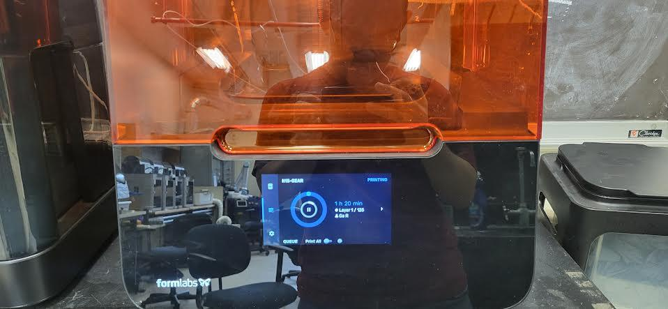

> [!WARNING]
> Abort the print and get a staff member if you hear clashing, scraping, or banging, if the machine shakes, if resin is leaking, or if anything solid ends up loose in the tank. A failed print left running presses debris into the tank film and turns a lost part into a lost tank.

6. **Once the first layers are down cleanly, you're free to go.** Come back near the end — the touchscreen shows time remaining, and PreForm shows it too.

7. When the print finishes, **open the cover and leave the platform hanging for two or three minutes** so the bulk of the resin drips back into the tank. Give it a gentle shake to break the drips loose. This is the cheapest cleanup you will ever do — it costs you three minutes and saves the bench.

   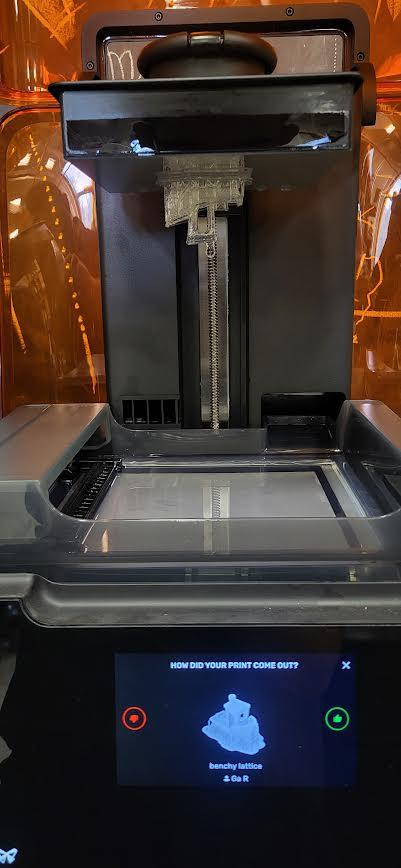

## Finishing up

Gloves on for all of this.

1. **Unlock the platform, lift it out, and seat it on the build platform jig** on the finishing tray. The jig holds it at an angle so resin runs off into the tray instead of onto you.

   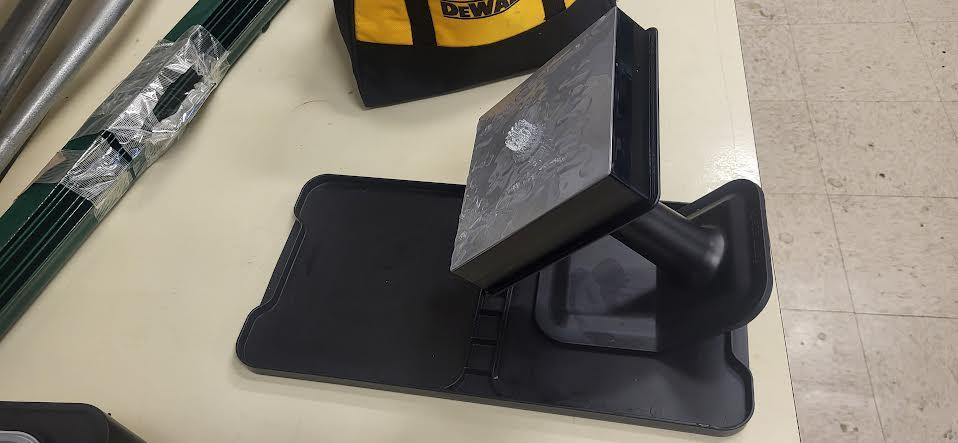

2. **Pry the raft off with a plastic scraper only.** Work at a low angle, going around the edge of the raft to get air under it rather than levering at one spot. Point the platform at a wall or an empty part of the bench — rafts let go suddenly, and a part that flies does so trailing resin.

   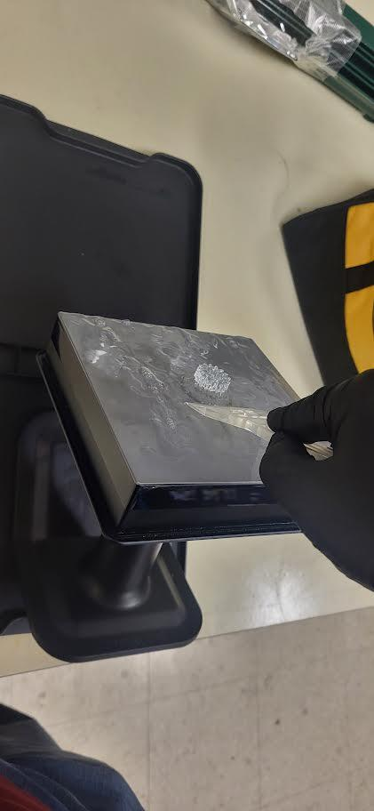

> [!WARNING]
> **Never use the metal scraper or the tweezers on the build platform.** Those are for snapping supports off the part once it's cured. Metal on the platform gouges it, and every print afterward sticks badly to the scar.

3. **Take the part straight to the washer**, supports and all. Don't cut the supports off yet — they hold the still-soft part in shape. See [Form Wash and Form Cure](/docs/sla-printers/formlabs-form-3-resin-printer/form-wash-and-form-cure/) for times and how to run both machines.

4. **While it washes, clean up.** The finishing bench has everything you need:

   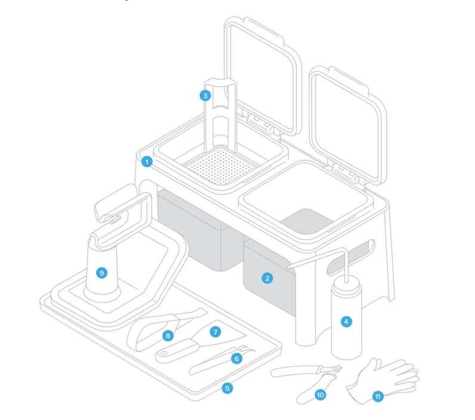

   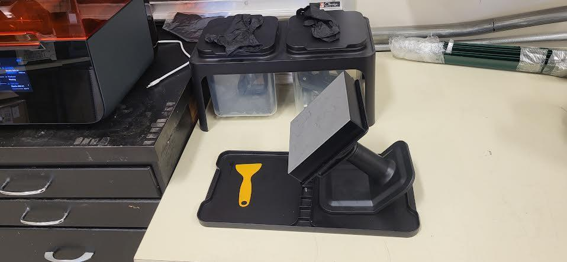

   - **Build platform:** scrape the leftover resin and cured bits off with the plastic scraper onto a paper towel, then wipe it down with a second towel dampened from the **rinse bottle**. Let it dry fully before it goes back in the printer.
   - **Tools:** same two-towel routine — dry towel first for the bulk, then a lightly dampened one for the film left behind.
   - **Bench and tray:** wipe any spill up now, while it's still liquid. If it's left a sticky patch, a towel with a little soap on it lifts the residue; wipe the soap off afterwards.

   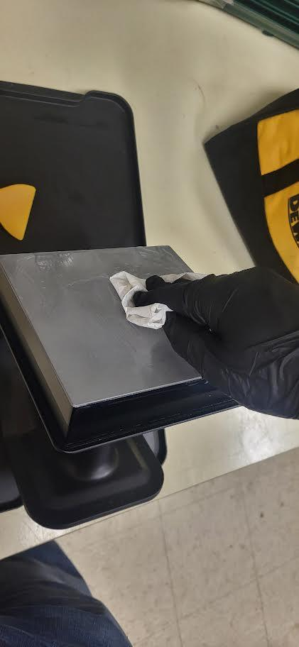

> [!WARNING]
> **Nothing with resin or alcohol on it goes down the drain — not the sink, not the floor drain.** Resin-soaked paper towels and used gloves go in [resin waste container — ask a staff member where].

5. **Put the platform back in the printer**, return every tool to its spot on the station, and set the printer to sleep: **Settings → Sleep**.

6. **Take your part with you** — the lab has no storage.

## Common problems

**The print failed and there's something loose in the tank.** Stop and get a staff member. The fix is a *cleaning mesh* — the printer prints a thin hexagonal sheet across the whole tank floor that picks the debris up as it goes, and it's run from **Settings → Maintenance → Print Cleaning Mesh**. Don't fish around in the tank with tweezers while you wait; that's how tanks die.

**The part came out tacky or slimy after washing.** The alcohol in the washer is saturated with dissolved resin and isn't cleaning any more. Tell a staff member it needs changing rather than running longer cycles in dirty solvent, which makes surfaces tackier, not cleaner.

**The part is warped, or a hollow part has resin weeping out of it.** Almost always a sealed cavity: uncured resin was trapped inside with no drain hole, and it's now leaking out or pulling the walls in as it cures. Re-slice with a **Hole** added at the lowest point, and check the Print Validation panel for **Cups** before you print again.

**The raft won't come off the platform.** Get more of the plastic scraper under the edge and work around the perimeter rather than levering harder in one place. If it genuinely won't budge, ask staff — don't reach for the metal scraper.

**Fine details or thin features are missing from the part.** They were unsupported. PreForm flags these as **Minima** before you print; re-orient the model so those features grow off something solid, or add manual touchpoints there.

**Resin has spilled inside the printer.** A small spill on a flat surface you can wipe up yourself with a paper towel, then a towel with a little alcohol. **If it's on the optics window, the rails, or any cabling, stop and get a staff member immediately** — don't wipe those.

**The touchscreen is showing an error.** Note what it says and get a staff member. Don't clear it and re-run the job.
