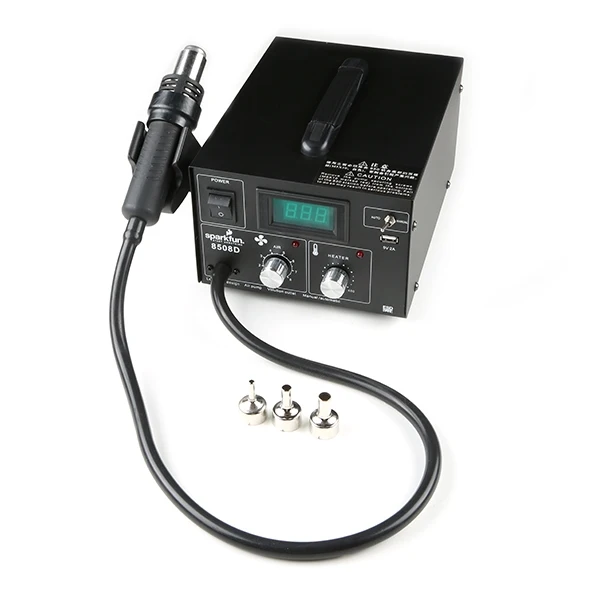

A hot air rework station melts solder without touching it. Instead of a tip pressed against one joint, it blows a controlled stream of hot air over an area, so every joint under a surface-mount component reflows at once and the part lifts straight off. Use it to remove surface-mount parts from a board, to place and reflow replacements, to fix a joint you can't reach with an iron, and to shrink heat-shrink tubing. For through-hole parts and wires, the [soldering station](/docs/workbenches/instruments/soldering-station-weller-we1010na/) is faster and far more controllable. For assembling a whole surface-mount board rather than repairing one, the [PCB machines](/docs/which-machine/#pcb-assembly-machines) are the right route.

> [!WARNING]
> **Never aim hot air at a battery, and remove any battery or coin cell from the board before you start.** A lithium cell heated to reflow temperature vents, burns, and can't be put out with the usual means. This applies to the coin cell on a board as much as to a pack.

> [!WARNING]
> **You can't see hot air, and you won't feel it until it has already burnt you.** The nozzle stays dangerously hot for minutes after shutdown. Point the handle at your board or at nothing, never across the bench, and put it back in its cradle every time you let go.

> [!WARNING]
> **Hot air doesn't only heat the part you're aiming at.** It lifts and slides neighbouring components, melts plastic connectors and sockets, and cooks electrolytic capacitors until they burst. Shield anything nearby that you're not reworking — Kapton tape or aluminium foil over it — and keep the nozzle as tight to your target as you can.

## Before you start

- **No training or checkout is required**, but rework is fiddly. If it's a board you can't replace, ask a staff member to watch the first attempt.
- **Safety glasses on**, and the **fume extractor running** — reflowing solder paste and old flux produces the same fumes as an iron, over a wider area.
- **Work on a heat-resistant surface** with nothing flammable near the board.
- **Have your tweezers ready before you start heating.** Once the solder flows you have a few seconds, and hunting for tools with a live handle in your other hand is how things get burnt.
- **Flux helps more than heat does.** A little fresh flux on the joints makes parts release at a lower temperature and with far less damage to the board.

## Operating

1. **Fit the right nozzle while the station is cold** — a nozzle roughly the size of the part concentrates the air where you want it and keeps it off everything else. Never change a nozzle on a hot station.

2. Switch the station on and set **temperature** and **airflow** on the two knobs. Around **350 °C with low to medium airflow** is a reasonable starting point for lead-free rework; adjust from there rather than starting high. Too much airflow blows small components off the board — including the ones you meant to keep.

3. Let the air come up to temperature, and **apply fresh flux** to the joints you're reworking.

4. **Hold the nozzle about 1–2 cm above the part** and keep it moving in small circles over the whole component and its joints. Parking it in one spot overheats the board there and lifts pads.

5. **Watch the solder, not the clock.** When it goes visibly shiny and wet and the part settles slightly, the joints have flowed.

6. **Lift the part with tweezers, with no force at all.** If it resists, the solder hasn't flowed everywhere — keep heating. Prying a part off a hot board takes the pads with it, and a lifted pad is much harder to repair than the fault you started with.

7. To fit a replacement, clean the pads up with solder wick and an iron, flux them, position the new part, and reflow the same way.

8. **Handle back in its cradle** as soon as you let go of it.

> [!WARNING]
> **Don't keep going when it isn't working.** If a part hasn't released after a minute or so of heating, stop and let the board cool. Sustained heat delaminates the board and destroys parts you weren't trying to remove. A large ground plane sinking the heat away is the usual cause, and a staff member can suggest the fix.

## Finishing up

- **Put the handle in its cradle and switch the heater off.** Most stations of this type keep blowing air afterwards to cool the element down — leave it powered until the fan stops on its own.
- **Don't touch the nozzle** until it has been cool for several minutes. If you need it off, wait longer.
- Clear removed components, solder debris, and tape off the bench.
- Switch off the fume extractor if nobody else needs it.

## Common problems

**Small parts blow away as soon as I apply heat.** The airflow is too high. Turn it down — hot air rework works at a much gentler flow than people expect, and the heat, not the wind, does the job.

**The solder won't flow no matter how long I heat it.** Usually a large copper plane or ground pour pulling heat away as fast as you add it. Add flux, warm a wider area around the part first so the board isn't fighting you, and be patient rather than turning the temperature up. If it still won't go, get a staff member — more heat at that point does more harm than good.

**The board is going brown around where I'm working.** Too hot, too long, or the nozzle held too still. Stop, let it cool completely, and restart at a lower temperature with the nozzle moving.

**A pad came off with the component.** It happens, and it's repairable, but not by continuing. Stop and show a staff member — the fix depends on which pad and what it connects to.
