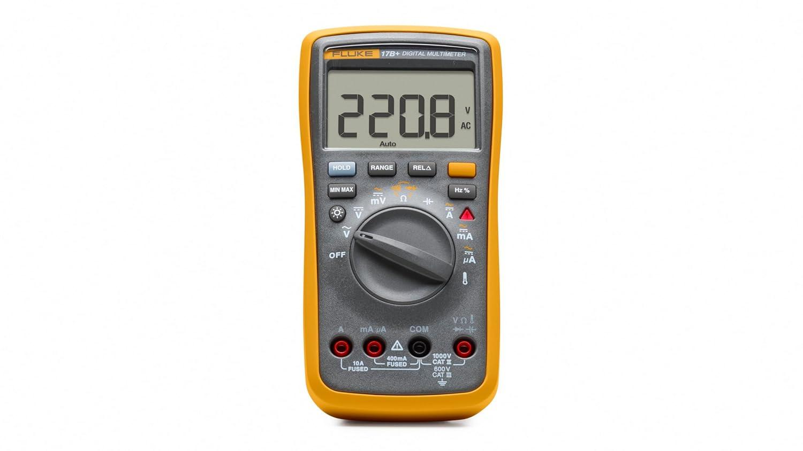
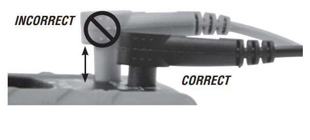
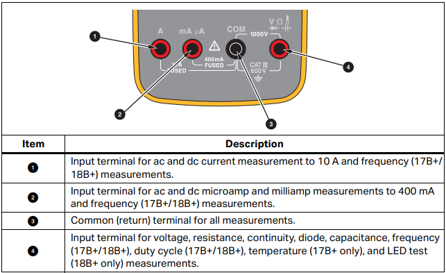
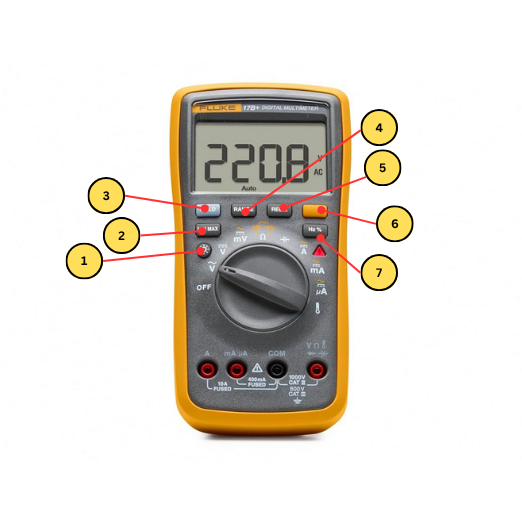
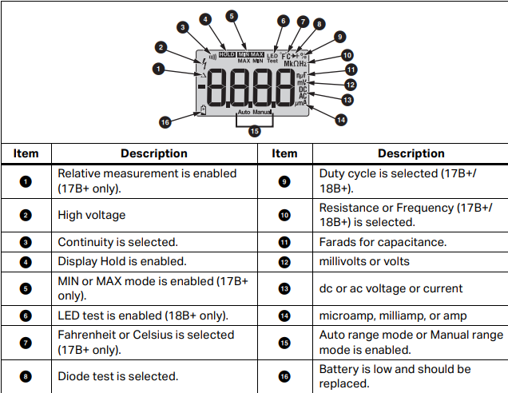
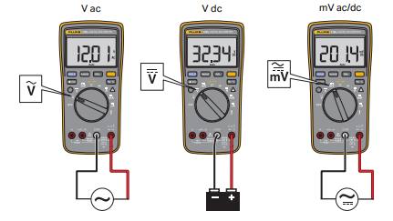
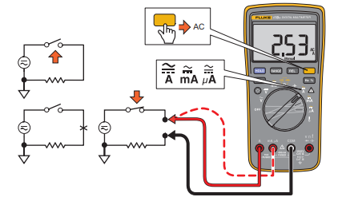
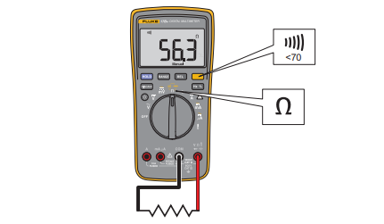

The Fluke 17B+ is a handheld digital multimeter, and it's the instrument you'll reach for most at the [electric workbenches](/docs/workbenches/electric-workbenches/). It measures DC and AC voltage, DC and AC current, resistance, capacitance, frequency, and temperature, and it tests diodes and continuity. Use it to check that a supply rail is at the voltage you expected, to find a break in a wire or a solder bridge between two pins, to confirm a component's value, or to work out which part of a circuit isn't getting power.

It's an auto-ranging meter, which means you pick *what* to measure and it works out the scale by itself.

> [!WARNING]
> **After measuring current, move the red lead back to the VΩ terminal.** In the current terminals the meter is a near-short by design — current has to flow *through* it. Leave the lead there, switch to volts, and touch the probes across a supply and you short that supply through the meter. At best you blow the meter's fuse; on a stiff supply you get a flash and a burn. This is the single most common way multimeters get destroyed.

> [!WARNING]
> **Never measure resistance, continuity, capacitance, or diodes on a powered circuit.** These modes work by pushing the meter's own small current through the part. Voltage already present gives you a meaningless reading and can damage the meter. Power down and, where the reading matters, disconnect the part from the rest of the circuit.

## Before you start

- **No training or checkout is required** — the meter lives at the bench, and everything you need is on this page.
- **Check the test leads before every session.** Look for cracked or split insulation, exposed metal anywhere but the probe tips, and bent or loose banana plugs. A damaged lead gets reported to staff, not used.
- **Push the plugs all the way in.** A partly seated plug makes an intermittent connection and gives readings that wander for no visible reason.

  

- **Prove the meter works before you trust it.** Measure something you already know — a fresh AA battery should read about 1.5 V DC. If it doesn't, the meter's battery may be flat (the display shows a battery symbol) or a lead may be broken.
- Keep your fingers behind the finger guards on the probes, not on the metal tips.
- Low-voltage bench work only — see the hazard callouts on the [Electric Workbenches](/docs/workbenches/electric-workbenches/) page for what that rules out.

## The meter at a glance

**The dial** selects what you're measuring, and turning it to **OFF** is how you switch the meter off. Going clockwise from OFF: **Ṽ** (AC volts), **V̅** (DC volts), **mV**, the **Ω** position that also holds continuity, diode test and capacitance, then **A**, **mA**, and **µA** for current, and finally the thermometer symbol for temperature.

**The terminals** along the bottom are where the leads go. The black lead goes in **COM** and stays there for everything. The red lead moves depending on what you're measuring.

In practice: **VΩ** on the right for voltage, resistance, continuity, diodes, capacitance, and temperature; **mA µA** for currents up to 400 mA; and **A** for currents up to 10 A. The two current terminals are separately fused.

**The buttons** above the dial are shortcuts you mostly won't need:

1. **Backlight** — hold it to light the display.
2. **MIN MAX** — records the lowest and highest readings seen.
3. **HOLD** — freezes the current reading, for when you can't watch the screen and the probes at once.
4. **RANGE** — leaves auto-ranging and steps through fixed ranges. Press and hold to go back to auto.
5. **REL△** — zeroes out the present reading and shows everything after it as a difference. Useful for subtracting your test leads' own resistance before measuring something small.
6. **The orange shift button** — switches between the two functions printed at a dial position, like AC and DC current, or resistance, continuity and diode test.
7. **Hz %** — switches to frequency and duty cycle.

**The display** shows the reading plus small symbols telling you what mode you're in — AC or DC, the unit, auto or manual range, and a battery symbol when the battery is low.

## Measuring voltage

Voltage is measured **across** two points — the meter goes in parallel with whatever you're measuring, and the circuit stays connected and powered.

1. Turn the dial to **V̅** for DC (batteries, supply rails, almost everything at this bench), **Ṽ** for AC, or **mV** for small DC voltages.
2. Red lead in **VΩ**, black lead in **COM**.
3. Touch the black probe to your circuit's ground and the red probe to the point you're interested in.
4. Read the display. A negative sign just means your probes are the other way round from the circuit — the magnitude is still correct.

## Measuring current

Current is measured **through** the circuit, which means breaking it open and putting the meter in the gap so all the current flows through the meter. It's the one measurement that requires changing the circuit, and it's the one people get wrong.

1. **Power the circuit down.**
2. Break the path you want to measure — unplug a wire, lift one end of a component, or use a jumper you already planned to remove.
3. Turn the dial to **mA** for anything up to 400 mA, or **A** for up to 10 A. If you have no idea what to expect, start at **A**.
4. Move the red lead to the matching terminal — **mA µA** or **A**. Black stays in **COM**.
5. Press the orange shift button if you need AC rather than DC.
6. Connect the probes across the break, so the meter completes the circuit, then power up and read the display.

7. Power down, remove the meter, restore the connection — and **move the red lead back to VΩ**, as the warning at the top of this page explains.

## Measuring resistance and testing continuity

Both of these push a small current through the part, so the circuit must be **unpowered**. If the part is soldered into a board, the rest of the board sits in parallel with it and the reading will be lower than the part's real value — lift one leg if the exact number matters.

1. Turn the dial to the **Ω** position. Red lead in **VΩ**, black in **COM**.
2. For **resistance**, touch a probe to each end of the part and read the display.
3. For **continuity**, press the orange shift button once to turn on the beeper. Below about 70 Ω it beeps continuously — that's a connection. Silence means there isn't one.

Continuity is the fastest debugging tool on the bench. Use it to confirm a wire isn't broken, that a joint you just soldered actually connects, and that two neighbouring pins that *shouldn't* be connected aren't — a solder bridge is invisible and the beeper finds it instantly.

## Testing a diode

1. Dial to the **Ω** position, then press the orange shift button twice to reach diode test.
2. Red lead in **VΩ**, black in **COM**.
3. Red probe on the anode, black probe on the cathode (the striped end). A working silicon diode reads roughly 0.5–0.8 V; an LED reads higher.
4. Swap the probes. A working diode now reads open — that's the whole point of a diode. A reading near zero both ways means it's shorted; open both ways means it's blown or you're on the wrong pins.

## Finishing up

- **Turn the dial to OFF.** The meter has no separate power button, and left on a live function it flattens its battery.
- Check the red lead is back in the **VΩ** terminal, so the next person doesn't inherit a meter set up to short their circuit.
- Unplug the leads, coil them loosely, and put the meter and leads back where they live.
- If the battery symbol was showing, tell a staff member so it gets replaced.

## Common problems

**The reading jumps around or won't settle.** Usually the probes aren't making solid contact — press a little harder, or scrape through any oxide or solder mask. Check the lead plugs are fully seated too. On a high-resistance measurement some drift is normal, because your body is part of the circuit if you're touching the probe tips.

**It reads zero, or nothing at all.** Check the dial is on the right function and the red lead is in the right terminal for it — measuring volts with the lead still in the **A** terminal is the classic version of this. If current reads zero on a circuit you know is running, the meter's fuse for that terminal has probably blown; tell a staff member rather than swapping it yourself.

**A resistor reads lower than its marked value.** If it's still soldered into a board, you're measuring it in parallel with everything else connected to those two nodes. Lift one end to measure it on its own.

**The display shows OL.** That means over limit — the meter can't measure what it's seeing. On resistance or continuity it just means "no connection," which is often exactly the answer you wanted. On voltage or current it means you're beyond the meter's range, so stop and reconsider what you're connected to.
