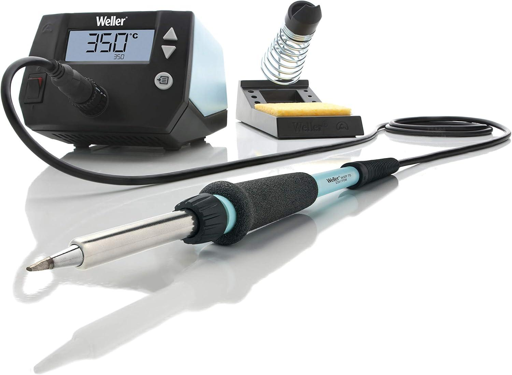
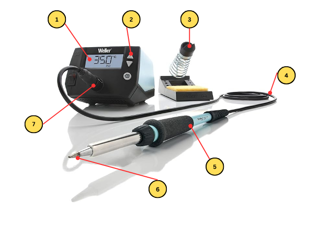

The Weller WE1010NA is a 70 W temperature-controlled soldering station: a base unit that holds the temperature you dial in, a pencil iron on a flexible cord, and a stand with a sponge. Use it to solder through-hole components onto circuit boards, join and tin wires, fit connectors and terminals, and — with solder wick or a desoldering pump — take joints apart again. It's for electronics-sized work; anything heavier than that belongs on different equipment, and the [hot air rework station](/docs/workbenches/instruments/hot-air-rework-station-sparkfun-8508d/) next to it is the better tool for surface-mount parts.

> [!WARNING]
> **Never flick or shake solder off the tip.** Molten solder thrown off an iron travels further than you'd expect and sticks to whatever it lands on, including eyes. Wipe the tip on the damp sponge or the brass wool instead — that's what they're for.

> [!WARNING]
> **The metal shaft between the grip and the tip gets hot too.** Hold the iron by the foam grip only, and don't slide your hand forward to steady it.

## Before you start

- **Safety glasses on.** Flux spits when it hits a hot tip, and clipping leads afterwards flings sharp wire.
- **Switch the fume extractor on before you heat the iron**, and keep its intake near your work.
- **The lab's solder is lead-free.** It melts hotter and wets more slowly than leaded solder, and the joints it makes look duller. That's the solder, not a fault.
- **The iron lives in its stand.** Not on the bench, not on your board, not balanced on a box — in the stand, every time you let go of it.
- Work on a surface that can take heat, and keep paper, plastic bags, and anything else that melts or burns away from the stand.

## The station at a glance

1. **Display** — shows the tip temperature, with the setpoint underneath.
2. **Up and down buttons** — set the temperature.
3. **Stand** — with the sponge tray at its base.
4. **Cord** — heat-resistant, but don't drape it across the tip or over an edge where the iron can be pulled off the bench.
5. **Iron** — hold it by the foam grip.
6. **Tip** — screwed into the barrel by the knurled collar.
7. **Iron jack** — where the iron plugs into the base unit.

## Operating

1. Check the iron is plugged into the **jack (7)** and sitting in its **stand (3)**, then switch the station on.

2. Set the temperature with the **up and down buttons (2)**. **350 °C is a good starting point** for the lab's lead-free solder; most electronics work sits somewhere between 320 °C and 370 °C. Hotter isn't better — it degrades the tip, burns the flux off before it can do its job, and lifts pads off boards.

3. **Wet the sponge and wring it out.** It should be damp, not dripping — a soaked sponge pulls so much heat out of the tip that the iron can't recover between joints.

4. Wait for the display to reach the setpoint, then **tin the tip**: melt a little solder onto it so it's shiny and silver all over, then wipe it on the sponge. A bare, dull, oxidised tip won't transfer heat no matter how hot the display says it is. Re-tin every few joints and always before you put the iron away.

5. **Heat the joint, not the solder.** Touch the tip so it contacts the component lead and the pad at the same time, and hold it there for a second or two.

6. **Feed the solder into the joint**, against the side away from the tip — not onto the tip itself. If the joint is hot enough, the solder flows in and wraps around the lead by itself. If you have to melt solder on the tip and wipe it on, the joint is too cold and what you get won't hold.

7. Take the solder away first, then the iron, and **don't move the joint while it cools**. A joint disturbed as it solidifies comes out dull and grainy and is mechanically weak.

8. **Look at what you made.** A good joint is a smooth concave cone that wets both the pad and the lead. A ball of solder sitting on top, touching the lead but not spread across the pad, is a cold joint — reheat it until it flows. Lead-free joints look duller than leaded ones even when they're perfect, so judge the shape rather than the shine.

9. **Clip the lead** close to the joint, with the cut end pointed down at the bench and away from anyone. Clipped leads are the thing most likely to end up in someone's eye at this bench.

10. Iron back in the **stand (3)** between every joint.

> [!WARNING]
> **Let the station cool completely before changing a tip.** The tip and the barrel stay hot long after the display drops, and the collar that holds them is metal. If you need a different tip, ask a staff member rather than working it loose with pliers.

## Finishing up

- Tin the tip one last time and leave the solder on it — the coating stops the tip oxidising while it's stored.
- Put the iron in its **stand**, switch the station off, and leave it there to cool. Don't move it, coil the cord around it, or put it away while it's hot.
- Rinse and wring out the sponge.
- Clear clipped leads, solder debris, and offcuts off the bench into the bin.
- Switch off the fume extractor if nobody else is soldering.

## Common problems

**Solder won't stick to the joint — it beads up and rolls off.** Almost always a dirty or oxidised tip, or not enough flux. Re-tin the tip, and make sure you're heating the pad and lead rather than presenting solder to the tip. Lead-free solder needs more heat and more patience than leaded, so give it a moment before deciding something is wrong.

**The joint looks dull, lumpy, or grainy.** Either it moved while cooling, or it never got hot enough. Reheat until the solder visibly flows and wets the pad, then leave it alone until it's solid.

**The display drops a long way as soon as you touch a joint and won't come back.** You're pulling more heat out than the tip can supply — usually a large ground plane or a thick wire acting as a heatsink. Use a bigger tip if one is available, or raise the temperature slightly. Check the sponge isn't soaking wet too.

**The tip won't tin at all — solder just runs off the bare metal.** The tip is oxidised past the point where solder will stick. Tip tinner will sometimes rescue it; tell a staff member rather than attacking it with sandpaper or a file, which destroys the plating for good.

**The station powers up but the iron never heats.** Check the iron's plug is fully seated in the **jack (7)**. If it is, stop and tell a staff member — don't take the iron apart.
